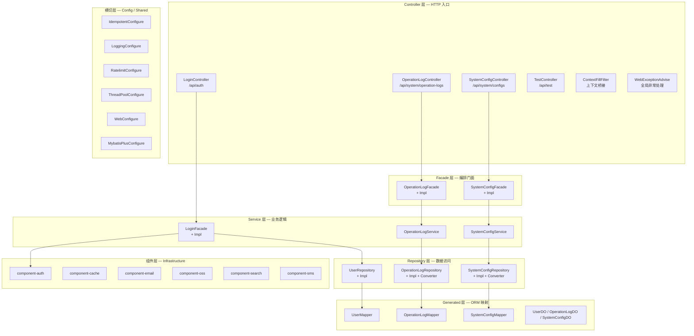
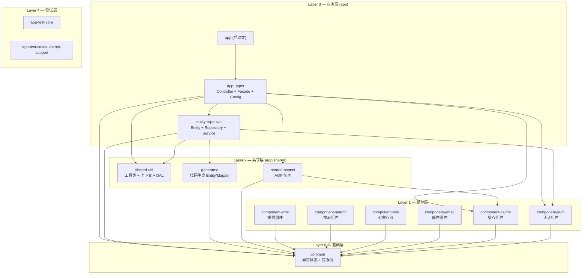

# 架构总览

> **职责**: 描述 web-quick-start-light 项目的整体架构设计，包括分层模型、模块拓扑、技术栈选型与核心设计模式
> **轨道**: Intent
> **维护者**: Frozen（AI 创建后冻结）

## 目录

- [概述](#概述)
- [设计背景](#设计背景)
- [技术方案](#技术方案)
  - [分层架构](#分层架构)
  - [模块拓扑与依赖 DAG](#模块拓扑与依赖-dag)
  - [技术栈全景](#技术栈全景)
  - [核心设计模式](#核心设计模式)
  - [构建顺序与并行度](#构建顺序与并行度)
- [关键设计决策](#关键设计决策)
- [相关文档](#相关文档)

## 概述

web-quick-start-light 是一个基于 Java 25 + Spring Boot 4.x 的轻量级 Web 快速启动脚手架，采用 **DDD-lite + Template Method** 架构风格。项目通过严格的四层分层（Controller → Facade → Service → Repository）保证代码职责清晰，通过 6 个独立组件模块（auth/cache/email/oss/search/sms）实现基础设施的可插拔扩展。全项目包含 196 个源文件、74 个测试文件、420 个测试用例，零循环依赖，由 ArchUnit 测试守护分层边界。作为脚手架项目，其核心目标是提供一套开箱即用、架构规范、易于裁剪的 Java Web 开发起点。

---

## 设计背景

### 项目定位

web-quick-start-light（组织：`org.smm.archetype`）定位于**轻量级脚手架**，而非重量级框架。其设计哲学是：

1. **零外部依赖启动** — 默认使用 SQLite 嵌入式数据库，无需安装 MySQL/PostgreSQL 即可运行
2. **开箱即用的基础设施** — 内置认证、缓存、日志、AOP 切面、上下文传播等常用能力
3. **架构即约束** — 通过 ArchUnit 测试 + 代码生成 + 模板方法模式，将架构规范固化到代码中
4. **渐进式复杂度** — 简单场景（单体 SQLite）到复杂场景（分布式微服务）均可平滑演进

### 动机

在 Java Web 开发中，新项目启动通常面临以下问题：

- **架构规范缺失** — 团队成员对分层、依赖方向、异常处理等缺乏统一约定
- **基础设施重复建设** — 每个项目都要重新搭建认证、缓存、日志、上下文传播等基础能力
- **技术选型碎片化** — 不同项目使用不同版本的 ORM、序列化、监控等库，导致维护负担
- **脚手架过重** — 现有开源脚手架（如 JHipster）引入过多概念，学习成本高

本项目旨在提供一个**最小可行架构**：保留核心分层约束和基础设施抽象，去掉所有不必要的复杂度。

### 设计原则

| 原则 | 说明 | 体现 |
|------|------|------|
| **单向依赖** | 上层依赖下层，禁止反向引用 | ArchUnit 测试守护 + 四层严格分层 |
| **可替换性** | 所有基础设施通过接口抽象，支持替换 | Template Method + `@ConditionalOnMissingBean` |
| **约定优于配置** | 提供合理的默认值，减少配置项 | NoOp 实现、默认 SQLite、Serial GC |
| **测试即文档** | 架构规则通过测试表达，而非文档 | ArchitectureComplianceUTest 等 ArchUnit 测试 |
| **渐进增强** | 核心功能默认启用，高级功能按需开启 | `enabled` 开关 + `@ConditionalOnProperty` |

---

## 技术方案

### 分层架构

项目采用经典的 **四层分层架构**（Controller → Facade → Service → Repository），并在其下叠加 Generated 层和 Component 层：



#### 分层对应关系表

| 层级 | 包路径 | 模块归属 | 典型类 |
|------|--------|---------|--------|
| **Controller** | `controller.*` | app-main-upper | `LoginController`, `SystemConfigController`, `OperationLogController` |
| **Global** | `controller.global.*` | app-main-upper | `ContextFillFilter`, `WebExceptionAdvise` |
| **Facade** | `facade.*` | app-main-upper | `OperationLogFacade`, `SystemConfigFacade` 及其 Impl |
| **Service** | `service.*` | app-main-entity-repo-svc | `LoginFacadeImpl`, `OperationLogService`, `SystemConfigService` |
| **Repository** | `repository.*` | app-main-entity-repo-svc | `*Repository` 接口 + `*RepositoryImpl` + `*Converter` |
| **Entity** | `entity.*` | app-main-entity-repo-svc | `User`, `SystemConfig`, `OperationLog`, `BaseDO` |
| **Generated** | `generated.*` | app-main-shared-gen | `*DO`, `*Mapper`, `MybatisPlusGenerator` |
| **Config** | `config.*` | app-main-upper | `*Configure`, `*Properties` |
| **Component** | `component.*` | 独立 Maven 模块 | `AuthComponent`, `CacheComponent`, `OssComponent` 等 |
| **Exception** | `exception.*` | common | `BaseException`, `BizException`, `ClientException`, `SysException` |

#### 层间依赖规则

| 规则 | 源层 | 目标层 | 约束 | 守护方式 |
|------|------|--------|------|---------|
| Controller → Facade | Controller | Facade | ✅ 允许 | ArchUnit |
| Controller → Service | Controller | Service | ❌ 禁止（必须经过 Facade） | ArchUnit |
| Controller → Repository | Controller | Repository | ❌ 禁止 | ArchUnit |
| Facade → Service | Facade | Service | ✅ 允许 | ArchUnit |
| Service → Repository | Service | Repository | ✅ 允许 | ArchUnit |
| Repository → Generated | Repository | Generated | ✅ 允许 | ArchUnit |
| Entity → Spring | Entity | `org.springframework..` | ❌ 禁止 | ArchUnit |

> **已知违规**：`SystemConfigService` 引用了 Facade 层的 `ConfigGroupVO` 和 `UpdateConfigCommand`（Service → Facade 反向引用），属于分层边界的轻微模糊，但不构成 Maven 级别的循环依赖。

---

### 模块拓扑与依赖 DAG

项目共 14 个模块/子模块，组织为 7 层拓扑结构：



#### 核心与边缘模块分析

| 类型 | 模块 | 被依赖数 | 核心程度 |
|------|------|:-------:|:-------:|
| **核心** | common | 7 | ★★★★★ |
| **核心** | shared-util (BizContext) | 5+ | ★★★★☆ |
| **核心** | component-auth | 3 | ★★★☆☆ |
| **边缘** | component-cache | 1（仅 IdempotentAspect） | ★☆☆☆☆ |
| **边缘** | component-email/oss/search/sms | 1（仅 Maven 声明） | ★☆☆☆☆ |

> **洞察**：component-email / component-oss / component-search / component-sms 四个组件目前仅有 Maven 依赖声明，无实际业务代码消费方，属于**预留扩展点**。

---

### 技术栈全景

| 类别 | 技术 | 版本 | 说明 |
|------|------|:----:|------|
| **语言** | Java | 25 | ScopedValue、虚拟线程、record |
| **框架** | Spring Boot | 4.0.2 | Web MVC + AutoConfiguration |
| **ORM** | MyBatis-Plus | 3.5.16 | 代码生成 + 分页 + 逻辑删除 |
| **数据库** | SQLite | 3.51.3 | 嵌入式，零运维 |
| **认证** | Sa-Token | 1.45.0 | 轻量级认证框架 |
| **缓存** | Caffeine | — | 本地高性能缓存 |
| **限流** | Bucket4j | 8.17.0 | 令牌桶算法 |
| **序列化** | FastJSON2 | 2.0.61 | JSON 序列化 |
| **二进制序列化** | Kryo | 5.6.2 | 高性能对象序列化 |
| **可观测性** | OpenTelemetry + Jaeger | — | 分布式追踪 |
| **日志** | SLF4J + Logback + LogstashEncoder | — | 结构化日志 |
| **API 文档** | SpringDoc OpenAPI | 3.0.3 | Swagger UI |
| **测试** | JUnit 5 + Mockito + AssertJ + ArchUnit | — | 单元 + 集成 + 架构守护 |
| **构建** | Maven | — | 多模块聚合 |
| **工具库** | Hutool 5.8.44, MapStruct 1.6.3, Lombok | — | 通用工具 |
| **GC** | Serial GC | — | ≤1G 堆最优 |

---

### 核心设计模式

#### 1. Template Method + Strategy（跨 6 个组件模块）

所有组件模块统一采用 Template Method 模式，公开方法标记 `final`，封装参数校验 + 日志 + 异常转换，子类通过 `protected abstract do*()` 实现核心逻辑：

| 组件模块 | 接口 | 抽象基类 | 具体实现 | 扩展点数 |
|---------|------|---------|---------|:-------:|
| component-auth | `AuthComponent` | `AbstractAuthComponent` | `SaTokenAuthComponent`, `NoOpAuthComponent` | 4 (`do*`) |
| component-cache | `CacheComponent` | `AbstractCacheComponent` | `CaffeineCacheComponent` | 8 (`do*`) |
| component-email | `EmailComponent` | `AbstractEmailComponent` | `NoOpEmailComponent` | 3 (`do*`) |
| component-oss | `OssComponent` | `AbstractOssComponent` | `LocalOssComponent` | 7 (`do*`) |
| component-search | `SearchComponent` | `AbstractSearchComponent` | `SimpleSearchComponent` | 14 (`do*`) |
| component-sms | `SmsComponent` | `AbstractSmsComponent` | `NoOpSmsComponent` | 3 (`do*`) |

#### 2. ConditionalOnMissingBean（Spring Boot 条件装配）

所有组件的 AutoConfiguration 使用 `@ConditionalOnMissingBean`，允许上层模块通过自定义 Bean 覆盖默认实现：

```java
@Bean
@ConditionalOnMissingBean(XxxComponent.class)
public XxxComponent xxxComponent() {
    return new DefaultXxxComponent();
}
```

#### 3. Null Object 模式

为不需要真实功能的场景提供空实现，避免到处写 `if (component != null)`：

| 组件 | 空实现类 | 场景 |
|------|---------|------|
| component-auth | `NoOpAuthComponent` | Sa-Token 不在 classpath 时，`isLogin()` 恒返回 `true` |
| component-email | `NoOpEmailComponent` | 开发/测试环境，仅日志记录 |
| component-sms | `NoOpSmsComponent` | 开发/测试环境，返回成功 + UUID |

#### 4. Repository + Converter 模式

所有数据访问层遵循统一的 Repository 模式，将 DO（数据对象）与 Entity（领域对象）分离：

```
接口 (XxxRepository) → 实现 (XxxRepositoryImpl) → 转换器 (XxxConverter) → Mapper (generated)
```

#### 5. AOP 横切关注点模式

3 个 AOP 切面共享相同的设计结构，通过注解标记 + 策略接口实现关注点分离：

| 切面 | 注解 | 依赖组件 | Key 解析 |
|------|------|---------|---------|
| `IdempotentAspect` | `@Idempotent` | `CacheComponent` | SpEL + paramsHashCode |
| `LogAspect` | `@BusinessLog` | `OperationLogWriter` (策略接口) | 无 |
| `RateLimitAspect` | `@RateLimit` | Bucket4j (内置) | SpEL + 方法签名 |

---

### 构建顺序与并行度

#### 拓扑排序（自底向上）

| 层级 | 模块 | 依赖 | 说明 |
|:----:|------|------|------|
| **L0** | `common` | 无 | 异常体系、错误码契约，全局根基 |
| **L1** | 6 个 component 模块 | common | 可完全**并行构建** |
| **L2** | `shared-util`, `generated`, `shared-aspect` | L0~L1 | 也可**并行构建** |
| **L3** | `entity-repo-svc` | L0~L2 | 领域实体 + Repository + Service |
| **L4** | `app-upper` | L0~L3 全部 | Controller + Facade + Config |
| **L5** | `app` | app-upper | Spring Boot 入口 |
| **L6** | `app-test-core`, `app-test-cases-shared-support` | app + 各模块 | 测试层 |

#### 并行构建组

```
Group 1: [common]
Group 2: [component-auth, component-cache, component-email, component-oss, component-search, component-sms]  ← 6 路并行
Group 3: [shared-util, generated, shared-aspect]  ← 3 路并行
Group 4: [entity-repo-svc]
Group 5: [app-upper]
Group 6: [app]
Group 7: [app-test-core, app-test-cases-shared-support]  ← 2 路并行
```

---

## 关键设计决策

### 为什么选择四层架构（Controller → Facade → Service → Repository）？

**传统三层（Controller → Service → DAO）的问题**：
- Service 层同时承担业务编排和数据访问编排，职责过重
- Controller 直接调用 Service 导致跨用例复用困难
- 缺少编排层，复杂用例的流程组合散落在 Controller 中

**四层的收益**：
- **Facade 层**专注于用例编排（一个 API 端点对应一个 Facade 方法），不包含业务规则
- **Service 层**专注于单一领域的业务逻辑，可被多个 Facade 复用
- **Repository 层**专注于数据访问，与 ORM 细节隔离
- Controller 层仅做 HTTP 协议适配（参数校验、响应包装）

### 为什么使用 Template Method 模式统一组件骨架？

**决策**：6 个组件模块（auth/cache/email/oss/search/sms）全部采用 Template Method + Strategy 模式。

**理由**：
1. **横切逻辑统一** — 参数校验、日志记录、异常转换在每个组件中都相同，Template Method 将其固化到基类的 `final` 方法中
2. **扩展点明确** — 子类只需实现 `do*()` 方法，扩展点数量和签名清晰可见
3. **异常契约统一** — 所有组件异常统一转换为 `ClientException(CommonErrorCode.XXX_FAILED)`，上层无需关心底层差异
4. **测试简化** — 基类的横切逻辑只需测试一次，子类测试专注于核心逻辑

### 为什么选择 SQLite 作为默认数据库？

**决策**：脚手架默认使用 SQLite 嵌入式数据库，而非 MySQL/PostgreSQL。

**权衡**：
- **优势**：零运维（无需安装数据库）、零配置（JDBC URL 即可）、启动即用（适合脚手架演示和开发）
- **劣势**：不支持并发写入（仅适合低并发场景）、无原生时间类型（通过 TypeHandler 兼容）、SQL 方言差异
- **缓解**：提供 MySQL DDL 模板（`schema-template.sql`）和代码生成器（`MybatisPlusGenerator`），支持一键切换

### 为什么使用 ScopedValue 替代 ThreadLocal？

**决策**：`BizContext` 基于 Java 25 的 `ScopedValue` API 实现上下文传播，而非传统的 `ThreadLocal`。

**理由**：
- **虚拟线程安全** — `ScopedValue` 与虚拟线程（Virtual Threads）天然兼容，而 `ThreadLocal` 在虚拟线程池场景下存在内存泄漏风险
- **不可变性** — `ScopedValue` 的值在作用域内不可变（通过 `copyAsReplica()` 创建副本），避免了 `ThreadLocal` 的可变状态问题
- **生命周期明确** — `ScopedValue.where().run()` 的作用域由代码块界定，不会出现忘记 `remove()` 的问题
- **性能** — `ScopedValue` 的读取开销接近字段访问，远低于 `ThreadLocal.get()`

### 为什么选择 Serial GC？

**决策**：生产环境启动脚本（`start.sh`）默认使用 Serial GC（`-XX:+UseSerialGC`）。

**理由**：
- **小内存最优** — 在 ≤1G 堆的场景下，Serial GC 的吞吐量最高（无并发协调开销）
- **零额外内存** — 无 remembered sets、region tables、write barriers 等数据结构，节省 ~100MB 内存
- **暂停可接受** — 512MB 堆下 Full GC 暂停通常 <100ms，对脚手架级别的应用足够
- **Oracle 推荐** — Oracle 官方文档明确推荐小数据集使用 Serial GC

### 循环依赖检测结论

✅ **全项目零循环依赖**。经过对所有模块 Maven 依赖和 Java import 关系的遍历确认，依赖图为严格的 DAG（有向无环图）。

---

## 相关文档

| 文档 | 关系 | 说明 |
|------|------|------|
| [架构决策记录](arch-decisions.md) | 交叉 | 各决策的详细背景、后果与状态 |
| [组件设计模式](../components/component-pattern.md) | 下游 | 6 个组件的 Template Method 统一骨架 |
| [异常体系](../business/exception-system.md) | 下游 | 三层异常分类（Biz/Client/Sys） |
| [上下文传播机制](../infrastructure/context-propagation.md) | 下游 | BizContext + ScopedValue + OTel Baggage |
| [编码规范](../guides/coding-standards.md) | 下游 | ArchUnit 守护规则与编码约定 |
| [配置参考](../guides/configuration-reference.md) | 下游 | 全部 YAML 配置项与 Properties |
