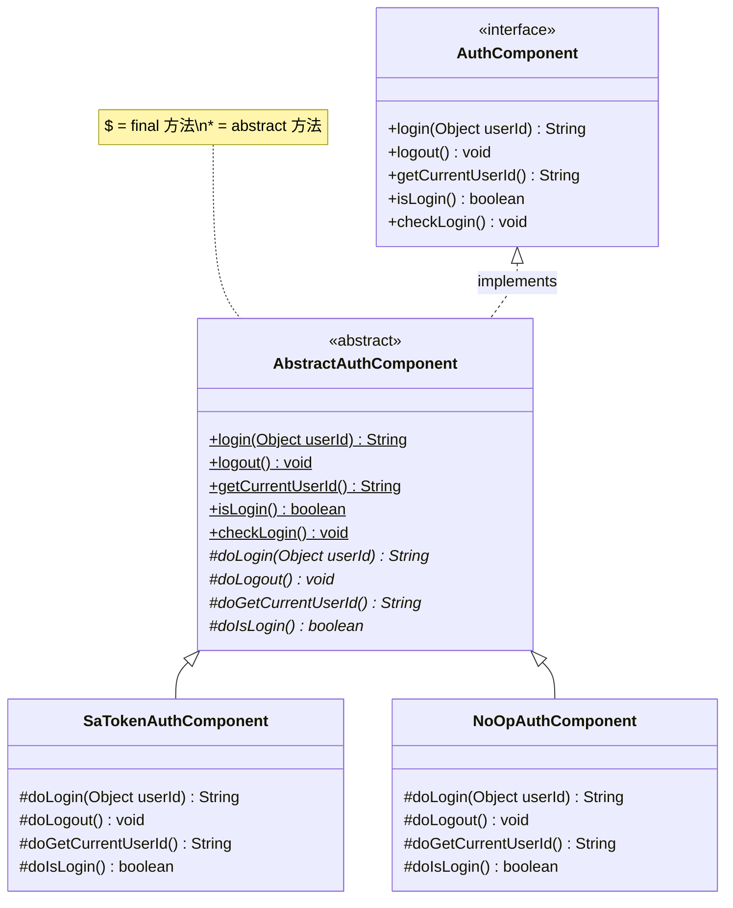
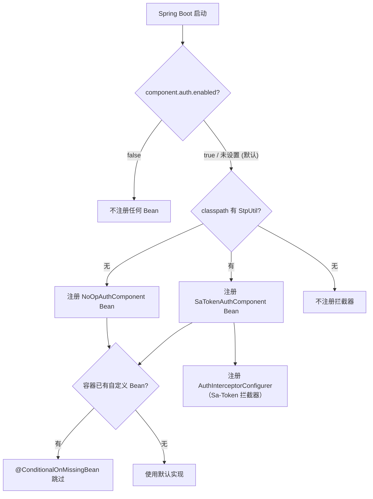
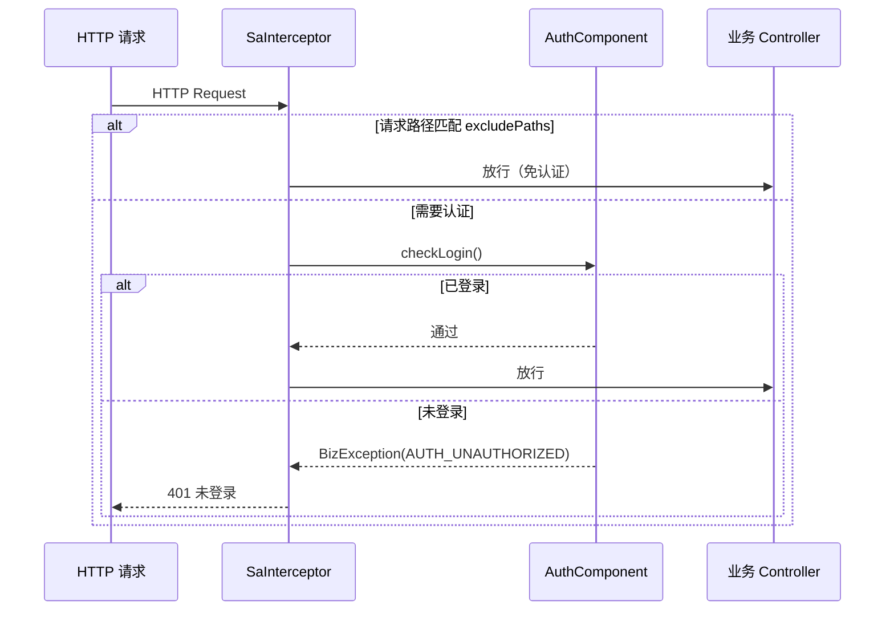
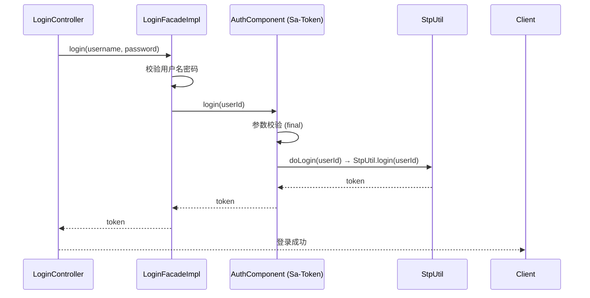
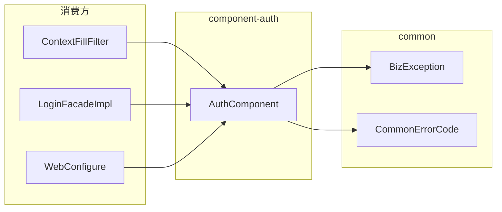

# 认证组件 (component-auth)

> **职责**: 描述认证组件的 API、流程和配置
> **轨道**: Contract
> **维护者**: AI

---

## 目录

- [概述](#概述)
- [公共 API 参考](#公共-api-参考)
  - [AuthComponent 接口](#authcomponent-接口)
  - [AbstractAuthComponent 抽象基类](#abstractauthcomponent-抽象基类)
  - [SaTokenAuthComponent 实现](#satokenauthcomponent-实现)
  - [NoOpAuthComponent 实现](#noopauthcomponent-实现)
- [服务流程](#服务流程)
  - [条件装配流程](#条件装配流程)
  - [认证拦截流程](#认证拦截流程)
  - [登录认证流程](#登录认证流程)
- [依赖关系](#依赖关系)
  - [上游依赖](#上游依赖)
  - [下游消费方](#下游消费方)
- [安全配置](#安全配置)
  - [AuthProperties 配置项](#authproperties-配置项)
  - [异常契约](#异常契约)
- [相关文档](#相关文档)
- [变更历史](#变更历史)

---

## 概述

`component-auth` 是项目的认证基础设施组件，位于依赖 DAG 的 **Layer 1（组件层）**，仅依赖 `common` 模块。它定义了 5 个核心认证操作，通过 Template Method + Strategy 双模式实现认证框架的可插拔替换。

核心特性：
- **5 个认证操作**：login / logout / getCurrentUserId / isLogin / checkLogin
- **4 个扩展点**：`doLogin` / `doLogout` / `doGetCurrentUserId` / `doIsLogin`
- **双策略实现**：Sa-Token 实现用于生产环境，NoOp 实现用于开发/测试环境
- **默认启用**：`component.auth.enabled` 默认为 `true`（matchIfMissing）
- **WebMvc 集成**：自动注册 Sa-Token 拦截器，支持配置排除路径



---

## 公共 API 参考

### AuthComponent 接口

认证组件的核心契约，所有业务模块通过此接口与认证组件交互。

```java
package org.smm.archetype.component.auth;

public interface AuthComponent {

    /**
     * 登录，返回 token。
     * @param userId 用户标识（不能为 null）
     * @return 登录凭证 token
     * @throws BizException 参数为 null 或登录失败时抛出
     */
    String login(Object userId);

    /**
     * 注销当前会话。
     */
    void logout();

    /**
     * 获取当前登录用户 ID。
     * @return 当前用户 ID，未登录返回 null
     */
    String getCurrentUserId();

    /**
     * 判断是否已登录。
     * @return true 表示已登录
     */
    boolean isLogin();

    /**
     * 校验登录状态，未登录抛出异常。
     * @throws BizException 错误码 AUTH_UNAUTHORIZED (6601)
     */
    void checkLogin();
}
```

### AbstractAuthComponent 抽象基类

Template Method 模式骨架，封装参数校验与异常处理。

```java
public abstract class AbstractAuthComponent implements AuthComponent {

    /**
     * 登录（final，不可覆写）。
     * 流程：参数校验 → doLogin()
     * @throws BizException(Fail) userId 为 null 时
     */
    public final String login(Object userId);

    /** 注销（final）。 */
    public final void logout();

    /** 获取当前用户 ID（final）。 */
    public final String getCurrentUserId();

    /** 判断登录状态（final）。 */
    public final boolean isLogin();

    /**
     * 校验登录状态（final）。
     * 未登录时抛出 BizException(AUTH_UNAUTHORIZED, "请先登录")
     */
    public final void checkLogin();

    // ===== 扩展点（子类实现） =====

    protected abstract String doLogin(Object userId);
    protected abstract void doLogout();
    protected abstract String doGetCurrentUserId();
    protected abstract boolean doIsLogin();
}
```

### SaTokenAuthComponent 实现

委托 `cn.dev33.satoken.stp.StpUtil` 完成所有认证操作，仅在 Sa-Token 存在于 classpath 时激活。

| 扩展点 | 实现方式 |
|--------|---------|
| `doLogin(Object userId)` | `StpUtil.login(userId)` → `StpUtil.getTokenValue()` |
| `doLogout()` | `StpUtil.logout()` |
| `doGetCurrentUserId()` | `StpUtil.getLoginIdAsString()` |
| `doIsLogin()` | `StpUtil.isLogin()` |

### NoOpAuthComponent 实现

空操作兜底实现，适用于 Sa-Token 不在 classpath 的场景。

| 扩展点 | 返回值 |
|--------|--------|
| `doLogin(Object userId)` | `null` |
| `doLogout()` | 无操作 |
| `doGetCurrentUserId()` | `null` |
| `doIsLogin()` | `true`（恒登录） |

> **注意**：NoOp 实现的 `isLogin()` 恒返回 `true`，这意味着所有认证检查都会通过。仅适用于开发/测试环境。

---

## 服务流程

### 条件装配流程



**装配规则总结**：

| 条件 | AuthComponent Bean | 拦截器 |
|------|:-----------------:|:-----:|
| `enabled=false` | 不注册 | 不注册 |
| `enabled=true` + Sa-Token 在 classpath | SaTokenAuthComponent | 注册 |
| `enabled=true` + Sa-Token 不在 classpath | NoOpAuthComponent | 不注册 |
| 已有自定义 Bean | 跳过（不覆盖） | — |

### 认证拦截流程

当 Sa-Token 在 classpath 时，`AuthInterceptorConfigurer` 自动注册 WebMvc 拦截器：



### 登录认证流程



---

## 依赖关系

### 上游依赖

| 依赖 | Scope | 说明 |
|------|-------|------|
| `common` | compile | `BizException`, `CommonErrorCode` (AUTH_UNAUTHORIZED, FAIL) |
| `cn.dev33:sa-token-spring-boot4-starter` | **optional** | Sa-Token 认证框架，classpath 存在时激活 |
| `org.springframework.boot:spring-boot-autoconfigure` | compile | Spring Boot 自动配置支持 |
| `org.springframework:spring-web` | optional | Web 支持 |
| `org.springframework:spring-webmvc` | optional | WebMvc 拦截器注册 |

### 下游消费方

| 消费方 | 使用方式 | 说明 |
|--------|---------|------|
| `ContextFillFilter` | `AuthComponent.getCurrentUserId()` | 从认证组件获取当前用户 ID，填充到 `BizContext` |
| `LoginFacadeImpl` | `AuthComponent.login()` | 登录门面，委托认证组件完成登录操作 |
| `WebConfigure` | 注入 `AuthComponent` | Web 配置中引用认证组件 |



---

## 安全配置

### AuthProperties 配置项

配置前缀：`component.auth`

| 配置项 | 类型 | 默认值 | 说明 |
|--------|------|:------:|------|
| `component.auth.enabled` | `boolean` | `true` | 是否启用认证组件（matchIfMissing） |
| `component.auth.exclude-paths` | `List<String>` | `[]` | 免认证路径列表（Ant 风格通配符） |

**配置示例**：

```yaml
component:
  auth:
    enabled: true
    exclude-paths:
      - /api/auth/login
      - /api/auth/register
      - /api/test/**
      - /doc.html
      - /swagger-ui/**
```

### 异常契约

| 场景 | 异常类型 | 错误码 | 消息 |
|------|----------|--------|------|
| `login(null)` | `BizException` | `FAIL` | "userId不能为空" |
| `checkLogin()` 未登录 | `BizException` | `AUTH_UNAUTHORIZED (6601)` | "请先登录" |

---

## 相关文档

| 文档 | 关系 | 说明 |
|------|------|------|
| [component-pattern](component-pattern.md) | 本模式的具体实现之一 | 组件设计模式规范 |
| [component-cache](component-cache.md) | 同层组件 | 共享 Template Method 模式 |
| [component-oss](component-oss.md) | 同层组件 | 共享 Template Method 模式 |
| [component-search](component-search.md) | 同层组件 | 共享 Template Method 模式 |
| [component-messaging](component-messaging.md) | 同层组件 | 共享 Template Method 模式 |

---

## 变更历史

| 版本 | 日期 | 变更内容 |
|------|------|---------|
| 0.0.1-SNAPSHOT | 2026-04-25 | 初始版本：AuthComponent 接口、AbstractAuthComponent 模板方法、SaTokenAuthComponent、NoOpAuthComponent、AuthAutoConfiguration、AuthInterceptorConfigurer、AuthProperties |
