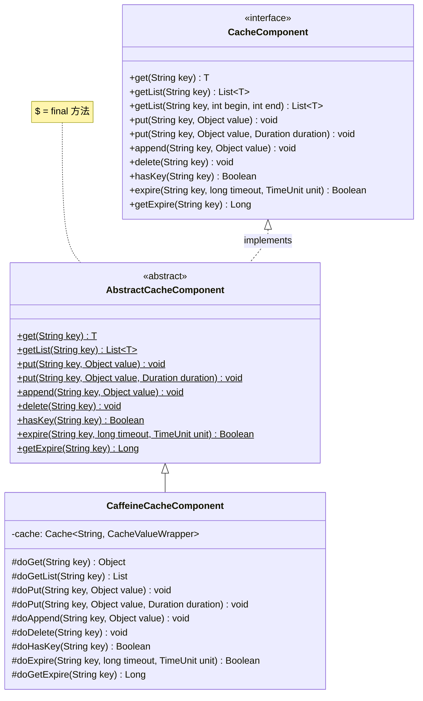
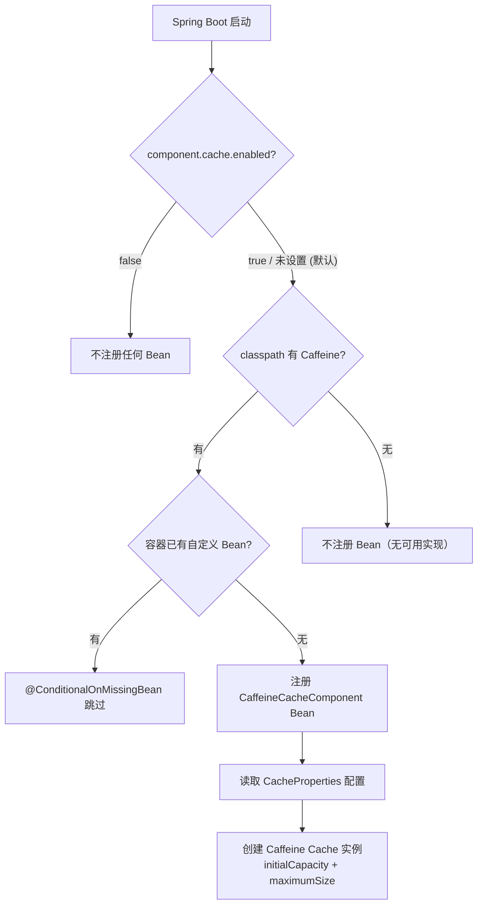
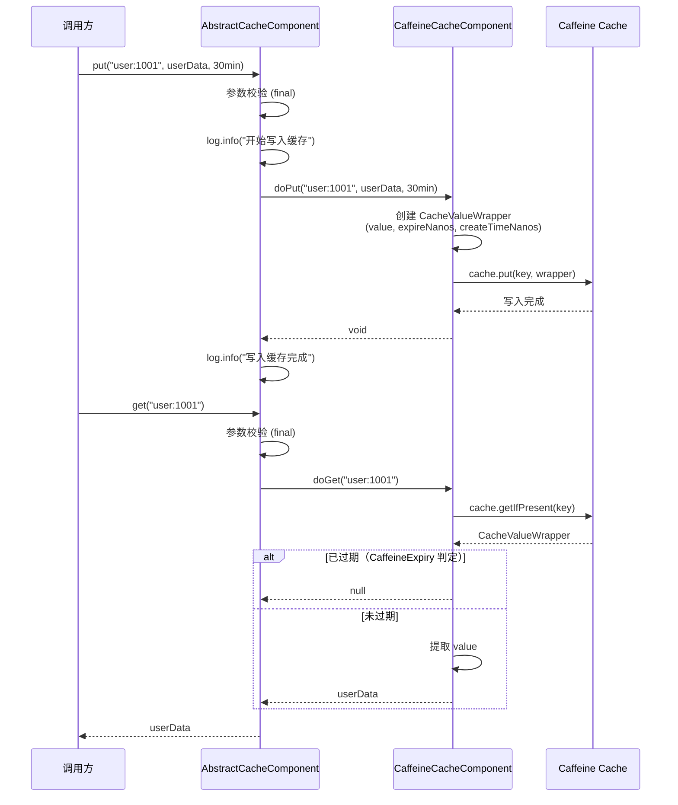
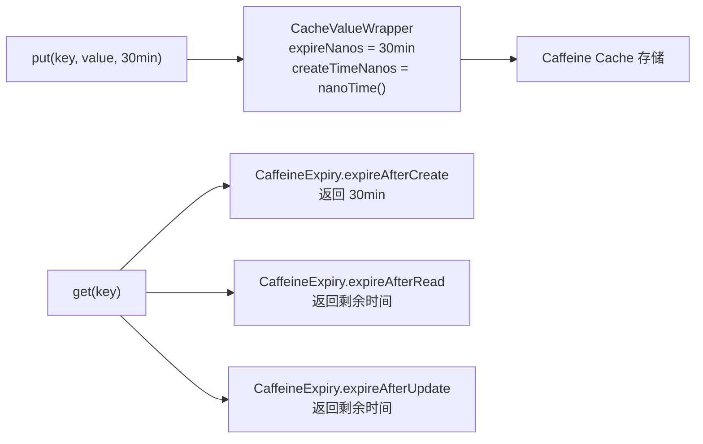
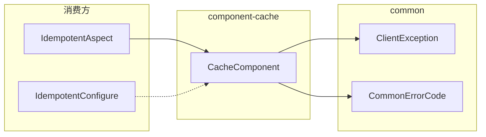

# 缓存组件 (component-cache)

> **职责**: 描述缓存组件的 API、流程和配置
> **轨道**: Contract
> **维护者**: AI

---

## 目录

- [概述](#概述)
- [公共 API 参考](#公共-api-参考)
  - [CacheComponent 接口](#cachecomponent-接口)
  - [AbstractCacheComponent 抽象基类](#abstractcachecomponent-抽象基类)
  - [CaffeineCacheComponent 实现](#caffeinecachecomponent-实现)
- [服务流程](#服务流程)
  - [条件装配流程](#条件装配流程)
  - [缓存读写流程](#缓存读写流程)
  - [独立 TTL 机制](#独立-ttl-机制)
- [依赖关系](#依赖关系)
  - [上游依赖](#上游依赖)
  - [下游消费方](#下游消费方)
- [核心类型定义](#核心类型定义)
  - [CacheValueWrapper](#cachevaluewrapper)
  - [CaffeineExpiry](#caffeineexpiry)
- [缓存配置](#缓存配置)
  - [CacheProperties 配置项](#cacheproperties-配置项)
  - [异常契约](#异常契约)
- [相关文档](#相关文档)
- [变更历史](#变更历史)

---

## 概述

`component-cache` 是项目的缓存基础设施组件，位于依赖 DAG 的 **Layer 1（组件层）**，仅依赖 `common` 模块。它基于 Caffeine 高性能本地缓存库，提供 10 个缓存操作方法，支持独立 entry 级别的 TTL 管理。

核心特性：
- **10 个缓存操作**：get / getList / put / append / delete / hasKey / expire / getExpire 等
- **8 个扩展点**：对应每个公开方法的 `do*` 实现
- **独立 TTL**：每个缓存 entry 拥有独立的过期时间，通过自定义 `CaffeineExpiry` 策略实现
- **默认启用**：`component.cache.enabled` 默认为 `true`（matchIfMissing）
- **Caffeine optional**：Caffeine 依赖标记为 optional，按需引入



---

## 公共 API 参考

### CacheComponent 接口

缓存客户端的核心抽象接口，定义了全部缓存操作契约。

```java
package org.smm.archetype.component.cache;

import java.time.Duration;
import java.util.List;
import java.util.concurrent.TimeUnit;

public interface CacheComponent {

    /**
     * 获取缓存值，不存在返回 null。
     * @param key 缓存键（不能为空）
     * @return 缓存值，不存在返回 null
     * @throws ClientException(ILLEGAL_ARGUMENT) key 为空时
     * @throws ClientException(CACHE_OPERATION_FAILED) 缓存操作失败时
     */
    <T> T get(String key);

    /**
     * 获取 List 类型缓存值。
     * @param key 缓存键
     * @return List 类型缓存值，不存在返回 null
     */
    <T> List<T> getList(String key);

    /**
     * 获取 List 类型缓存值的子列表（分页）。
     * @param key 缓存键
     * @param beginIdx 起始索引（含）
     * @param endIdx 结束索引（不含）
     * @return 子列表
     */
    <T> List<T> getList(String key, int beginIdx, int endIdx);

    /**
     * 写入缓存（使用默认过期时间）。
     * @param key 缓存键
     * @param value 缓存值
     */
    void put(String key, Object value);

    /**
     * 写入缓存（指定过期时间）。
     * @param key 缓存键
     * @param value 缓存值
     * @param duration 过期时间
     */
    void put(String key, Object value, Duration duration);

    /**
     * 追加元素到 List 类型缓存。
     * @param key 缓存键
     * @param value 追加值
     */
    void append(String key, Object value);

    /**
     * 删除缓存。
     * @param key 缓存键
     */
    void delete(String key);

    /**
     * 判断键是否存在。
     * @param key 缓存键
     * @return true 表示存在
     */
    Boolean hasKey(String key);

    /**
     * 设置过期时间。
     * @param key 缓存键
     * @param timeout 超时时间
     * @param unit 时间单位
     * @return true 表示设置成功
     */
    Boolean expire(String key, long timeout, TimeUnit unit);

    /**
     * 获取剩余过期时间（秒）。
     * @param key 缓存键
     * @return 剩余秒数
     */
    Long getExpire(String key);
}
```

### AbstractCacheComponent 抽象基类

Template Method 模式骨架，统一封装参数校验、异常处理和日志记录。定义 8 个 `protected abstract do*()` 扩展点。

### CaffeineCacheComponent 实现

基于 Caffeine 的本地缓存实现，支持独立 entry TTL。核心特性：

- 使用 `CacheValueWrapper` 包装缓存值，携带过期时间和创建时间戳
- 通过 `CaffeineExpiry` 实现按 entry 级别的过期策略
- `expire` 通过重新写入（重新创建 `CacheValueWrapper`）更新过期时间
- `getExpire` 通过 `System.nanoTime()` 差值计算剩余秒数

---

## 服务流程

### 条件装配流程



### 缓存读写流程



### 独立 TTL 机制

Caffeine 原生仅支持全局 TTL 配置，本组件通过自定义 `CaffeineExpiry` 实现了 entry 级别的独立过期：



---

## 依赖关系

### 上游依赖

| 依赖 | Scope | 说明 |
|------|-------|------|
| `common` | compile | `ClientException`, `CommonErrorCode` |
| `com.github.ben-manes.caffeine:caffeine` | **optional** | Caffeine 本地缓存库 |
| `spring-boot-autoconfigure-processor` | optional | 自动配置元数据生成 |
| `spring-boot-configuration-processor` | optional | 配置属性元数据生成 |
| `lombok` | optional | `@Getter`, `@Setter`, `@Slf4j` |

### 下游消费方

| 消费方 | 使用方式 | 说明 |
|--------|---------|------|
| `IdempotentAspect` | 构造器注入 `CacheComponent` | 幂等校验：`put(key, value, ttl)` + `hasKey(key)` |
| `IdempotentConfigure` | `@ConditionalOnBean(CacheComponent.class)` | 条件化注册幂等切面 |



---

## 核心类型定义

### CacheValueWrapper

内部值包装器，携带缓存值、过期时间和创建时间戳，是独立 TTL 机制的核心。

```java
// 内部类（CaffeineCacheComponent 中）
record CacheValueWrapper(
    Object value,              // 缓存值
    long expireNanos,          // 过期时间（纳秒，相对于 createTimeNanos）
    long createTimeNanos       // 创建时间（System.nanoTime()）
) {}
```

### CaffeineExpiry

实现 Caffeine `Expiry` 接口的过期策略，按 entry 级别独立判定过期。

```java
// 内部类（CaffeineCacheComponent 中）
class CaffeineExpiry implements Expiry<String, CacheValueWrapper> {
    @Override
    public long expireAfterCreate(String key, CacheValueWrapper wrapper, long currentTime) {
        return wrapper.expireNanos();  // 使用 entry 自身的过期时间
    }

    @Override
    public long expireAfterRead(/* ... */) {
        return currentDuration;  // 读取不影响过期
    }

    @Override
    public long expireAfterUpdate(/* ... */) {
        return currentDuration;  // 更新后使用新的过期时间
    }
}
```

> **注意**：`expireAfterRead` 返回 `currentDuration`，这意味着读取操作不会延长过期时间。`expire-after-access` 配置项实际无效。

---

## 缓存配置

### CacheProperties 配置项

配置前缀：`component.cache`

| 配置项 | 类型 | 默认值 | 说明 |
|--------|------|:------:|------|
| `component.cache.initial-capacity` | `Integer` | `1000` | 缓存初始容量 |
| `component.cache.maximum-size` | `Long` | `10000` | 最大缓存条目数 |
| `component.cache.expire-after-write` | `Duration` | `30天` | 写入后默认过期时间 |
| `component.cache.expire-after-access` | `Duration` | `30天` | 访问后过期时间（声明但未生效） |
| `component.cache.enabled` | `boolean` | `true` | 是否启用缓存自动配置 |

**配置示例**：

```yaml
component:
  cache:
    enabled: true
    initial-capacity: 500
    maximum-size: 5000
    expire-after-write: 1h
```

### 异常契约

| 场景 | 异常类型 | 错误码 | 说明 |
|------|----------|--------|------|
| 参数非法（key 为 null/空） | `ClientException` | `ILLEGAL_ARGUMENT` | 参数校验失败 |
| 缓存操作失败 | `ClientException` | `CACHE_OPERATION_FAILED` | do*() 方法执行异常 |

---

## 相关文档

| 文档 | 关系 | 说明 |
|------|------|------|
| [component-pattern](component-pattern.md) | 本模式的具体实现之一 | 组件设计模式规范 |
| [component-auth](component-auth.md) | 同层组件 | 共享 Template Method 模式 |
| [component-oss](component-oss.md) | 同层组件 | 共享 Template Method 模式 |
| [component-search](component-search.md) | 同层组件 | 共享 Template Method 模式 |
| [component-messaging](component-messaging.md) | 同层组件 | 共享 Template Method 模式 |

---

## 变更历史

| 版本 | 日期 | 变更内容 |
|------|------|---------|
| 0.0.1-SNAPSHOT | 2026-04-25 | 初始版本：CacheComponent 接口（10 方法）、AbstractCacheComponent 模板方法（8 扩展点）、CaffeineCacheComponent（独立 TTL）、CacheProperties、CacheAutoConfiguration |
