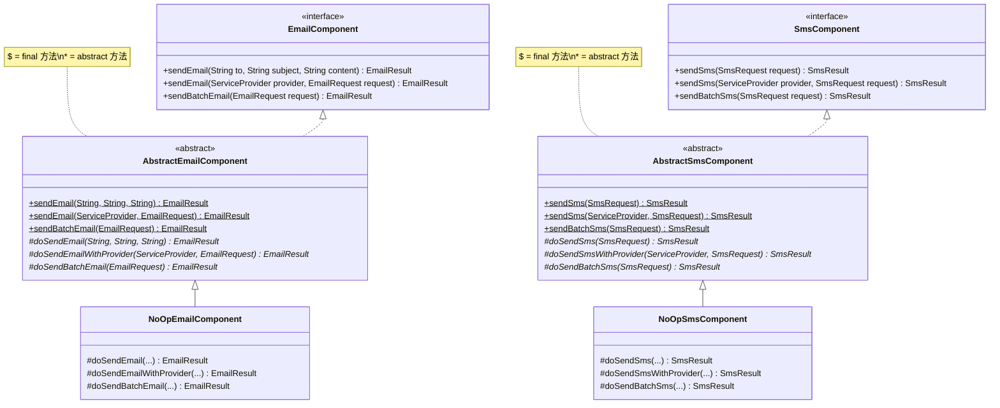
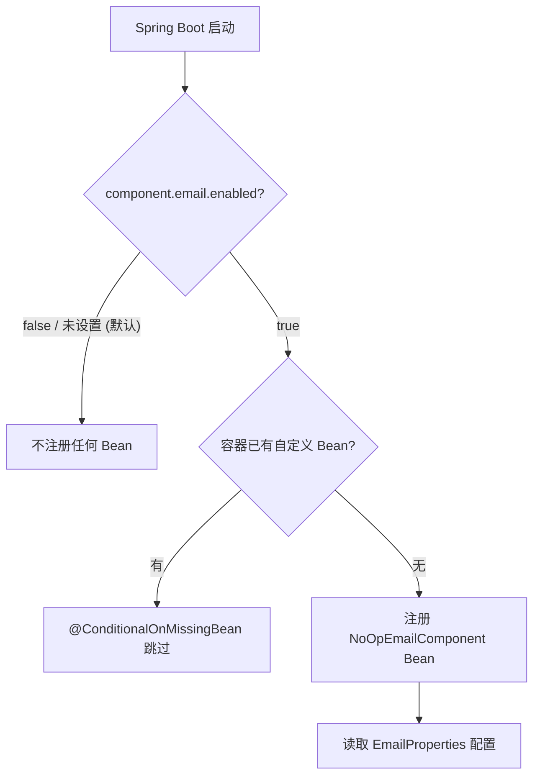
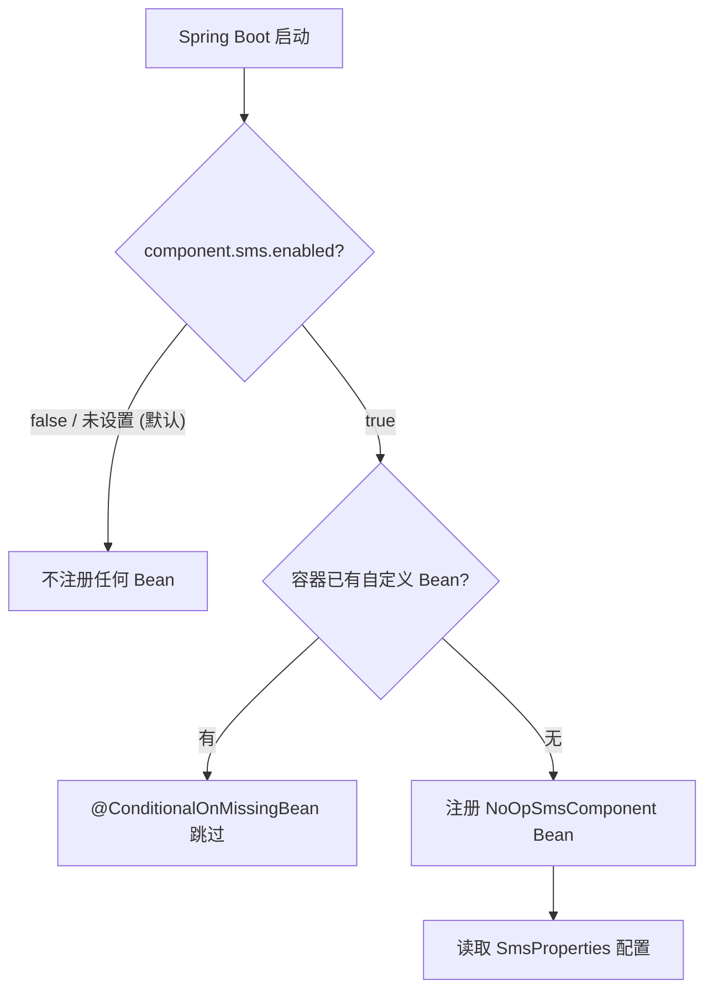
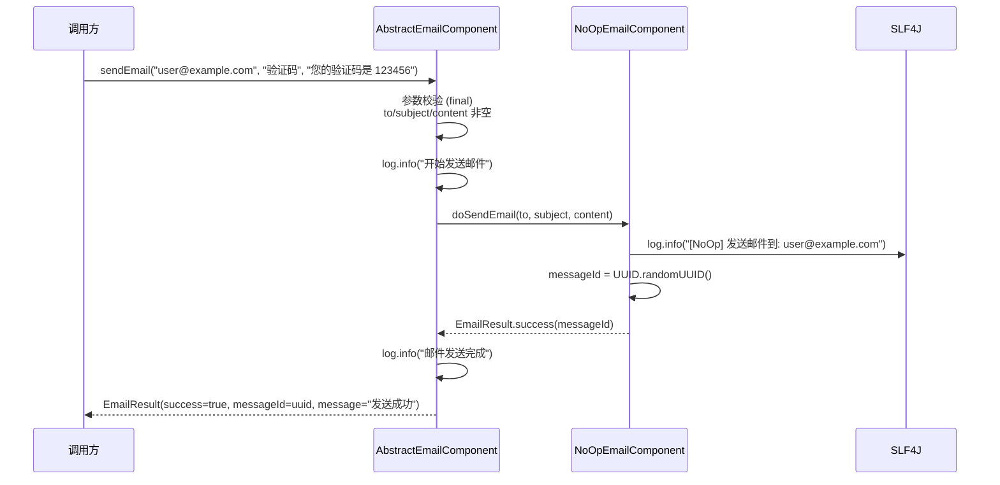
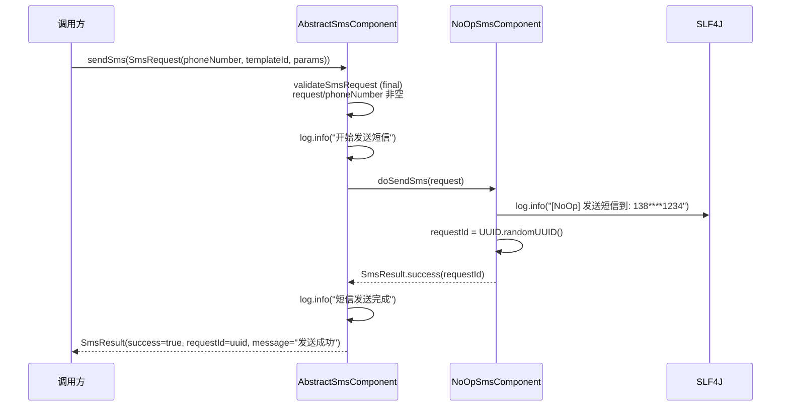
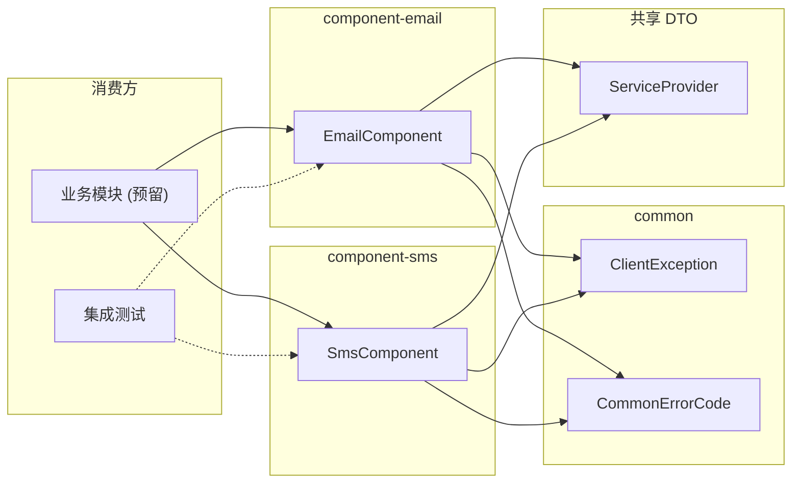

# 邮件与短信组件 (component-messaging)

> **职责**: 描述邮件与短信组件的 API、流程和配置
> **轨道**: Contract
> **维护者**: AI

---

## 目录

- [概述](#概述)
- [公共 API 参考](#公共-api-参考)
  - [EmailComponent 接口](#emailcomponent-接口)
  - [SmsComponent 接口](#smscomponent-接口)
  - [AbstractEmailComponent 抽象基类](#abstractemailcomponent-抽象基类)
  - [AbstractSmsComponent 抽象基类](#abstractsmscomponent-抽象基类)
  - [NoOpEmailComponent 实现](#noopemailcomponent-实现)
  - [NoOpSmsComponent 实现](#noopsmscomponent-实现)
- [服务流程](#服务流程)
  - [邮件条件装配流程](#邮件条件装配流程)
  - [短信条件装配流程](#短信条件装配流程)
  - [邮件发送流程](#邮件发送流程)
  - [短信发送流程](#短信发送流程)
- [依赖关系](#依赖关系)
  - [上游依赖](#上游依赖)
  - [下游消费方](#下游消费方)
- [核心类型定义](#核心类型定义)
  - [EmailRequest / EmailResult](#emailrequest--emailresult)
  - [SmsRequest / SmsResult](#smsrequest--smsresult)
  - [ServiceProvider 枚举](#serviceprovider-枚举)
- [消息配置](#消息配置)
  - [EmailProperties 配置项](#emailproperties-配置项)
  - [SmsProperties 配置项](#smsproperties-配置项)
  - [异常契约](#异常契约)
- [相关文档](#相关文档)
- [变更历史](#变更历史)

---

## 概述

`component-messaging` 是项目中邮件和短信两个消息类组件的统一文档。两个子组件位于依赖 DAG 的 **Layer 1（组件层）**，仅依赖 `common` 模块。它们遵循完全相同的 Template Method + Strategy + Null Object 设计模式，接口对称、扩展点数量一致（各 3 个），且共享 `ServiceProvider` 服务提供商枚举。

**子组件概览**：

| 维度 | component-email | component-sms |
|------|:--------------:|:------------:|
| 核心接口 | `EmailComponent` | `SmsComponent` |
| 接口方法数 | 3 | 3 |
| 扩展点数 | 3 (`do*`) | 3 (`do*`) |
| 默认启用 | `false` | `false` |
| 默认实现 | `NoOpEmailComponent` | `NoOpSmsComponent` |
| 条件依赖 | `spring-boot-starter-mail` (optional) | 无 |



---

## 公共 API 参考

### EmailComponent 接口

邮件客户端核心契约，提供三种发送模式。

```java
package org.smm.archetype.component.email;

import org.smm.archetype.component.dto.ServiceProvider;
import java.util.List;
import java.util.Map;

public interface EmailComponent {

    /**
     * 发送简单纯文本邮件。
     * @param to 收件人地址（不能为 null）
     * @param subject 邮件主题（不能为 null/空）
     * @param content 邮件内容（不能为 null/空）
     * @return 发送结果
     * @throws ClientException(EMAIL_SEND_FAILED) 参数校验失败或发送异常
     */
    EmailResult sendEmail(String to, String subject, String content);

    /**
     * 通过指定服务商发送模板邮件。
     * @param provider 服务提供商（ALIYUN / TENCENT / LOCAL / CUSTOM）
     * @param request 邮件请求（不能为 null）
     * @return 发送结果
     */
    EmailResult sendEmail(ServiceProvider provider, EmailRequest request);

    /**
     * 批量发送邮件。
     * @param request 邮件请求（to 列表不能为空）
     * @return 发送结果
     */
    EmailResult sendBatchEmail(EmailRequest request);
}
```

### SmsComponent 接口

短信客户端核心契约，提供三种发送模式。

```java
package org.smm.archetype.component.sms;

import org.smm.archetype.component.dto.ServiceProvider;

public interface SmsComponent {

    /**
     * 使用默认服务商发送模板短信。
     * @param request 短信请求（phoneNumber 不能为 null/空）
     * @return 发送结果
     * @throws ClientException(SMS_SEND_FAILED) 参数校验失败或发送异常
     */
    SmsResult sendSms(SmsRequest request);

    /**
     * 指定服务商发送短信。
     * @param provider 服务提供商
     * @param request 短信请求
     * @return 发送结果
     */
    SmsResult sendSms(ServiceProvider provider, SmsRequest request);

    /**
     * 批量发送短信。
     * @param request 短信请求（phoneNumber 支持多个号码）
     * @return 发送结果
     */
    SmsResult sendBatchSms(SmsRequest request);
}
```

### AbstractEmailComponent 抽象基类

Template Method 模式骨架，封装参数校验、日志记录和异常转换。

**公开方法（final）校验逻辑**：

| 方法 | 校验内容 |
|------|---------|
| `sendEmail(to, subject, content)` | to/subject/content 非空 |
| `sendEmail(provider, request)` | request 非 null |
| `sendBatchEmail(request)` | request 非 null，to 非空非空列表 |

**扩展点（protected abstract）**：

| 扩展点 | 对应公开方法 |
|--------|------------|
| `doSendEmail(to, subject, content)` | `sendEmail` 简单邮件 |
| `doSendEmailWithProvider(provider, request)` | `sendEmail(provider, request)` |
| `doSendBatchEmail(request)` | `sendBatchEmail` |

### AbstractSmsComponent 抽象基类

Template Method 模式骨架，与 AbstractEmailComponent 结构对称。

**公开方法（final）校验逻辑**：

| 方法 | 校验内容 |
|------|---------|
| `sendSms(request)` | request 非空，phoneNumber 非空 |
| `sendSms(provider, request)` | request 非空 |
| `sendBatchSms(request)` | request 非空 |

**扩展点（protected abstract）**：

| 扩展点 | 对应公开方法 |
|--------|------------|
| `doSendSms(request)` | `sendSms` 默认服务商 |
| `doSendSmsWithProvider(provider, request)` | `sendSms(provider, request)` |
| `doSendBatchSms(request)` | `sendBatchSms` |

### NoOpEmailComponent 实现

空操作邮件实现，不调用真实邮件 SDK。

| 扩展点 | 行为 |
|--------|------|
| `doSendEmail(to, subject, content)` | `log.info` 记录操作，返回 `EmailResult.success(UUID)` |
| `doSendEmailWithProvider(provider, request)` | 同上 |
| `doSendBatchEmail(request)` | 同上 |

### NoOpSmsComponent 实现

空操作短信实现，不调用真实短信 SDK。

| 扩展点 | 行为 |
|--------|------|
| `doSendSms(request)` | `log.info("[NoOp]")` 记录操作，返回 `SmsResult.success(UUID)` |
| `doSendSmsWithProvider(provider, request)` | 同上 |
| `doSendBatchSms(request)` | 同上 |

---

## 服务流程

### 邮件条件装配流程



### 短信条件装配流程



### 邮件发送流程



### 短信发送流程



---

## 依赖关系

### 上游依赖

| 依赖 | Scope | 使用方 | 说明 |
|------|-------|--------|------|
| `common` | compile | email + sms | `ClientException`, `CommonErrorCode` |
| `spring-boot-starter-mail` | **optional** | email | Jakarta Mail 封装（NoOp 不需要） |
| `spring-boot-autoconfigure-processor` | optional | email + sms | 自动配置元数据生成 |
| `spring-boot-configuration-processor` | optional | email + sms | 配置属性元数据生成 |
| `lombok` | optional | email + sms | `@Slf4j`, `@Getter`, `@Setter` |

### 下游消费方

| 消费方 | 使用方式 | 说明 |
|--------|---------|------|
| 业务模块（预留） | `@Autowired EmailComponent` / `@Autowired SmsComponent` | 需要邮件/短信功能的业务代码 |
| `TechClientInterfaceITest` | `getBean(EmailComponent.class)` / `getBean(SmsComponent.class)` | 集成测试验证 Bean 注册 |



---

## 核心类型定义

### EmailRequest / EmailResult

**EmailRequest** — 邮件请求数据载体：

```java
public record EmailRequest(
    List<String> to,               // 收件人列表
    String templateId,              // 模板 ID（面向模板邮件场景）
    Map<String, String> templateParams, // 模板参数
    String subject                  // 邮件主题
) {}
```

**EmailResult** — 邮件发送结果，含工厂方法：

```java
public record EmailResult(
    boolean success,    // 是否成功
    String messageId,   // 消息 ID（成功时有值）
    String message      // 描述信息
) {
    public static EmailResult success(String messageId) { ... }
    public static EmailResult fail(String message) { ... }
}
```

### SmsRequest / SmsResult

**SmsRequest** — 短信请求数据载体：

```java
public record SmsRequest(
    String phoneNumber,         // 手机号（批量场景支持多个号码）
    String templateId,           // 短信模板 ID
    Map<String, String> templateParams  // 模板参数（如 {"code": "123456"}）
) {}
```

**SmsResult** — 短信发送结果，含工厂方法：

```java
public record SmsResult(
    boolean success,    // 是否成功
    String requestId,   // 请求追踪 ID
    String message      // 结果消息
) {
    public static SmsResult success(String requestId) { ... }
    public static SmsResult fail(String message) { ... }
}
```

### ServiceProvider 枚举

服务提供商标识枚举，被 Email 和 SMS 两个组件共用。

```java
public enum ServiceProvider {
    ALIYUN,    // 阿里云
    TENCENT,   // 腾讯云
    LOCAL,     // 本地（无操作）
    CUSTOM     // 自定义
}
```

> **注意**：`ServiceProvider` 当前分别在 email 和 sms 组件中各定义了一份，存在冗余。未来应抽取到 `common` 模块作为共享类型。

---

## 消息配置

### EmailProperties 配置项

配置前缀：`component.email`

| 配置项 | 类型 | 默认值 | 说明 |
|--------|------|:------:|------|
| `component.email.enabled` | `boolean` | `false` | 是否启用邮件组件（默认关闭） |
| `component.email.host` | `String` | `null` | SMTP 主机地址 |
| `component.email.port` | `int` | `587` | SMTP 端口 |
| `component.email.username` | `String` | `null` | 认证用户名 |
| `component.email.password` | `String` | `null` | 认证密码 |
| `component.email.ssl-enable` | `boolean` | `true` | 是否启用 SSL |
| `component.email.from` | `String` | `null` | 发件人地址 |

> **注意**：EmailProperties 当前已定义但未被 NoOpEmailComponent 使用，预留给真实 SMTP 实现类。

### SmsProperties 配置项

配置前缀：`component.sms`

| 配置项 | 类型 | 默认值 | 说明 |
|--------|------|:------:|------|
| `component.sms.enabled` | `boolean` | `false` | 是否启用短信组件（默认关闭） |
| `component.sms.provider` | `String` | — | 服务商标识 |
| `component.sms.access-key-id` | `String` | — | AccessKey ID |
| `component.sms.access-key-secret` | `String` | — | AccessKey Secret |
| `component.sms.sign-name` | `String` | — | 短信签名 |

> **注意**：SmsProperties 当前已绑定但未被 NoOpSmsComponent 注入使用，预留给真实服务商实现类。

### 异常契约

| 组件 | 场景 | 异常类型 | 错误码 |
|------|------|----------|--------|
| email | 参数校验失败 | `ClientException` | `EMAIL_SEND_FAILED` |
| email | 发送异常 | `ClientException` | `EMAIL_SEND_FAILED` |
| sms | request/phoneNumber 为 null/空 | `ClientException` | `SMS_SEND_FAILED` |
| sms | 发送异常 | `ClientException` | `SMS_SEND_FAILED` |

**异常处理策略（两个组件一致）**：
- `ClientException` 直接透传，不重复包装
- 其他异常统一包装为 `ClientException`（对应组件错误码），保留原始异常为 cause

---

## 相关文档

| 文档 | 关系 | 说明 |
|------|------|------|
| [component-pattern](component-pattern.md) | 本模式的具体实现之一 | 组件设计模式规范 |
| [component-auth](component-auth.md) | 同层组件 | 共享 Template Method 模式 |
| [component-cache](component-cache.md) | 同层组件 | 共享 Template Method 模式 |
| [component-oss](component-oss.md) | 同层组件 | 共享 Template Method 模式 |
| [component-search](component-search.md) | 同层组件 | 共享 Template Method 模式 |

---

## 变更历史

| 版本 | 日期 | 变更内容 |
|------|------|---------|
| 0.0.1-SNAPSHOT | 2026-04-25 | **component-email**：EmailComponent 接口（3 方法）、AbstractEmailComponent 模板方法、NoOpEmailComponent、EmailRequest/EmailResult/ServiceProvider DTO、EmailProperties、EmailAutoConfiguration |
| 0.0.1-SNAPSHOT | 2026-04-25 | **component-sms**：SmsComponent 接口（3 方法）、AbstractSmsComponent 模板方法、NoOpSmsComponent、SmsRequest/SmsResult/ServiceProvider DTO、SmsProperties、SmsAutoConfiguration |
