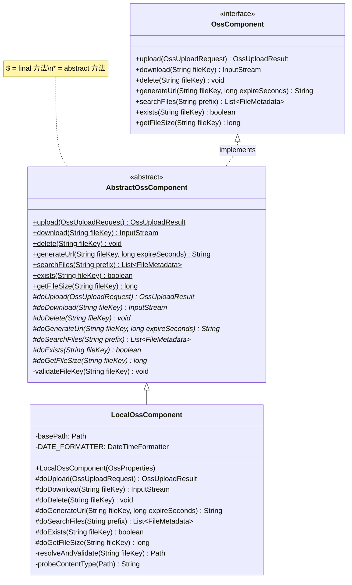
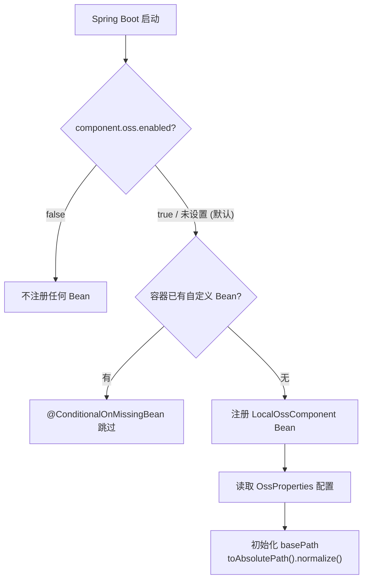
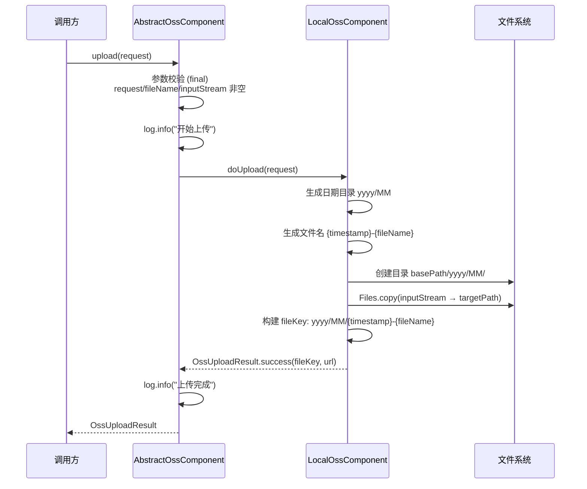
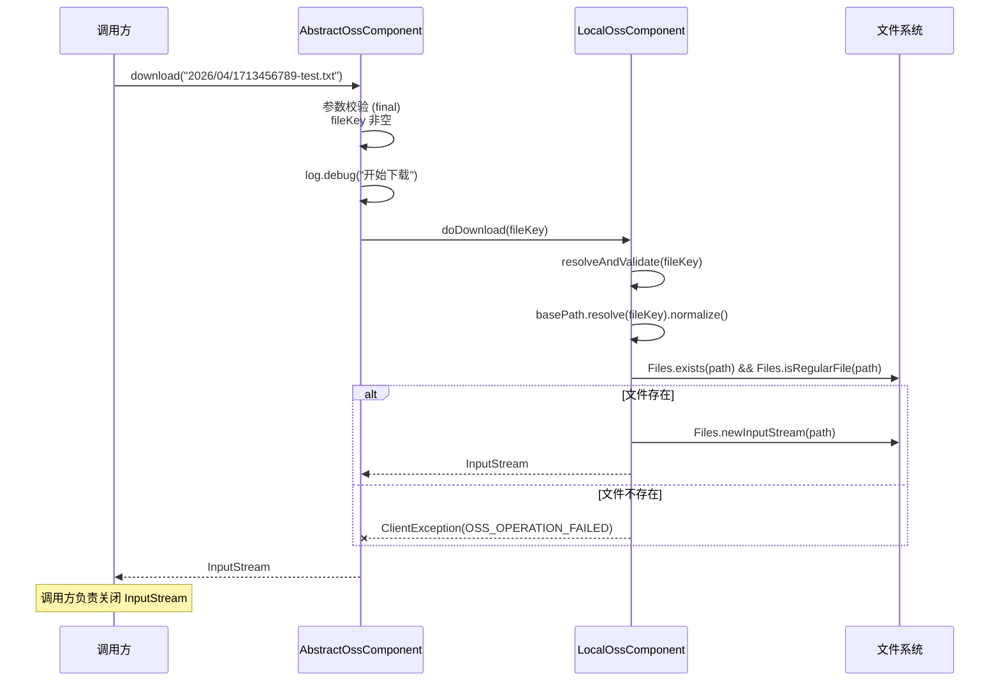
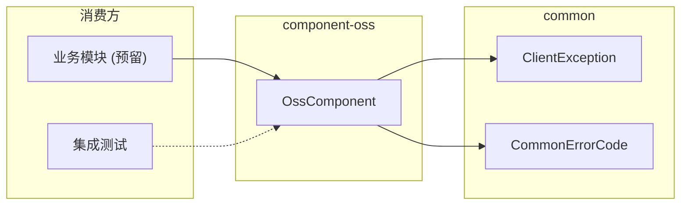

# 对象存储组件 (component-oss)

> **职责**: 描述对象存储组件的 API、流程和配置
> **轨道**: Contract
> **维护者**: AI

---

## 目录

- [概述](#概述)
- [公共 API 参考](#公共-api-参考)
  - [OssComponent 接口](#osscomponent-接口)
  - [AbstractOssComponent 抽象基类](#abstractosscomponent-抽象基类)
  - [LocalOssComponent 实现](#localosscomponent-实现)
- [服务流程](#服务流程)
  - [条件装配流程](#条件装配流程)
  - [文件上传流程](#文件上传流程)
  - [文件下载流程](#文件下载流程)
- [依赖关系](#依赖关系)
  - [上游依赖](#上游依赖)
  - [下游消费方](#下游消费方)
- [核心类型定义](#核心类型定义)
  - [OssUploadRequest](#ossuploadrequest)
  - [OssUploadResult](#ossuploadresult)
  - [FileMetadata](#filemetadata)
- [存储配置](#存储配置)
  - [OssProperties 配置项](#ossproperties-配置项)
  - [异常契约](#异常契约)
- [相关文档](#相关文档)
- [变更历史](#变更历史)

---

## 概述

`component-oss` 是项目的对象存储基础设施组件，位于依赖 DAG 的 **Layer 1（组件层）**，仅依赖 `common` 模块。它定义了 7 个文件操作方法，当前提供基于 Java NIO 的本地文件系统实现，通过 Template Method + Strategy 双模式支持云 OSS 的零侵入替换。

核心特性：
- **7 个文件操作**：upload / download / delete / generateUrl / searchFiles / exists / getFileSize
- **7 个扩展点**：对应每个公开方法的 `do*` 实现
- **日期分层目录**：按 `yyyy/MM` 组织存储文件
- **默认启用**：`component.oss.enabled` 默认为 `true`（matchIfMissing）
- **Record DTO**：使用 Java Record 定义不可变数据载体



---

## 公共 API 参考

### OssComponent 接口

对象存储操作的核心契约，所有业务模块通过此接口与存储组件交互。

```java
package org.smm.archetype.component.oss;

import java.io.InputStream;
import java.util.List;

public interface OssComponent {

    /**
     * 上传文件。
     * @param request 上传请求（fileName 和 inputStream 必填）
     * @return 上传结果（含 fileKey 和 url）
     * @throws ClientException(ILLEGAL_ARGUMENT) 参数非法时
     */
    OssUploadResult upload(OssUploadRequest request);

    /**
     * 下载文件。
     * @param fileKey 文件存储键（必填）
     * @return 文件输入流（调用方负责关闭）
     * @throws ClientException(ILLEGAL_ARGUMENT) fileKey 为空时
     * @throws ClientException(OSS_OPERATION_FAILED) 文件不存在或 IO 异常时
     */
    InputStream download(String fileKey);

    /**
     * 删除文件。
     * @param fileKey 文件存储键（必填）
     * @throws ClientException(ILLEGAL_ARGUMENT) fileKey 为空时
     * @throws ClientException(OSS_OPERATION_FAILED) IO 异常时
     */
    void delete(String fileKey);

    /**
     * 生成文件访问 URL。
     * @param fileKey 文件存储键（必填）
     * @param expireSeconds URL 有效期（秒，必须为正数）
     * @return 文件访问 URL
     * @throws ClientException(ILLEGAL_ARGUMENT) 参数非法时
     * @throws ClientException(OSS_OPERATION_FAILED) IO 异常时
     */
    String generateUrl(String fileKey, long expireSeconds);

    /**
     * 按前缀搜索文件。
     * @param prefix 文件键前缀（可为 null，表示全量搜索）
     * @return 匹配的文件元数据列表
     * @throws ClientException(OSS_OPERATION_FAILED) IO 异常时
     */
    List<FileMetadata> searchFiles(String prefix);

    /**
     * 检查文件是否存在。
     * @param fileKey 文件存储键（必填）
     * @return true 表示文件存在
     * @throws ClientException(ILLEGAL_ARGUMENT) fileKey 为空时
     */
    boolean exists(String fileKey);

    /**
     * 获取文件大小。
     * @param fileKey 文件存储键（必填）
     * @return 文件大小（字节）
     * @throws ClientException(ILLEGAL_ARGUMENT) fileKey 为空时
     * @throws ClientException(OSS_OPERATION_FAILED) 文件不存在或 IO 异常时
     */
    long getFileSize(String fileKey);
}
```

### AbstractOssComponent 抽象基类

Template Method 模式骨架，封装参数校验（`validateFileKey`）、日志记录和异常转换。

**校验规则**：
- `upload`：request != null, fileName 非空, inputStream 非空
- 其他方法：fileKey 非空

**异常转换**：捕获所有 `Exception`，转换为 `ClientException`，使用 `OSS_UPLOAD_FAILED` 或 `OSS_OPERATION_FAILED` 错误码。

### LocalOssComponent 实现

基于 Java NIO 的本地文件系统实现，核心特性：

- **日期分层目录**：`basePath/yyyy/MM/` 结构组织存储文件
- **文件名生成**：`{timestamp}-{originalFileName}`（时间戳防重名）
- **NIO 拷贝**：`Files.copy(inputStream → targetPath, REPLACE_EXISTING)`
- **路径安全**：`basePath` 在构造时转为绝对路径并 normalize
- **MIME 探测**：`Files.probeContentType()` 探测文件类型，失败回退为 `application/octet-stream`

---

## 服务流程

### 条件装配流程



### 文件上传流程



### 文件下载流程



---

## 依赖关系

### 上游依赖

| 依赖 | Scope | 说明 |
|------|-------|------|
| `common` | compile | `ClientException`, `CommonErrorCode` |
| `spring-boot-autoconfigure` | compile | Spring Boot 自动配置支持 |
| `spring-boot-autoconfigure-processor` | optional | 自动配置元数据生成 |
| `spring-boot-configuration-processor` | optional | 配置属性元数据生成 |
| `lombok` | optional | `@Getter`, `@Setter`, `@Slf4j` |

### 下游消费方

| 消费方 | 使用方式 | 说明 |
|--------|---------|------|
| 业务模块（预留） | `@Autowired OssComponent` | 需要文件存储功能的业务代码 |
| `TechClientInterfaceITest` | `getBean(OssComponent.class)` | 集成测试验证 Bean 注册 |



---

## 核心类型定义

### OssUploadRequest

文件上传请求数据载体，Java Record 不可变类型。

```java
public record OssUploadRequest(
    String fileName,        // 原始文件名（必填）
    InputStream inputStream, // 文件输入流（必填）
    long contentLength,     // 文件大小（字节）
    String contentType      // MIME 类型
) {}
```

### OssUploadResult

文件上传结果数据载体，含语义化工厂方法。

```java
public record OssUploadResult(
    boolean success,    // 是否成功
    String fileKey,     // 存储键（如 "2026/04/1713456789-test.txt"）
    String url,         // 访问 URL
    String message      // 结果消息
) {
    public static OssUploadResult success(String fileKey, String url) { ... }
    public static OssUploadResult fail(String message) { ... }
}
```

### FileMetadata

文件元数据，用于搜索结果返回。

```java
public record FileMetadata(
    String fileKey,      // 存储键
    String fileName,     // 文件名
    long fileSize,       // 文件大小（字节）
    String contentType,  // MIME 类型
    String url           // 访问 URL
) {}
```

---

## 存储配置

### OssProperties 配置项

配置前缀：`component.oss`

| 配置项 | 类型 | 默认值 | 说明 |
|--------|------|:------:|------|
| `component.oss.enabled` | `boolean` | `true` | 是否启用 OSS 组件 |
| `component.oss.type` | `String` | `"local"` | 存储类型（预留扩展，如 `aliyun`、`minio`） |
| `component.oss.localStoragePath` | `String` | `"./uploads"` | 本地存储根路径 |

**配置示例**：

```yaml
component:
  oss:
    enabled: true
    type: local
    local-storage-path: /data/uploads
```

### 异常契约

| 场景 | 异常类型 | 错误码 | 说明 |
|------|----------|--------|------|
| request/fileName/inputStream 为 null | `ClientException` | `ILLEGAL_ARGUMENT` | 参数校验失败 |
| fileKey 为 null/空 | `ClientException` | `ILLEGAL_ARGUMENT` | 参数校验失败 |
| expireSeconds 非正数 | `ClientException` | `ILLEGAL_ARGUMENT` | 参数校验失败 |
| 上传 IO 异常 | `ClientException` | `OSS_UPLOAD_FAILED` | 文件写入失败 |
| 下载/删除/URL/搜索 IO 异常 | `ClientException` | `OSS_OPERATION_FAILED` | 文件操作失败 |

---

## 相关文档

| 文档 | 关系 | 说明 |
|------|------|------|
| [component-pattern](component-pattern.md) | 本模式的具体实现之一 | 组件设计模式规范 |
| [component-auth](component-auth.md) | 同层组件 | 共享 Template Method 模式 |
| [component-cache](component-cache.md) | 同层组件 | 共享 Template Method 模式 |
| [component-search](component-search.md) | 同层组件 | 共享 Template Method 模式 |
| [component-messaging](component-messaging.md) | 同层组件 | 共享 Template Method 模式 |

---

## 变更历史

| 版本 | 日期 | 变更内容 |
|------|------|---------|
| 0.0.1-SNAPSHOT | 2026-04-25 | 初始版本：OssComponent 接口（7 方法）、AbstractOssComponent 模板方法、LocalOssComponent（本地文件系统）、OssUploadRequest/Result/FileMetadata DTO、OssProperties、OssAutoConfiguration |
