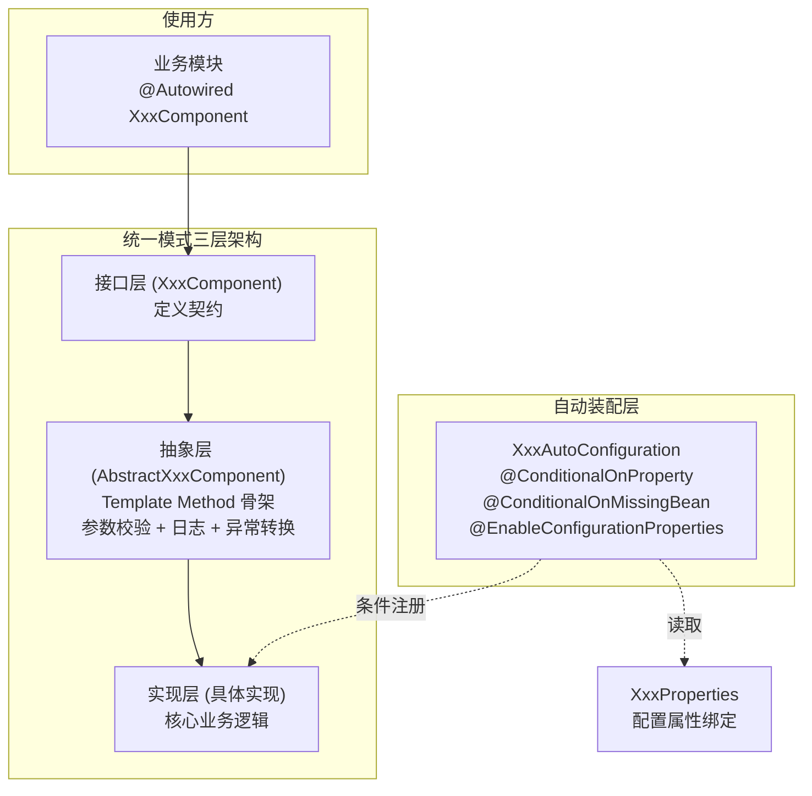
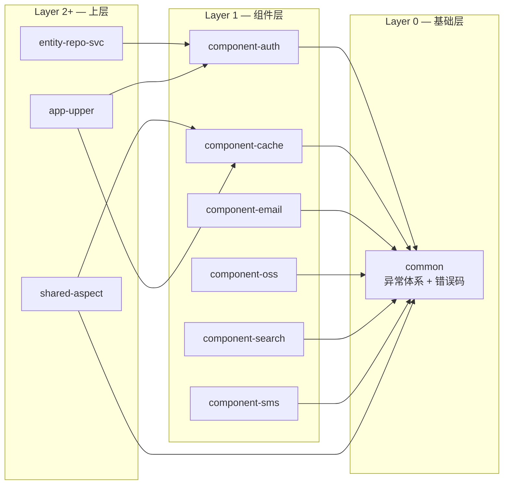

# 组件设计模式

> **职责**: 描述所有组件共享的 Template Method + Strategy 设计模式
> **轨道**: Intent
> **维护者**: Frozen

---

## 目录

- [概述](#概述)
- [设计背景](#设计背景)
- [技术方案](#技术方案)
  - [Template Method 模式](#template-method-模式)
  - [Strategy 模式](#strategy-模式)
  - [AutoConfiguration 条件装配](#autoconfiguration-条件装配)
  - [Null Object 模式](#null-object-模式)
- [关键设计决策](#关键设计决策)
  - [公开方法 final 化](#公开方法-final-化)
  - [异常统一转换策略](#异常统一转换策略)
  - [组件启用策略](#组件启用策略)
  - [跨组件共享 DTO 策略](#跨组件共享-dto-策略)
- [组件模式总览](#组件模式总览)
- [相关文档](#相关文档)

---

## 概述

`web-quick-start-light` 项目的组件层位于依赖 DAG 的 **Layer 1**，包含 6 个独立 Maven 模块。所有组件模块遵循统一的设计模式体系——**Template Method + Strategy + AutoConfiguration**，形成高度一致的架构风格。

这种统一模式的核心价值在于：

1. **零学习成本切换**：熟悉一个组件的使用方式后，即可直接使用其他所有组件
2. **横切关注点集中**：参数校验、日志记录、异常转换统一在抽象基类中处理
3. **扩展零侵入**：新增实现类 + 注册 Bean 即可替换默认实现，业务代码无需修改
4. **安全兜底**：Null Object 模式确保组件在缺少底层依赖时不会导致系统崩溃



---

## 设计背景

### 为什么需要统一的组件模式？

在典型的 Spring Boot 项目中，基础设施组件（认证、缓存、邮件、短信、对象存储、搜索）往往由不同的开发者或在不同时期引入，容易出现以下问题：

| 问题 | 描述 | 本项目解决方案 |
|------|------|---------------|
| **风格不一致** | 不同组件使用不同的异常处理、日志策略 | Template Method 统一封装 |
| **难以替换** | 组件与具体实现强耦合，切换成本高 | Strategy 接口 + 条件装配 |
| **配置混乱** | 缺乏统一的配置命名约定 | `component.{name}.*` 前缀约定 |
| **测试困难** | 组件依赖外部服务，单元测试受阻 | Null Object 模式 + NoOp 实现 |
| **重复代码** | 参数校验、异常转换在每个组件中重复实现 | 抽象基类统一处理 |

### 依赖拓扑定位

组件层在项目依赖拓扑中处于 **Layer 1（基础层之上，共享层之下）**，仅依赖 `common` 模块，被上层 `shared-aspect`、`entity-repo-svc`、`app-upper` 等模块消费：



> **构建并行度**：6 个组件模块之间无相互依赖，可完全并行构建。

---

## 技术方案

### Template Method 模式

Template Method 是所有组件模块的核心骨架模式，由三个层次组成：

| 层次 | 类型 | 职责 |
|------|------|------|
| **接口层** | `XxxComponent` (interface) | 定义面向调用方的公开方法契约 |
| **抽象层** | `AbstractXxxComponent` (abstract class) | `final` 公开方法封装横切逻辑；`protected abstract do*()` 定义扩展点 |
| **实现层** | 具体实现类 | 仅实现 `do*()` 方法，专注核心业务逻辑 |

**统一特征**：

1. **公开方法 `final`**：确保所有调用必须经过参数校验和异常处理，子类无法绕过
2. **扩展点 `protected abstract`**：以 `do` 前缀命名（如 `doLogin`、`doGet`、`doUpload`），清晰区分模板方法和扩展点
3. **横切逻辑三件套**：参数校验 → 日志记录 → 异常转换，在 `final` 方法中按序执行
4. **ClientException 透传**：若子类抛出 `ClientException`，基类不重复包装，直接上抛

```java
// 统一的 Template Method 伪代码
public abstract class AbstractXxxComponent implements XxxComponent {

    @Override
    public final ReturnType publicMethod(Param param) {
        // 1. 参数校验
        validate(param);
        // 2. 日志记录
        log.info("开始操作: {}", param);
        try {
            // 3. 委托子类实现
            ReturnType result = doPublicMethod(param);
            log.info("操作完成");
            return result;
        } catch (ClientException e) {
            // 4. ClientException 直接透传
            throw e;
        } catch (Exception e) {
            // 5. 其他异常统一转换
            log.error("操作失败: {}", param, e);
            throw new ClientException(CommonErrorCode.XXX_FAILED, e);
        }
    }

    protected abstract ReturnType doPublicMethod(Param param);
}
```

### Strategy 模式

每个组件通过接口定义策略抽象，支持运行时替换具体实现：

| 组件 | 策略接口 | 可用实现 |
|------|---------|---------|
| component-auth | `AuthComponent` | `SaTokenAuthComponent`, `NoOpAuthComponent` |
| component-cache | `CacheComponent` | `CaffeineCacheComponent` |
| component-email | `EmailComponent` | `NoOpEmailComponent`（可扩展 SMTP） |
| component-oss | `OssComponent` | `LocalOssComponent`（可扩展 Aliyun/MinIO） |
| component-search | `SearchComponent` | `SimpleSearchComponent`（可扩展 Elasticsearch） |
| component-sms | `SmsComponent` | `NoOpSmsComponent`（可扩展 Aliyun/Tencent） |

**策略切换机制**：通过 Spring Boot 的 `@ConditionalOnMissingBean` 实现，用户自定义 Bean 自动覆盖默认实现：

```java
@Bean
@ConditionalOnMissingBean(XxxComponent.class)
public XxxComponent xxxComponent() {
    return new DefaultXxxComponent();
}
```

### AutoConfiguration 条件装配

所有组件均使用 Spring Boot 3.x 自动配置机制，通过 `META-INF/spring/org.springframework.boot.autoconfigure.AutoConfiguration.imports` 注册。

**条件装配链**：

```
component.{name}.enabled = false  →  不注册任何 Bean
                          ↓ true
classpath 有依赖库  →  功能实现 Bean
                          ↓ 无
                    NoOp Bean（兜底）
                          ↓ 已有自定义 Bean
                    @ConditionalOnMissingBean 跳过
```

| 组件 | 默认 enabled | 条件依赖 | 默认实现 |
|------|:----------:|---------|---------|
| component-auth | `true` (matchIfMissing) | `StpUtil.class` | Sa-Token → `SaTokenAuthComponent`，否则 → `NoOpAuthComponent` |
| component-cache | `true` (matchIfMissing) | `Caffeine.class` | `CaffeineCacheComponent` |
| component-email | `false` | 无 | `NoOpEmailComponent` |
| component-oss | `true` (matchIfMissing) | 无 | `LocalOssComponent` |
| component-search | `true` (matchIfMissing) | 无 | `SimpleSearchComponent` |
| component-sms | `false` | 无 | `NoOpSmsComponent` |

### Null Object 模式

三个组件提供了 NoOp（空操作）实现，作为安全兜底：

| 组件 | 空实现类 | 典型行为 |
|------|---------|---------|
| component-auth | `NoOpAuthComponent` | `isLogin()` 恒返回 `true`，允许所有操作 |
| component-email | `NoOpEmailComponent` | 仅日志记录，返回成功 + UUID messageId |
| component-sms | `NoOpSmsComponent` | 仅日志记录，返回成功 + UUID requestId |

Null Object 模式的价值：
- **开发环境**：无需配置真实外部服务即可正常运行
- **单元测试**：避免 Mock 外部 SDK，NoOp 实现天然适合测试
- **CI/CD**：构建流水线无需依赖外部服务账号

---

## 关键设计决策

### 公开方法 final 化

**决策**：所有抽象基类的公开方法均标记为 `final`。

**理由**：
- 确保参数校验和异常处理逻辑不可被子类绕过
- 模板方法模式的标准实践，明确标识"哪些方法是骨架，哪些是扩展点"
- 编译期即可保证架构约束（而非依赖代码审查）

**权衡**：降低了子类的灵活性，但换来了安全性和一致性。若子类需要自定义横切逻辑，应通过组合而非继承。

### 异常统一转换策略

**决策**：所有组件操作异常统一转换为 `ClientException`，使用 `CommonErrorCode` 中对应的错误码。

**转换规则**：

| 异常类型 | 处理方式 |
|---------|---------|
| `ClientException` | 直接透传，不重复包装 |
| 参数校验失败 | 抛出 `ClientException(ILLEGAL_ARGUMENT)` + 具体描述 |
| 业务异常（如未登录） | 抛出 `BizException(AUTH_UNAUTHORIZED)` 等 |
| 其他所有异常 | 包装为 `ClientException(XXX_OPERATION_FAILED)`，保留原始异常为 cause |

**错误码映射**：

| 组件 | 操作失败错误码 |
|------|---------------|
| component-auth | `AUTH_UNAUTHORIZED (6601)` |
| component-cache | `CACHE_OPERATION_FAILED` |
| component-email | `EMAIL_SEND_FAILED` |
| component-oss | `OSS_UPLOAD_FAILED`, `OSS_OPERATION_FAILED` |
| component-search | `SEARCH_OPERATION_FAILED` |
| component-sms | `SMS_SEND_FAILED` |

### 组件启用策略

**决策**：按组件的"基础设施必要性"分级设定默认启用状态。

| 策略 | 组件 | 默认状态 | 理由 |
|------|------|:-------:|------|
| **默认启用** | auth, cache, oss, search | `true` (matchIfMissing) | 核心功能组件，多数场景需要 |
| **默认关闭** | email, sms | `false` | 外部服务依赖型，需显式开启 |

**配置前缀约定**：所有组件配置统一使用 `component.{name}.*` 前缀，确保命名空间隔离。

### 跨组件共享 DTO 策略

**决策**：`ServiceProvider` 枚举被 Email 和 SMS 两个组件共用，当前放置在各自的 `dto` 包下。

**已知问题**：该枚举定义存在冗余（Email 和 SMS 各自定义了一份相同的 `ServiceProvider`），未来应抽取到 `common` 模块作为共享类型。

---

## 组件模式总览

| 组件 | 接口方法数 | 扩展点数 | 设计模式 | 默认实现 |
|------|:--------:|:-------:|---------|---------|
| component-auth | 5 | 4 | Template + Strategy + Null Object | SaToken / NoOp |
| component-cache | 10 | 8 | Template + Strategy | Caffeine |
| component-email | 3 | 3 | Template + Strategy + Null Object | NoOp |
| component-oss | 7 | 7 | Template + Strategy | Local FS |
| component-search | 15 | 14 | Template + Strategy | Simple (Memory) |
| component-sms | 3 | 3 | Template + Strategy + Null Object | NoOp |

---

## 相关文档

| 文档 | 关系 | 说明 |
|------|------|------|
| [component-auth](component-auth.md) | 本模式的具体实现之一 | 认证组件详细文档 |
| [component-cache](component-cache.md) | 本模式的具体实现之一 | 缓存组件详细文档 |
| [component-oss](component-oss.md) | 本模式的具体实现之一 | 对象存储组件详细文档 |
| [component-search](component-search.md) | 本模式的具体实现之一 | 搜索组件详细文档 |
| [component-messaging](component-messaging.md) | 本模式的具体实现之一 | 邮件与短信组件详细文档 |
