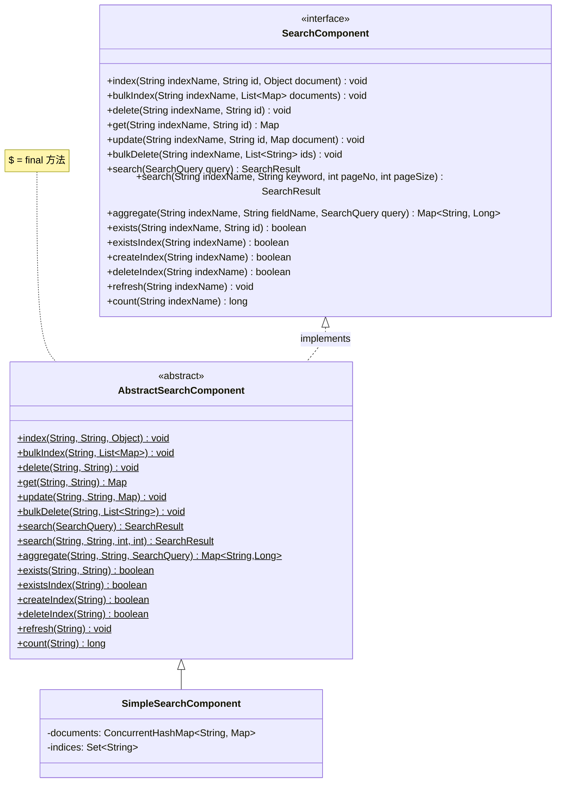
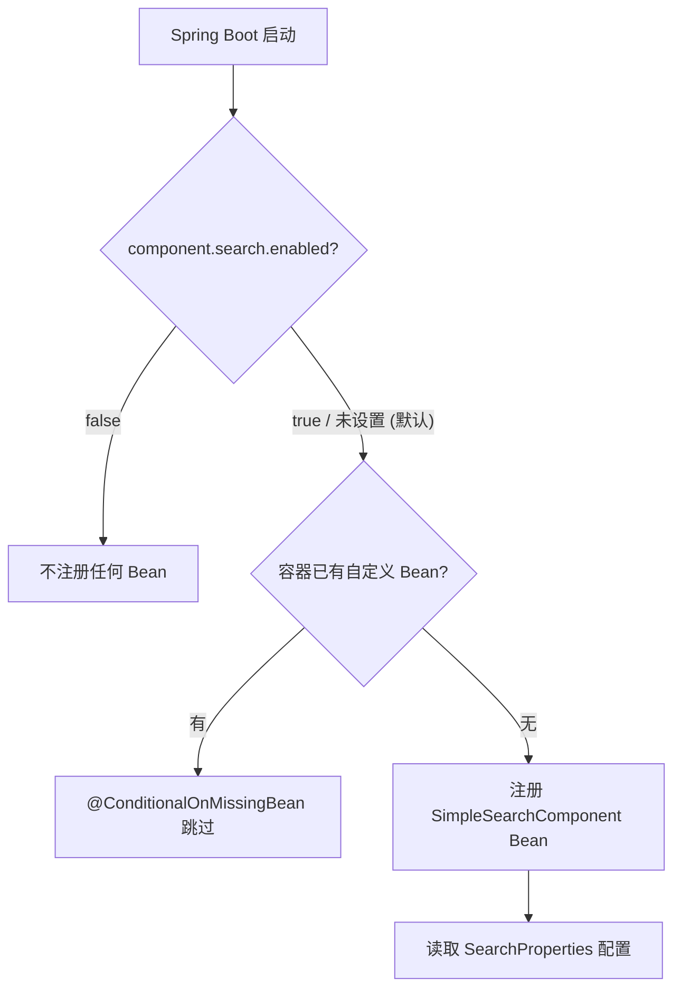
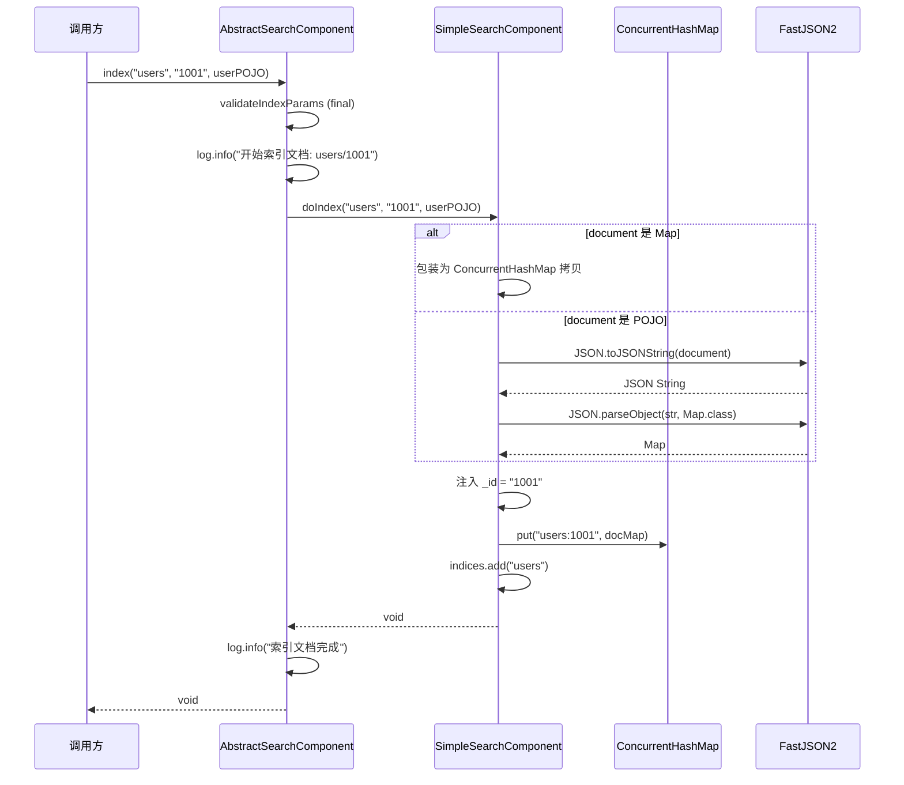
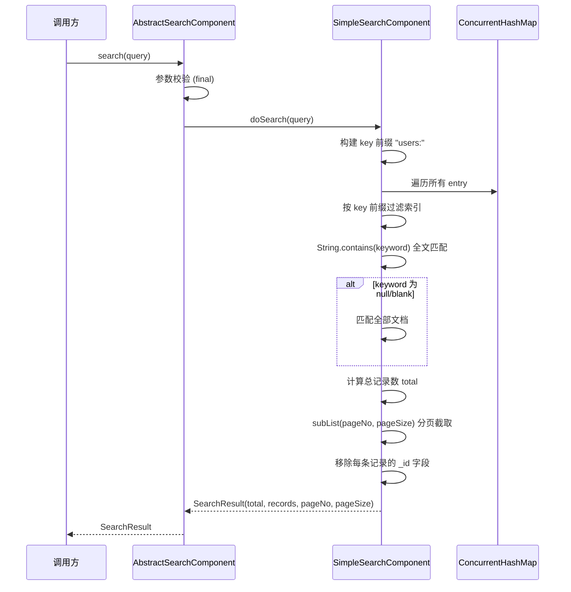
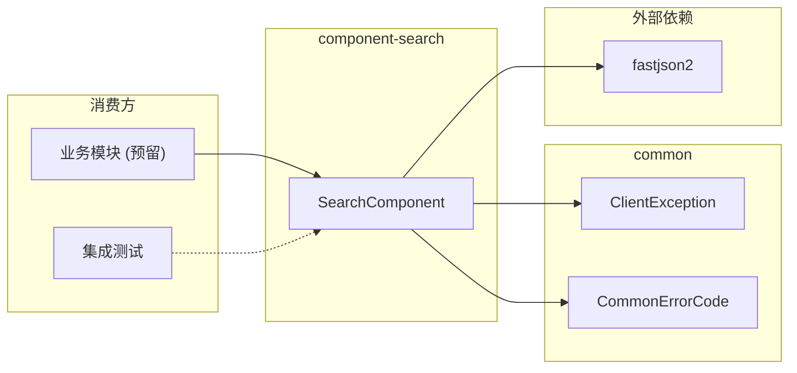

# 搜索组件 (component-search)

> **职责**: 描述搜索组件的 API、流程和配置
> **轨道**: Contract
> **维护者**: AI

---

## 目录

- [概述](#概述)
- [公共 API 参考](#公共-api-参考)
  - [SearchComponent 接口](#searchcomponent-接口)
  - [AbstractSearchComponent 抽象基类](#abstractsearchcomponent-抽象基类)
  - [SimpleSearchComponent 实现](#simplesearchcomponent-实现)
- [服务流程](#服务流程)
  - [条件装配流程](#条件装配流程)
  - [文档索引流程](#文档索引流程)
  - [搜索与聚合流程](#搜索与聚合流程)
- [依赖关系](#依赖关系)
  - [上游依赖](#上游依赖)
  - [下游消费方](#下游消费方)
- [核心类型定义](#核心类型定义)
  - [SearchQuery](#searchquery)
  - [SearchResult](#searchresult)
  - [SearchProperties](#searchproperties)
- [搜索配置](#搜索配置)
  - [配置项](#配置项)
  - [异常契约](#异常契约)
  - [已知约束](#已知约束)
- [相关文档](#相关文档)
- [变更历史](#变更历史)

---

## 概述

`component-search` 是项目的搜索基础设施组件，位于依赖 DAG 的 **Layer 1（组件层）**，仅依赖 `common` 模块和 `fastjson2`。它定义了 15 个搜索操作方法，当前基于 `ConcurrentHashMap` 提供内存搜索引擎实现，通过 Template Method + Strategy 双模式支持外部搜索引擎的零侵入替换。

核心特性：
- **15 个搜索操作**：文档 CRUD（index/bulkIndex/delete/get/update/bulkDelete）、搜索与聚合（search/aggregate）、索引管理（exists/existsIndex/createIndex/deleteIndex/refresh/count）
- **14 个扩展点**：对应每个操作的 `do*` 实现
- **内存搜索**：基于 `ConcurrentHashMap` + `String.contains()` 全文匹配
- **默认启用**：`component.search.enabled` 默认为 `true`（matchIfMissing）
- **POJO 序列化**：通过 fastjson2 自动将 POJO 文档转为 Map 存储



---

## 公共 API 参考

### SearchComponent 接口

搜索组件的核心契约，定义了全部搜索操作方法。

```java
package org.smm.archetype.component.search;

import java.util.List;
import java.util.Map;

public interface SearchComponent {

    // ===== 文档操作 =====

    /**
     * 索引单条文档。
     * @param indexName 索引名称（非空）
     * @param id 文档 ID（非空）
     * @param document 文档内容（Map 或 POJO）
     */
    void index(String indexName, String id, Object document);

    /**
     * 批量索引文档。
     * @param indexName 索引名称
     * @param documents 文档列表（每条文档包含 _id 字段）
     */
    void bulkIndex(String indexName, List<Map<String, Object>> documents);

    /**
     * 删除文档。
     * @param indexName 索引名称
     * @param id 文档 ID
     */
    void delete(String indexName, String id);

    /**
     * 获取文档。
     * @param indexName 索引名称
     * @param id 文档 ID
     * @return 文档内容 Map，不存在返回 null
     */
    Map<String, Object> get(String indexName, String id);

    /**
     * 更新文档。
     * @param indexName 索引名称
     * @param id 文档 ID
     * @param document 更新内容
     */
    void update(String indexName, String id, Map<String, Object> document);

    /**
     * 批量删除文档。
     * @param indexName 索引名称
     * @param ids 文档 ID 列表
     */
    void bulkDelete(String indexName, List<String> ids);

    // ===== 搜索与聚合 =====

    /**
     * 搜索文档。
     * @param query 搜索查询（含关键字、索引、分页参数）
     * @return 搜索结果（含总记录数、当前页记录、分页信息）
     */
    SearchResult search(SearchQuery query);

    /**
     * 便捷搜索方法。
     * @param indexName 索引名称
     * @param keyword 搜索关键字
     * @param pageNo 页码（从 1 开始）
     * @param pageSize 每页大小
     * @return 搜索结果
     */
    SearchResult search(String indexName, String keyword, int pageNo, int pageSize);

    /**
     * 聚合查询。
     * @param indexName 索引名称
     * @param fieldName 聚合字段
     * @param query 搜索查询
     * @return 字段值 → 计数的映射
     */
    Map<String, Long> aggregate(String indexName, String fieldName, SearchQuery query);

    // ===== 索引管理 =====

    /**
     * 判断文档是否存在。
     */
    boolean exists(String indexName, String id);

    /**
     * 判断索引是否存在。
     */
    boolean existsIndex(String indexName);

    /**
     * 创建索引。
     * @return true 表示创建成功
     */
    boolean createIndex(String indexName);

    /**
     * 删除索引。
     * @return true 表示删除成功
     */
    boolean deleteIndex(String indexName);

    /**
     * 刷新索引。
     */
    void refresh(String indexName);

    /**
     * 获取索引文档总数。
     */
    long count(String indexName);
}
```

### AbstractSearchComponent 抽象基类

Template Method 模式骨架，提供三层参数校验：

| 校验方法 | 检查内容 | 应用场景 |
|---------|---------|---------|
| `validateIndexName` | indexName 非空非空白 | 几乎所有方法 |
| `validateIndexNameAndId` | indexName + id 均非空非空白 | get / delete / exists / update |
| `validateIndexParams` | indexName + id + document 均非空 | index |

**异常处理策略**：
- 参数校验失败 → `ClientException(ILLEGAL_ARGUMENT)` + 具体描述
- do*() 执行异常 → `ClientException(SEARCH_OPERATION_FAILED)` + 操作描述，保留原始异常为 cause

### SimpleSearchComponent 实现

基于 `ConcurrentHashMap` 的内存搜索引擎，核心特性：

- **复合键存储**：`"indexName:docId"` 作为单一 Map 的 key，通过前缀过滤实现索引隔离
- **全文匹配**：将文档所有字段值转为字符串，执行 `String.contains(keyword)` 匹配
- **空关键字**：null 或 blank 关键字匹配全部文档
- **内存分页**：先过滤全量结果，再通过 `subList` 截取分页区间
- **POJO 支持**：通过 fastjson2 序列化为 JSON 再反序列化为 Map
- **内部 _id 注入**：索引时自动注入 `_id` 字段，get() 返回时移除该字段

---

## 服务流程

### 条件装配流程



### 文档索引流程



### 搜索与聚合流程



---

## 依赖关系

### 上游依赖

| 依赖 | Scope | 说明 |
|------|-------|------|
| `common` | compile | `ClientException`, `CommonErrorCode` (ILLEGAL_ARGUMENT, SEARCH_OPERATION_FAILED) |
| `com.alibaba.fastjson2:fastjson2` | compile | POJO 文档序列化/反序列化 |
| `spring-boot-autoconfigure-processor` | optional | 自动配置元数据生成 |
| `spring-boot-configuration-processor` | optional | 配置属性元数据生成 |
| `lombok` | optional | `@Getter`, `@Setter`, `@Slf4j` |

### 下游消费方

| 消费方 | 使用方式 | 说明 |
|--------|---------|------|
| 业务模块（预留） | `@Autowired SearchComponent` | 需要搜索功能的业务代码 |
| `TechClientInterfaceITest` | `getBean(SearchComponent.class)` | 集成测试验证 Bean 注册 |



---

## 核心类型定义

### SearchQuery

搜索查询 DTO，Java Record 不可变类型。

```java
public record SearchQuery(
    String keyword,     // 搜索关键字（可为 null/blank，表示匹配全部）
    String indexName,   // 索引名称
    int pageNo,         // 页码（从 1 开始）
    int pageSize        // 每页大小
) {}
```

### SearchResult

搜索结果 DTO，Java Record 不可变类型。

```java
public record SearchResult(
    long total,                     // 匹配总记录数
    List<Map<String, Object>> records,  // 当前页记录
    int pageNo,                     // 当前页码
    int pageSize                    // 每页大小
) {}
```

### SearchProperties

搜索组件配置属性。

```java
@ConfigurationProperties(prefix = "component.search")
public class SearchProperties {
    private int defaultPageSize = 10;   // 默认每页大小
    private int maxPageSize = 100;      // 最大每页大小
}
```

---

## 搜索配置

### 配置项

配置前缀：`component.search`

| 配置项 | 类型 | 默认值 | 说明 |
|--------|------|:------:|------|
| `component.search.enabled` | `boolean` | `true` | 是否启用搜索组件 |
| `component.search.default-page-size` | `int` | `10` | 默认每页大小 |
| `component.search.max-page-size` | `int` | `100` | 最大每页大小 |

**配置示例**：

```yaml
component:
  search:
    enabled: true
    default-page-size: 20
    max-page-size: 200
```

### 异常契约

| 场景 | 异常类型 | 错误码 | 说明 |
|------|----------|--------|------|
| indexName 为 null/blank | `ClientException` | `ILLEGAL_ARGUMENT` | 索引名校验失败 |
| id 为 null/blank | `ClientException` | `ILLEGAL_ARGUMENT` | 文档 ID 校验失败 |
| document 为 null | `ClientException` | `ILLEGAL_ARGUMENT` | 文档内容校验失败 |
| 搜索操作执行异常 | `ClientException` | `SEARCH_OPERATION_FAILED` | do*() 方法执行异常 |

### 已知约束

| 约束 | 说明 | 影响 |
|------|------|------|
| **内存存储** | 基于 ConcurrentHashMap，进程重启后数据丢失 | 仅适用于开发/测试环境 |
| **全文匹配精度** | 使用 `String.contains()` 匹配，不支持分词、同义词、拼音 | 搜索精度有限 |
| **内存分页** | 先过滤全量结果再 subList，大数据量下性能不佳 | 生产环境需替换为 Elasticsearch |
| **聚合 null 值** | null 值统计为 `"null"` 字符串键 | 可能与真实值混淆 |
| **_id 字段** | 内部注入的 `_id` 字段在 get() 时移除，但在搜索结果中可能存在 | 需注意数据一致性 |

---

## 相关文档

| 文档 | 关系 | 说明 |
|------|------|------|
| [component-pattern](component-pattern.md) | 本模式的具体实现之一 | 组件设计模式规范 |
| [component-auth](component-auth.md) | 同层组件 | 共享 Template Method 模式 |
| [component-cache](component-cache.md) | 同层组件 | 共享 Template Method 模式 |
| [component-oss](component-oss.md) | 同层组件 | 共享 Template Method 模式 |
| [component-messaging](component-messaging.md) | 同层组件 | 共享 Template Method 模式 |

---

## 变更历史

| 版本 | 日期 | 变更内容 |
|------|------|---------|
| 0.0.1-SNAPSHOT | 2026-04-25 | 初始版本：SearchComponent 接口（15 方法）、AbstractSearchComponent 模板方法（14 扩展点）、SimpleSearchComponent（ConcurrentHashMap 内存实现）、SearchQuery/SearchResult DTO、SearchProperties、SearchAutoConfiguration |
