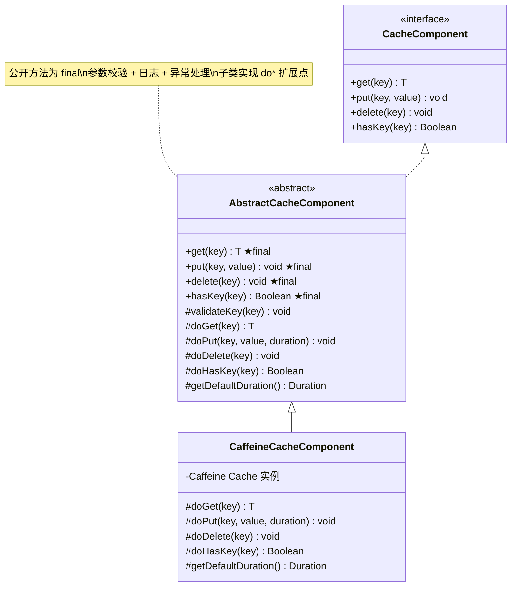
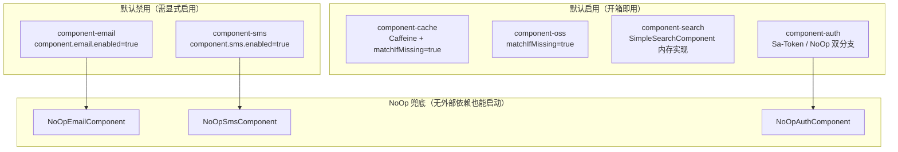

# 设计模式

> 🟢 Contract 轨 — 100% 反映代码现状

## 📋 目录

- [概述](#概述)
- [Template Method 模式](#template-method-模式)
- [条件装配模式](#条件装配模式)
- [代码示例](#代码示例)
- [相关文档](#相关文档)
- [变更历史](#变更历史)

## 概述

项目中使用的两种核心设计模式：**Template Method**（模板方法）和**条件装配**（Conditional Configuration）。Template Method 用于所有技术组件的抽象基类，统一参数校验、日志和异常处理逻辑；条件装配基于 Spring Boot 的 `@AutoConfiguration` 体系，按需加载组件 Bean，部分模块提供 NoOp 默认实现确保无外部依赖时也能正常启动。

## Template Method 模式

### 类图



### 设计思路

**Template Method 模式**的核心思想是将算法的骨架定义在抽象基类中，将可变部分延迟到子类实现：

1. **公开方法为 `final`**：防止子类绕过参数校验和日志记录
2. **`do*` 扩展点**：子类只需关注具体实现逻辑
3. **横切关注点统一处理**：参数校验（`validateKey`）、日志记录（`log.debug`）、异常转换（`ClientException`）在基类完成

```
┌─────────────────────────────────────────┐
│  AbstractXxxComponent（final 公开方法）      │
│                                         │
│  1. 参数校验                              │
│  2. 日志记录                              │
│  3. 调用 do*(子类实现)                     │
│  4. 异常处理 → ClientException            │
└────────────────┬────────────────────────┘
                 │ extends
┌────────────────▼────────────────────────┐
│  ConcreteXxxComponent                      │
│                                         │
│  #doGet(...)     → 具体读取逻辑           │
│  #doPut(...)     → 具体写入逻辑           │
│  #doDelete(...)  → 具体删除逻辑           │
└─────────────────────────────────────────┘
```

### 使用此模式的组件列表

| 组件 | 接口 | 抽象基类 | 实现类 | 方法数 |
|--------|------|---------|--------|--------|
| component-cache | `CacheComponent` | `AbstractCacheComponent` | `CaffeineCacheComponent` | 10 |
| component-oss | `OssComponent` | `AbstractOssComponent` | `LocalOssComponent` | 7 |
| component-email | `EmailComponent` | `AbstractEmailComponent` | `NoOpEmailComponent` | 3 |
| component-sms | `SmsComponent` | `AbstractSmsComponent` | `NoOpSmsComponent` | 3 |
| component-search | `SearchComponent` | `AbstractSearchComponent` | `SimpleSearchComponent` | 15 |
| component-auth | `AuthComponent` | `AbstractAuthComponent` | `SaTokenAuthComponent` / `NoOpAuthComponent` | 5 |

> 注：限流（`shared/aspect/ratelimit`）、幂等（`shared/aspect/idempotent`）和操作日志（`shared/aspect/operationlog`）采用 AOP 切面模式，集成在 app
> 模块的 `shared/` 包下，不使用 Template Method。详见 [模块结构 - app 内部包组织](module-structure.md#app-内部包组织)。

## 条件装配模式

### 机制说明

所有组件模块使用 Spring Boot 的**自动配置**体系实现按需加载：

```
@AutoConfiguration                    ← 声明为自动配置类
@ConditionalOnClass(Xxx.class)        ← classpath 中存在指定类时生效
@ConditionalOnProperty(prefix=..., name="enabled", havingValue="true")
                                      ← 配置属性启用时生效
@EnableConfigurationProperties(...)   ← 绑定配置属性类
```

### 装配策略总览

| 组件 | ConditionalOnClass | ConditionalOnProperty | 默认启用 | NoOp 实现 | 模式 |
|--------|-------------------|----------------------|---------|----------|------|
| component-cache | `Caffeine.class` | `component.cache.enabled` | ✅ | ❌ | Template Method |
| component-oss | - | `component.oss.enabled` | ✅ | ❌ | Template Method |
| component-email | - | `component.email.enabled` | ❌ | ✅ `NoOpEmailComponent` | Template Method |
| component-sms | - | `component.sms.enabled` | ❌ | ✅ `NoOpSmsComponent` | Template Method |
| component-search | - | `component.search.enabled` | ✅ | ✅ `SimpleSearchComponent`（内存） | Template Method |
| component-auth | Bean 级别条件 | `component.auth.enabled` | ✅ | ✅ `NoOpAuthComponent` | Template Method |

> **注意**：`component-log`、`component-ratelimit`、`component-idempotent` 已迁移至 `app/.../shared/aspect/` 下，不再作为独立组件模块，故不在此表中列出。

### 装配策略分类



> **注意**：`component-log`、`component-ratelimit`、`component-idempotent` 已迁移至 `app/.../shared/aspect/` 下，不再作为独立组件模块参与条件装配。

## 代码示例

### Template Method 典型用法

以 `AbstractCacheComponent.get()` 为例，展示 Template Method 的骨架结构：

```java
@Slf4j
public abstract class AbstractCacheComponent implements CacheComponent {

    /**
     * 公开方法 — final 修饰，子类不可覆写。
     * 统一完成：参数校验 → 日志 → 调用子类扩展点 → 异常处理
     */
    @Override
    public final <T> T get(String key) {
        // 1. 参数校验
        validateKey(key);
        // 2. 日志记录
        log.debug("Cache get: key={}", key);
        // 3. 调用子类扩展点
        try {
            return doGet(key);
        } catch (Exception e) {
            // 4. 异常处理 → 统一转换为 ClientException
            log.error("Cache get 异常: key={}", key, e);
            throw new ClientException(CommonErrorCode.CACHE_OPERATION_FAILED,
                    "缓存读取失败: " + key, e);
        }
    }

    // 参数校验（私有方法，所有公开方法共用）
    private void validateKey(String key) {
        if (key == null || key.isEmpty()) {
            throw new ClientException(CommonErrorCode.ILLEGAL_ARGUMENT,
                    "cache key must not be null or empty");
        }
    }

    // 子类扩展点 — 具体缓存读取逻辑
    protected abstract <T> T doGet(String key);
}
```

### 条件装配典型用法

以 `AuthAutoConfiguration` 为例，展示按 classpath 条件分支加载不同实现：

```java
@AutoConfiguration
@EnableConfigurationProperties(AuthProperties.class)
@ConditionalOnProperty(prefix = "component.auth", name = "enabled",
        havingValue = "true", matchIfMissing = true)
public class AuthAutoConfiguration {

    /**
     * Sa-Token 在 classpath 时 → 注册 SaTokenAuthComponent
     */
    @Bean
    @ConditionalOnClass(name = "cn.dev33.satoken.stp.StpUtil")
    @ConditionalOnMissingBean(AuthComponent.class)
    public AuthComponent saTokenAuthComponent() {
        return new SaTokenAuthComponent();
    }

    /**
     * 兜底 → 注册 NoOpAuthComponent（无需任何外部依赖）
     */
    @Bean
    @ConditionalOnMissingBean(AuthComponent.class)
    public AuthComponent noOpAuthComponent() {
        return new NoOpAuthComponent();
    }
}
```

## 设计考量

### Template Method vs Strategy

**驱动力**：技术组件需要统一的校验/日志骨架，同时允许子类定制具体行为。

**备选方案**：

| 方案 | 特点 | 适用场景 |
|------|------|---------|
| Strategy 模式 | 运行时动态切换算法族 | 同一接口有多种可互换的实现，需要运行时决策 |
| Template Method 模式 | 编译期固定的算法骨架 | 行为在编译期确定，子类只需定制局部步骤 |

**选择 Template Method 的理由**：

1. **行为固定**：组件实现在编译期已确定（如 `CaffeineCacheComponent` 不会在运行时变成 `RedisCacheComponent`），不需要运行时切换策略
2. **横切关注点保障**：`final` 公开方法防止子类跳过参数校验和日志记录，保证了横切关注点的完整性
3. **扩展点明确**：`do*` 抽象方法（如 `doGet`、`doPut`、`doDelete`）清晰界定了子类的职责边界，降低了子类犯错的概率
4. **代码集中**：所有子类共用的参数校验、异常转换逻辑集中在抽象基类，避免重复

### 条件装配 vs 工厂模式

**驱动力**：技术组件需要根据 classpath 和配置条件自动装配，不存在对应依赖时不影响启动。

**备选方案**：

| 方案 | 特点 | 适用场景 |
|------|------|---------|
| 工厂模式 | 集中创建对象，手动管理分支 | 对象创建逻辑复杂且不依赖框架 |
| Spring Boot 条件装配 | `@ConditionalOnClass` + `@ConditionalOnProperty` | 与 Spring 生态集成，按 classpath 和配置自动决策 |

**选择条件装配的理由**：

1. **框架原生**：Spring Boot 条件装配是框架原生能力，与 `@AutoConfiguration`、`spring.factories` / `AutoConfiguration.imports` 无缝集成
2. **零侵入**：不需要额外的工厂类或手动 `if-else` 分支，自动配置类本身就是"工厂"
3. **类路径感知**：`@ConditionalOnClass` 能在编译期就感知依赖是否存在，避免 `ClassNotFoundException`
4. **NoOp 兜底**：`@ConditionalOnMissingBean` 保证始终有一个兜底 Bean，应用永远不会因缺少某组件而启动失败

## 相关文档

| 文档 | 说明 |
|------|------|
| [系统全景](system-overview.md) | C4 架构图与技术栈概要 |
| [模块结构](module-structure.md) | Maven 多模块和四层架构 |
| [请求流转](request-lifecycle.md) | HTTP 请求完整处理链路 |
| [线程上下文](thread-context.md) | ScopedValue 上下文传递机制 |

## 变更历史

| 日期 | 变更内容 |
|------|---------|
| 2026-04-14 | 初始创建 |
