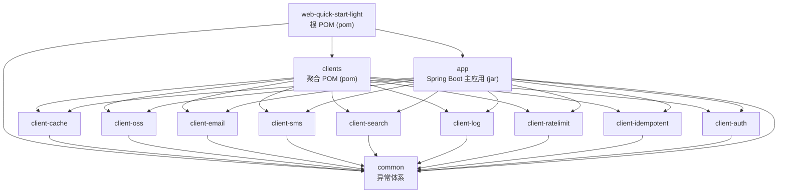
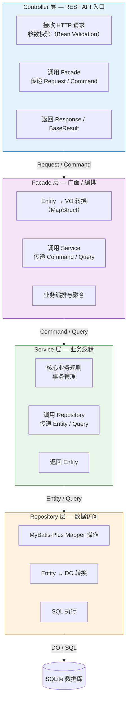

# 模块结构

> 🟢 Contract 轨 — 100% 反映代码现状

## 📋 目录

- [概述](#概述)
- [目录树结构](#目录树结构)
- [Maven 依赖关系图](#maven-依赖关系图)
- [四层架构](#四层架构)
- [层间依赖规则](#层间依赖规则)
- [ArchUnit 守护规则](#archunit-守护规则)
- [相关文档](#相关文档)
- [变更历史](#变更历史)

## 概述

Maven 多模块结构和四层架构说明。项目采用 Maven POM 聚合模式，分为根 POM、common（公共模块）、clients（客户端聚合）、app（主应用）四个层级。app 模块内部遵循 Controller → Facade → Service → Repository 的严格四层架构，层间依赖单向流动，由 ArchUnit 在测试阶段守护约束。

## 目录树结构

```
web-quick-start-light/                     (根 POM, packaging=pom)
├── common/                                (异常体系: ErrorCode, CommonErrorCode, BaseException...)
├── clients/                               (parent POM, packaging=pom)
│   ├── client-cache/                      (Caffeine 本地缓存, 10 方法, Template Method)
│   ├── client-oss/                        (本地对象存储, NIO + 日期分层, 7 方法, Template Method)
│   ├── client-email/                      (Jakarta Mail 邮件, 3 方法, NoOp 默认实现, 条件装配)
│   ├── client-sms/                        (短信, 3 方法, NoOp 默认实现, 条件装配)
│   ├── client-search/                     (内存搜索, ConcurrentHashMap, 15 方法, 条件装配)
│   ├── client-log/                        (日志客户端, @BusinessLog 注解, LogAspect 切面, 条件装配)
│   ├── client-ratelimit/                  (限流客户端, @RateLimit 注解, Bucket4j, 条件装配)
│   ├── client-idempotent/                 (幂等客户端, @Idempotent 注解, Caffeine, 条件装配)
│   └── client-auth/                       (认证客户端, Sa-Token/NoOp, Template Method, 条件装配)
└── app/                                   (主应用, packaging=jar, 依赖 common + 所有 client-*)
```

## Maven 依赖关系图



> 箭头表示 `depends on`（A → B 表示 A 的 pom.xml 中声明了对 B 的依赖）。所有 client-* 模块仅依赖 common，不互相依赖。

## 四层架构

app 模块内部采用严格的四层架构，依赖方向单向向下流动：



### 各层职责

| 层级 | 包路径 | 职责 | 数据形态 |
|------|--------|------|---------|
| Controller | `controller` | 接收 HTTP 请求、参数校验、调用 Facade | Request → Command |
| Facade | `facade` | Entity→VO 转换、业务编排、聚合多个 Service | Command → Entity → VO |
| Service | `service` | 核心业务逻辑、事务管理 | Command → Entity |
| Repository | `repository` | 数据访问、MyBatis-Plus Mapper、Entity↔DO 转换 | Entity → DO |

## 层间依赖规则

### 允许的依赖

| 依赖关系 | 说明 |
|---------|------|
| Controller → Facade | 通过门面层隔离 API 与业务逻辑 |
| Facade → Service | 门面层调用服务层获取业务数据 |
| Service → Repository | 服务层调用仓储层访问数据 |
| Facade 可转换 Entity → VO | MapStruct 编译期安全转换 |
| Repository 可转换 DO → Entity | 数据对象与业务对象转换 |

### 禁止的依赖

| 禁止关系 | 原因 | ArchUnit 规则 |
|---------|------|--------------|
| Controller → Repository | 跳过 Facade/Service 层 | `controllerShouldOnlyDependOnServiceLayer` |
| Controller → Service | 跨层调用（Login 除外） | `controllerShouldNotDependOnServiceDirectly` |
| Facade → Repository | 跳过 Service 层 | `facadeShouldNotDependOnRepository` |
| Service → Controller | 依赖倒置 | `serviceShouldNotDependOnControllerLayer` |
| Repository → Service / Controller | 依赖倒置 | `repositoryShouldNotDependOnServiceOrControllerLayer` |
| Entity → Spring Framework | 领域模型纯净性 | `entityShouldNotDependOnSpringFramework` |

## ArchUnit 守护规则

项目通过 `ArchitectureComplianceUTest`（继承 `UnitTestBase`）在每次构建时自动验证四层架构约束：

| 规则方法 | 守护的约束 | 说明 |
|---------|-----------|------|
| `controllerShouldOnlyDependOnServiceLayer` | Controller 禁止依赖 `..repository.mapper..` | 防止直接操作 Mapper |
| `controllerShouldNotDependOnServiceDirectly` | Controller 禁止依赖 `..service..`（Login 除外） | 强制通过 Facade 中转 |
| `facadeShouldNotDependOnRepository` | Facade 禁止依赖 `..repository..` | 防止跳过 Service 层 |
| `serviceShouldNotDependOnControllerLayer` | Service 禁止依赖 `..controller..` | 防止依赖倒置 |
| `repositoryShouldNotDependOnServiceOrControllerLayer` | Repository 禁止依赖 `..service..` 和 `..controller..` | 保持数据层独立 |
| `entityShouldNotDependOnSpringFramework` | Entity 禁止依赖 `org.springframework..` | 保持领域模型纯净 |

> 测试文件：`app/src/test/java/org/smm/archetype/support/basic/ArchitectureComplianceUTest.java`

## 设计考量

### 为什么选择多模块而非单模块

**驱动力**：骨架项目需要在保持轻量级的同时，提供清晰的模块边界和独立的依赖管理。

**备选方案**：

| 方案 | 优点 | 缺点 |
|------|------|------|
| 单模块 | 结构简单，IDE 导入快 | 所有代码耦合在一起，无法独立复用客户端模块；修改一个客户端可能导致全量重新编译 |
| 多模块（当前选择） | 模块间物理隔离，客户端可独立引用；Maven 依赖传递清晰 | IDE 导入略慢；需要维护 parent POM 依赖版本 |

**选择多模块的理由**：

1. **客户端可独立复用**：其他项目可以只引入 `client-cache` 而不引入整个骨架，Maven 依赖传递自动处理
2. **编译隔离**：修改 `client-sms` 不会触发 `app` 模块重新编译，提升开发效率
3. **依赖范围控制**：`common` 模块不依赖 Spring，确保异常体系等基础能力可以在任何环境下使用
4. **团队协作友好**：不同开发者可以独立修改不同客户端模块，减少合并冲突

### 为什么 common 模块不依赖 Spring Framework

**驱动力**：`common` 模块承载异常体系（`ErrorCode`、`BaseException`、`BizException` 等），属于纯粹的 Java 领域抽象，不应与特定框架绑定。

**设计理由**：

1. **框架无关性**：异常类在任何 Java 环境下都可用，包括非 Spring 环境（如消息消费者、定时任务脚本）
2. **依赖方向正确**：`common` 是最底层模块，如果它依赖 Spring，会导致所有上层模块被迫接受 Spring 的传递依赖
3. **Entity 纯净性**：ArchUnit 守护 `Entity → Spring Framework` 的禁止依赖规则，确保领域模型不与框架耦合
4. **测试简单**：`common` 模块的单元测试不需要 Spring 上下文，执行速度更快

## 相关文档

| 文档 | 说明 |
|------|------|
| [系统全景](system-overview.md) | C4 架构图与技术栈概要 |
| [请求流转](request-lifecycle.md) | HTTP 请求完整处理链路 |
| [设计模式](design-patterns.md) | Template Method 与条件装配 |
| [Java 编码规范](../conventions/java-conventions.md) | 四层架构约束与编码规范 |

## 变更历史

| 日期 | 变更内容 |
|------|---------|
| 2026-04-14 | 初始创建 |
