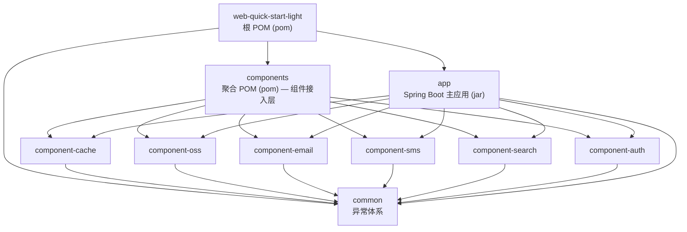
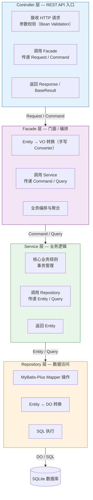

# 模块结构

> 🟢 Contract 轨 — 100% 反映代码现状

## 📋 目录

- [概述](#概述)
- [目录树结构](#目录树结构)
- [Maven 依赖关系图](#maven-依赖关系图)
- [四层架构](#四层架构)
- [层间依赖规则](#层间依赖规则)
- [ArchUnit 守护规则](#archunit-守护规则)
- [Domain Event 架构](#domain-event-架构)
- [设计考量](#设计考量)
- [相关文档](#相关文档)
- [变更历史](#变更历史)

## 概述

Maven 多模块结构和四层架构说明。项目采用 Maven POM 聚合模式，分为根 POM、common（公共模块）、components（组件聚合）、app（主应用）四个层级。app 模块内部遵循 Controller → Facade → Service → Repository 的严格四层架构，层间依赖单向流动，由 ArchUnit 在测试阶段守护约束。

## 目录树结构

```
web-quick-start-light/                     (根 POM, packaging=pom)
├── common/                                (异常体系: ErrorCode, CommonErrorCode, BaseException...)
├── components/                               (parent POM, packaging=pom — 组件接入层)
│   ├── component-cache/                      (Caffeine 本地缓存, 10 方法, Template Method)
│   ├── component-oss/                        (本地对象存储, NIO + 日期分层, 7 方法, Template Method)
│   ├── component-email/                      (Jakarta Mail 邮件, 3 方法, NoOp 默认实现, 条件装配)
│   ├── component-sms/                        (短信, 3 方法, NoOp 默认实现, 条件装配)
│   ├── component-search/                     (内存搜索, ConcurrentHashMap, 15 方法, 条件装配)
│   └── component-auth/                       (认证组件, Sa-Token/NoOp, Template Method, 条件装配)
└── app/                                   (主应用, packaging=jar, 依赖 common + 组件 component-*)
    └── shared/                            (跨层共享基础设施: 限流/幂等/操作日志/日志工具)
```

## Maven 依赖关系图


```mermaid
graph TD
    ROOT["web-quick-start-light<br/>根 POM (pom)"]
    COMMON["common<br/>异常体系"]
    COMPONENTS["components<br/>聚合 POM (pom) — 组件接入层"]
    APP["app<br/>Spring Boot 主应用 (jar)"]

    ROOT --> COMMON
    ROOT --> COMPONENTS
    ROOT --> APP

    COMPONENTS --> CACHE["component-cache"]
    COMPONENTS --> OSS["component-oss"]
    COMPONENTS --> EMAIL["component-email"]
    COMPONENTS --> SMS["component-sms"]
    COMPONENTS --> SEARCH["component-search"]
    COMPONENTS --> AUTH["component-auth"]

    CACHE --> COMMON
    OSS --> COMMON
    EMAIL --> COMMON
    SMS --> COMMON
    SEARCH --> COMMON
    AUTH --> COMMON

    APP --> COMMON
    APP --> CACHE
    APP --> OSS
    APP --> EMAIL
    APP --> SMS
    APP --> SEARCH
    APP --> AUTH
```

> 箭头表示 `depends on`（A → B 表示 A 的 pom.xml 中声明了对 B 的依赖）。所有 component-* 模块仅依赖 common，不互相依赖。components 模块只包含组件接入（Template
> Method 模式），应用层横切关注点（限流/幂等/操作日志/日志基础设施）集成在 app 模块的 `shared/` 包下。

## 四层架构

app 模块内部采用严格的四层架构，依赖方向单向向下流动：


```mermaid
flowchart TD
    subgraph Controller["Controller 层 — REST API 入口"]
        C1["接收 HTTP 请求<br/>参数校验（Bean Validation）"]
        C2["调用 Facade<br/>传递 Request / Command"]
        C3["返回 Response / BaseResult"]
    end

    subgraph Facade["Facade 层 — 门面 / 编排"]
        F1["Entity → VO 转换（手写 Converter）"]
        F2["调用 Service<br/>传递 Command / Query"]
        F3["业务编排与聚合"]
    end

    subgraph Service["Service 层 — 业务逻辑"]
        S1["核心业务规则<br/>事务管理"]
        S2["调用 Repository<br/>传递 Entity / Query"]
        S3["返回 Entity"]
    end

    subgraph Repository["Repository 层 — 数据访问"]
        R1["MyBatis-Plus Mapper 操作"]
        R2["Entity ↔ DO 转换"]
        R3["SQL 执行"]
    end

    DB[("SQLite 数据库")]

    Controller -->|Request / Command| Facade
    Facade -->|Command / Query| Service
    Service -->|Entity / Query| Repository
    Repository -->|DO / SQL| DB

    style Controller fill:#e3f2fd,stroke:#1976d2
    style Facade fill:#f3e5f5,stroke:#7b1fa2
    style Service fill:#e8f5e9,stroke:#388e3c
    style Repository fill:#fff3e0,stroke:#f57c00
```

### 各层职责

| 层级 | 包路径 | 职责 | 数据形态 |
|------|--------|------|---------|
| Controller | `controller` | 接收 HTTP 请求、参数校验、调用 Facade | Request → Command |
| Facade | `facade` | Entity→VO 转换、业务编排、聚合多个 Service | Command → Entity → VO |
| Service | `service` | 核心业务逻辑、事务管理 | Command → Entity |
| Repository | `repository` | 数据访问、MyBatis-Plus Mapper、Entity↔DO 转换 | Entity → DO |

### app 内部包组织

app 模块内部只有业务模块和 shared 两个顶层概念。

```
org.smm.archetype/
│
│  ═══ 业务模块（Spring Modulith 模式：根包 Facade + Event + internal/ 实现）═══
│
├── auth/                           ← 认证模块
│   ├── AuthFacade.java             ← 公开 API（接口）
│   ├── UserLoggedInEvent.java      ← 领域事件 record（实现 DomainEvent）
│   └── internal/
│       ├── AuthFacadeImpl.java
│       ├── ConfigChangedEventHandler.java  ← 事件消费方（@EventListener 同步）
│       ├── User.java               ← 领域模型
│       ├── UserRepository.java
│       ├── LoginController.java
│       ├── LoginRequest.java
│       ├── LoginVO.java
│       └── infrastructure/         ← 基础设施层（Phase 6 两层分包）
│           ├── UserDO.java
│           ├── UserMapper.java
│           ├── UserRepositoryImpl.java
│           └── UserConverter.java  ← MapStruct @Mapper(config=CentralMapperConfig)
├── operationlog/                   ← 操作日志模块
│   ├── OperationLogFacade.java
│   └── internal/
│       ├── OperationLogFacadeImpl.java
│       ├── OperationLog.java       ← 领域模型
│       ├── OperationLogService.java
│       ├── OperationLogRepository.java
│       ├── OperationLogController.java
│       ├── OperationLogPageQuery.java
│       ├── OperationLogVO.java
│       ├── UserLoggedInEventHandler.java  ← 事件消费方（@ApplicationModuleListener 异步）
│       └── infrastructure/
│           ├── OperationLogDO.java
│           ├── OperationLogMapper.java
│           ├── OperationLogRepositoryImpl.java
│           └── OperationLogConverter.java
├── systemconfig/                   ← 系统配置模块
│   ├── SystemConfigFacade.java     ← 公开 API（接口）
│   ├── ConfigChangedEvent.java     ← 领域事件 record（实现 DomainEvent）
│   └── internal/
│       ├── SystemConfigFacadeImpl.java
│       ├── SystemConfig.java       ← 领域模型
│       ├── SystemConfigService.java
│       ├── SystemConfigRepository.java
│       ├── SystemConfigController.java
│       ├── ConfigGroup.java / ConfigKey.java / ConfigValue.java  ← 值对象
│       ├── DisplayName.java / InputType.java / ValueType.java
│       ├── SystemConfigPageQuery.java / UpdateConfigCommand.java
│       ├── SystemConfigVO.java / ConfigGroupVO.java / UpdateConfigRequest.java
│       └── infrastructure/
│           ├── SystemConfigDO.java
│           ├── SystemConfigMapper.java
│           ├── SystemConfigRepositoryImpl.java
│           └── SystemConfigConverter.java
│
│  ═══ 公共基础设施（按功能域自包含）═══
│
├── shared/                         ← 公共基础设施
│   ├── CentralMapperConfig.java    ← MapStruct 全局配置（@MapperConfig）
│   ├── event/                      ← Domain Event 基础设施
│   ├── ratelimit/                  ← 限流（注解 + 切面 + 配置 + 属性）
│   ├── idempotent/                 ← 幂等（注解 + 切面 + Key 解析 + 配置）
│   ├── logging/                    ← 日志（配置 + 属性 + 过滤器 + 拦截器 + 工具）
│   ├── operationlog/               ← 操作日志切面（注解在 common 模块）
│   ├── context/                    ← 业务上下文（BizContext）
│   ├── dal/                        ← 数据访问基础设施（BaseDO + TypeHandler + MetaObjectHandler）
│   ├── generated/                  ← 代码生成器
│   ├── mybatis/                    ← MyBatis-Plus 配置
│   ├── threadpool/                 ← 线程池配置
│   ├── web/                        ← Web 层基础设施（配置 + 过滤器 + 异常处理 + 测试端点）
│   ├── pagination/                 ← 分页模型
│   ├── result/                     ← 响应模型
│   └── util/                       ← 序列化 + Spring 工具
│
└── WebStartLightApplication.java
```

#### 分包原则

| 区域     | 组织方式                           | 说明                             |
|--------|--------------------------------|--------------------------------|
| 业务模块   | Spring Modulith 模式（根包 Facade + internal/） | 模块间通过 Facade 接口通信，internal/ 不跨模块访问 |
| 公共基础设施 | 按功能域自包含                        | 每个功能域包含注解+切面+配置+属性，零跨包依赖       |

#### shared 层定位

`shared` 放置被多个业务模块共享使用的横切关注点和基础设施。每个功能域是自包含的独立包：

| 功能域 | 职责 | 包含内容 |
|------|------|------|
| `shared/CentralMapperConfig.java` | MapStruct 全局配置 | @MapperConfig(componentModel=SPRING, unmappedTargetPolicy=ERROR) |
| `shared/event/` | Domain Event 基础设施 | DomainEvent 接口 + DomainEventPublisher 接口 + SpringDomainEventPublisher 适配器 |
| `shared/ratelimit/` | 限流 | @RateLimit + RateLimitAspect + BucketFactory + SpelKeyResolver + LimitFallback + RatelimitConfigure + RateLimitProperties |
| `shared/idempotent/` | 幂等 | @Idempotent + IdempotentAspect + IdempotentKeyResolver + IdempotentConfigure |
| `shared/logging/` | 日志 | LoggingConfigure + LoggingProperties + SamplingTurboFilter + SlowQueryInterceptor + LogMarkers + SensitiveLogUtils |
| `shared/operationlog/` | 操作日志 | LogAspect（@BusinessLog 注解在 common 模块） |
| `shared/context/` | 上下文传播 | BizContext（基于 ScopedValue） |
| `shared/dal/` | 数据访问基础设施 | BaseDO + InstantTypeHandler + MyMetaObjectHandler |
| `shared/generated/` | 代码生成器 | MybatisPlusGenerator（跨模块工具，通过 --module 参数输出） |
| `shared/mybatis/` | MyBatis-Plus 配置 | MybatisPlusConfigure |
| `shared/threadpool/` | 线程池配置 | ThreadPoolConfigure + ThreadPoolProperties |
| `shared/web/` | Web 基础设施 | WebConfigure + ContextFillFilter + WebExceptionAdvise + TestController + AppInfoProperties + IpUtils |
| `shared/pagination/` | 分页模型 | PageQuery + PageResult |
| `shared/result/` | 响应模型 | BaseResult + BasePageResult |
| `shared/util/` | 序列化/Spring 工具 | KryoSerializer + SpringContextUtils |

> **注意**：每个功能域是自包含的——限流的所有组件都在 `shared/ratelimit/` 下，日志的所有组件都在 `shared/logging/` 下。不需要跨功能域包引用。

#### Configure 类规范

| 类型 | 位置 | 示例 |
|------|------|------|
| 公共基础设施配置 | shared 对应功能域包 | `shared/ratelimit/RatelimitConfigure.java`、`shared/logging/LoggingConfigure.java`、`shared/event/SpringDomainEventPublisher.java` |

> **Phase 6 变更**：模块专属 Configure 类（如 `AuthConfigure`）已移除。MapStruct Converter 通过 `@Mapper(config = CentralMapperConfig.class)` 自动注册为 Spring Bean，无需手动配置。

## 层间依赖规则

### 允许的依赖

| 依赖关系 | 说明 |
|---------|------|
| Controller → Facade | 通过门面层隔离 API 与业务逻辑 |
| Facade → Service | 门面层调用服务层获取业务数据 |
| Service → Repository | 服务层调用仓储层访问数据 |
| Facade 可转换 Entity → VO | MapStruct Converter 转换（@Mapper(config = CentralMapperConfig.class)） |
| Repository 可转换 DO → Entity | MapStruct Converter 转换（infrastructure/ 下） |

### 禁止的依赖

| 禁止关系 | 原因 | ArchUnit 规则 |
|---------|------|--------------|
| Controller → Repository | 跳过 Facade/Service 层 | `controllerShouldOnlyDependOnServiceLayer` |
| Controller → Service | 跨层调用（Login 除外） | `controllerShouldNotDependOnServiceDirectly` |
| Facade → Repository | 跳过 Service 层 | `facadeShouldNotDependOnRepository` |
| Service → Controller | 依赖倒置 | `serviceShouldNotDependOnControllerLayer` |
| Repository → Service / Controller | 依赖倒置 | `repositoryShouldNotDependOnServiceOrControllerLayer` |
| Entity → Spring Framework | 领域模型纯净性 | `entityShouldNotDependOnSpringFramework` |

## ArchUnit 守护规则

项目通过 ArchUnit + SourceScanner 在每次构建时自动验证架构约束。测试文件位于 `app/src/test/java/org/smm/archetype/support/basic/` 下。

### 编码规范（CodingConventionComplianceUTest）

| 规则 ID | 规则方法 | 守护的约束 | 说明 |
|---------|---------|-----------|------|
| C-01 | — | entity/repository 包禁止 LocalDateTime 和 java.util.Date | 时间字段统一使用 `Instant` |
| C-02 | — | 禁止 JPA/Hibernate 注解 | ORM 仅用 MyBatis-Plus，禁止 `@Entity`/`@Table`/`@Column` 等 |
| C-03 | — | 禁止 `BeanUtils.copyProperties` | 对象转换用 MapStruct 或手写 Converter |
| C-04 | — | 禁止 `System.out`/`System.err` | 日志用 SLF4J（`@Slf4j`），排除 `generated` 包 |
| C-05 | — | 禁止 Lombok `@With` | 用 `@Builder` 的 `withXxx()` 代替 |
| C-06 | — | facade 包下 VO/DTO 必须用 record | 见"Record 规范" |
| C-07 | — | Properties/Configure 类禁止 `@Data` | 用 `@Getter` + `@Setter` |
| C-08 | — | 禁止 @Autowired 字段注入 | 使用构造器注入 + @RequiredArgsConstructor |
| C-09 | — | 禁止抛出泛型异常 | 必须使用 BizException/ClientException/SysException + ErrorCode |
| C-10 | — | Controller 返回值必须 BaseResult/BasePageResult | 统一响应包装 |
| C-11 | — | 非 DO 类禁止 MyBatis-Plus 持久化注解 | 仅 DO（infrastructure/）可使用 @TableName/@TableId 等 |
| C-12 | — | 禁止 java.util.logging | 统一使用 SLF4J (@Slf4j) |
| C-13 | — | 禁止使用 @Deprecated API | 避免使用已废弃 API |
| C-14 | — | @Service 类字段必须 final | 确保使用构造器注入 |
| C-15 | — | Utility 类方法必须 static | 防止工具类被实例化 |
| C-16 | — | Logger 字段必须是 private static final | SLF4J Logger 规范 |

### 模块架构（ModuleArchitectureComplianceUTest）

| 规则 ID | 规则方法 | 守护的约束 | 说明 |
|---------|---------|-----------|------|
| M-01 | — | exception 包零 Spring 依赖 | common 模块不依赖 Spring Framework |
| M-02 | — | 组件模块间零互相依赖 | component 下各子模块互不引用 |
| M-03 | — | Facade 方法不得返回内部 Entity | public 方法返回类型不得在 `.entity.` 包下 |
| M-04 | — | Controller 路径前缀必须符合规范 | API Controller 以 `/api` 起始，Web Controller 以 `/web` 起始 |
| M-05 | — | 模块 internal/ 包零 Spring 依赖 | Controller/Service/Converter/RepositoryImpl/FacadeImpl/Configure/ITest/ETest 除外，infrastructure/ 子包除外 |
| M-06 | — | Repository 接口方法签名不得出现 MyBatis-Plus 类型 | 接口框架无关 |
| M-07 | — | 模块间不得直接访问其他模块的 internal/ 包 | 模块边界隔离 |
| M-08 | — | Facade 接口不得依赖 MyBatis-Plus 类型 | 公开 API 框架无关 |
| M-09 | — | 业务模块间通过根包 Facade 接口通信 | 模块间解耦 |
| M-10 | — | 业务模块间零循环依赖 | slices 独立检测 |

### Spring 配置（SpringConfigComplianceUTest）

| 规则 ID | 规则方法 | 守护的约束 | 说明 |
|---------|---------|-----------|------|
| S-01 | — | 组件 Properties 前缀以 `component.` 开头 | `@ConfigurationProperties(prefix = "component.xxx")` |

### shared/ 功能域隔离（SharedIsolationUTest）

| 规则 ID | 规则方法 | 守护的约束 | 说明 |
|---------|---------|-----------|------|
| S-02 | `shared_bottom_packages_should_not_depend_on_each_other` | 底层包之间零互相依赖 | 底层 8 包（context/event/idempotent/logging/operationlog/pagination/ratelimit/util）互不 import |
| S-02 | `shared_bottom_packages_should_not_depend_on_top_packages` | 底层包不得依赖上层包 | 底层不依赖上层（dal/generated/mybatis/result/threadpool/web） |
| S-02 | `all_shared_subpackages_should_be_classified` | 所有 shared/ 子包必须被分类 | 防止新增功能域被静默忽略（排除 internal） |

### 测试规范（TestConventionComplianceUTest）

| 规则 ID | 规则方法 | 守护的约束 | 说明 |
|---------|---------|-----------|------|
| T-01 | — | 含 `@Test` 的文件必须以 UTest.java 或 ITest.java 结尾 | 排除测试基础设施类 |
| T-02 | — | UTest 禁止 `@SpringBootTest` | 纯单元测试不启动 Spring 上下文 |
| T-03 | — | ITest 禁止 `@Mock` | 集成测试使用真实依赖 |
| T-05 | — | ETest 禁止 `@Mock` | 端到端测试使用真实依赖 |
| T-06 | — | 测试类禁止 Thread.sleep | 使用 Awaitility 或 CountDownLatch |

### 四层架构（ArchitectureComplianceUTest）

| 规则方法 | 守护的约束 | 说明 |
|---------|-----------|------|
| `controllerShouldOnlyDependOnServiceLayer` | Controller 禁止依赖 `..repository.mapper..` | 防止直接操作 Mapper |
| `controllerShouldNotDependOnServiceDirectly` | Controller 禁止依赖 `..service..`（Login 除外） | 强制通过 Facade 中转 |
| `facadeShouldNotDependOnRepository` | Facade 禁止依赖 `..repository..` | 防止跳过 Service 层 |
| `serviceShouldNotDependOnControllerLayer` | Service 禁止依赖 `..controller..` | 防止依赖倒置 |
| `repositoryShouldNotDependOnServiceOrControllerLayer` | Repository 禁止依赖 `..service..` 和 `..controller..` | 保持数据层独立 |
| `entityShouldNotDependOnSpringFramework` | Entity 禁止依赖 `org.springframework..` | 保持领域模型纯净 |

### 全局禁止规则

| 测试文件 | 守护的约束 | 说明 |
|---------|-----------|------|
| `NoDataAnnotationUTest` | 全项目禁止 `@Data` | 使用 `@Builder` + `@RequiredArgsConstructor` |
| `NoValueInjectionUTest` | 禁止 `@Value` 注入 | 使用 `@ConfigurationProperties` |
| `NoRedundantConfigureUTest` | 禁止冗余 Configure 类 | 避免无实际配置的空 Configure |

### Modulith 边界验证（ModulithComplianceUTest）

测试通过 `JavaClass.Predicates.resideInAPackage()` 排除外部 Maven 模块（`exception..`、`component..`），仅验证 4 个 app 内业务模块：

| 模块 | 包 | 声明 |
|------|------|------|
| Authentication | `auth/` | `allowedDependencies = {"shared", "systemconfig"}` |
| Operation Log | `operationlog/` | `allowedDependencies = {"shared", "auth"}` |
| System Configuration | `systemconfig/` | `allowedDependencies = {"shared"}` |
| Shared Cross-Cutting | `shared/` | `type = OPEN` |

**排除策略**：`exception` 和 `component` 包来自外部 Maven 模块（common、components），不属于 app 内业务模块。`ModulithComplianceUTest` 通过 `ApplicationModules.of(Class, DescribedPredicate)` 排除这些包，Modulith 不将其视为模块，也不会检查对它们的依赖引用。

**运行时兼容**：`@SpringBootApplication(excludeName=...)` 排除了 4 个 Modulith 自动配置（事件发布/JDBC 事件持久化/事件外部化/Moments），因为这些功能不支持 SQLite。

## Domain Event 架构

Phase 6 引入了领域事件机制，用于模块间的异步/同步通信，替代模块间的直接 Facade 调用（适用于"发布-订阅"场景）。

### 事件流转

```
┌──────────────┐     publish(event)      ┌──────────────────────┐
│  业务模块 A    │ ──────────────────────► │  DomainEventPublisher │
│  (发布方)     │                          │  (Spring 适配器)       │
└──────────────┘                          └──────────┬───────────┘
                                                     │ Spring ApplicationEvent
                                                     ▼
                                          ┌──────────────────────┐
                                          │  Spring EventBus      │
                                          └──────────┬───────────┘
                                                     │
                              ┌───────────────────────┼───────────────────────┐
                              ▼                       ▼                       ▼
                     ┌────────────────┐      ┌────────────────┐      ┌────────────────┐
                     │ 业务模块 B       │      │ 业务模块 C       │      │ ...            │
                     │ @EventListener  │      │ @Application   │      │                │
                     │ (同步)          │      │ ModuleListener  │      │                │
                     │                │      │ (异步+独立事务)  │      │                │
                     └────────────────┘      └────────────────┘      └────────────────┘
```

### 三层结构

| 层次 | 位置 | 角色 | 示例 |
|------|------|------|------|
| 接口层 | `shared/event/` | DomainEvent 接口 + DomainEventPublisher 接口（零 Spring 依赖） | `DomainEvent`、`DomainEventPublisher` |
| 适配层 | `shared/event/` | Spring 适配器实现 | `SpringDomainEventPublisher`（注入 `ApplicationEventPublisher`） |
| 事件定义 | 各模块根包 | record 实现 DomainEvent | `auth/UserLoggedInEvent`、`systemconfig/ConfigChangedEvent` |

### 关键设计决策

1. **事件 record 在模块根包**（API 包）：作为模块公开 API 的一部分，其他模块可以引用事件类型
2. **消费方在 internal/ 下**：`@ApplicationModuleListener`（异步 + 独立事务 + 自动重试）或 `@EventListener`（同步）
3. **发布方通过 DomainEventPublisher 接口**：零 Spring 依赖，Service 层注入即可使用
4. **事件接口零 Spring 依赖**：DomainEvent 和 DomainEventPublisher 不引入任何 Spring 类型

### 当前事件清单

| 事件 record | 发布方 | 消费方 | 消费方式 |
|-------------|--------|--------|----------|
| `UserLoggedInEvent` | auth 模块（登录成功时） | operationlog 模块 | `@ApplicationModuleListener`（异步） |
| `ConfigChangedEvent` | systemconfig 模块（配置变更时） | auth 模块 | `@EventListener`（同步） |

## 设计考量

### 为什么选择多模块而非单模块

**驱动力**：骨架项目需要在保持轻量级的同时，提供清晰的模块边界和独立的依赖管理。

**备选方案**：

| 方案 | 优点 | 缺点 |
|------|------|------|
| 单模块 | 结构简单，IDE 导入快 | 所有代码耦合在一起，无法独立复用组件模块；修改一个组件可能导致全量重新编译 |
| 多模块（当前选择） | 模块间物理隔离，组件可独立引用；Maven 依赖传递清晰 | IDE 导入略慢；需要维护 parent POM 依赖版本 |

**选择多模块的理由**：

1. **组件可独立复用**：其他项目可以只引入 `component-cache` 而不引入整个骨架，Maven 依赖传递自动处理
2. **编译隔离**：修改 `component-sms` 不会触发 `app` 模块重新编译，提升开发效率
3. **依赖范围控制**：`common` 模块不依赖 Spring，确保异常体系等基础能力可以在任何环境下使用
4. **团队协作友好**：不同开发者可以独立修改不同组件模块，减少合并冲突

### 为什么 common 模块不依赖 Spring Framework

**驱动力**：`common` 模块承载异常体系（`ErrorCode`、`BaseException`、`BizException` 等），属于纯粹的 Java 领域抽象，不应与特定框架绑定。

**设计理由**：

1. **框架无关性**：异常类在任何 Java 环境下都可用，包括非 Spring 环境（如消息消费者、定时任务脚本）
2. **依赖方向正确**：`common` 是最底层模块，如果它依赖 Spring，会导致所有上层模块被迫接受 Spring 的传递依赖
3. **Entity 纯净性**：ArchUnit 守护 `Entity → Spring Framework` 的禁止依赖规则，确保领域模型不与框架耦合
4. **测试简单**：`common` 模块的单元测试不需要 Spring 上下文，执行速度更快

## 相关文档

| 文档 | 说明 |
|------|------|
| [系统全景](system-overview.md) | C4 架构图与技术栈概要 |
| [请求流转](request-lifecycle.md) | HTTP 请求完整处理链路 |
| [设计模式](design-patterns.md) | Template Method 与条件装配 |
| [Java 编码规范](../conventions/java-conventions.md) | 四层架构约束与编码规范 |

## 变更历史

| 日期         | 变更内容                                                                                                              |
|------------|-------------------------------------------------------------------------------------------------------------------|
| 2026-04-14 | 初始创建                                                                                                              |
| 2026-04-14 | 新增「app 内部包组织」章节；components 模块精简为纯中间件接入层（移除 component-log/component-ratelimit/component-idempotent）；横切关注点纳入 app 模块 `shared/` 包 |
| 2026-04-15 | `shared/logging/` 合并到 `shared/util/logging/`，统一 shared 下 aspect/util 两个维度 |
| 2026-05-11 | `entity/api/` → `entity/base/`；`shared/util/context/` 修正为仅含 BizContext；中间件→组件措辞修正；MapStruct→手写 Converter |
| 2026-05-13 | Phase 6+7 同步：MapStruct 迁移完成（@Mapper(config=CentralMapperConfig)替代手写@Component）；Domain Event 架构（shared/event/ + 模块根包 Event record）；infrastructure/ 两层分包；ArchUnit 规则扩展至 44 条（C-01~C-16/M-01~M-10/S-01/T-01~T-06/四层架构 6 条/全局禁止 3 条/Modulith 3 条）；移除已删除的 Configure 类 |
| 2026-05-13 | Modulith 模块精简：exception/component 不再作为独立 Modulith 模块（package-info.java 删除），改为通过 JavaClass.Predicates.resideInAPackage() 排除外部 Maven 模块；模块数从 6 降为 4；@SpringBootApplication(excludeName) 排除 4 个不支持 SQLite 的 Modulith 自动配置 |
| 2026-05-14 | S-02 shared/ 功能域分层隔离：底层 8 包零互依赖 + 底层不依赖上层 + 未分类功能域检测；ArchUnit 规则 44→45 条（+3 个测试方法） |
