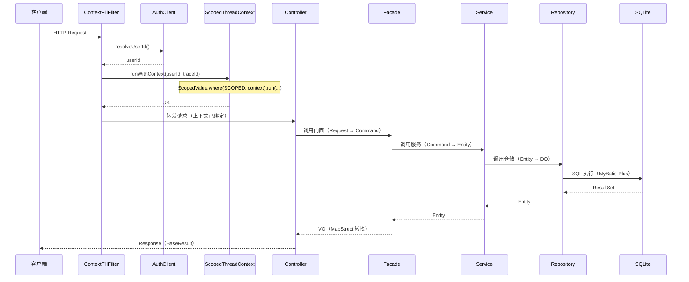
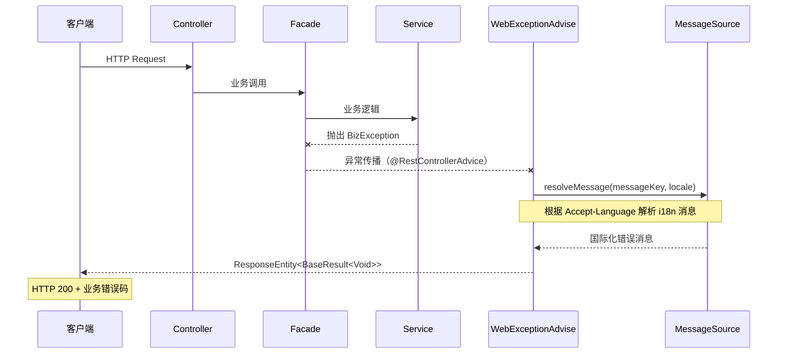
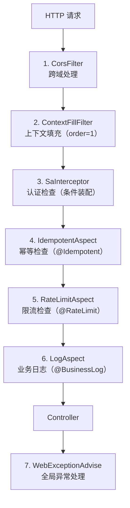

# 请求流转

> 🟢 Contract 轨 — 100% 反映代码现状

## 📋 目录

- [概述](#概述)
- [正常请求流转](#正常请求流转)
- [异常处理分支](#异常处理分支)
- [各环节职责说明](#各环节职责说明)
- [关键组件列表](#关键组件列表)
- [相关文档](#相关文档)
- [变更历史](#变更历史)

## 概述

HTTP 请求从进入到响应的完整处理链路。请求依次经过 Servlet Filter（ContextFillFilter）→ Controller → Facade → Service → Repository → SQLite 数据库，响应沿原路返回。异常情况由 WebExceptionAdvise 统一捕获并处理，支持国际化错误消息。

## 正常请求流转

### 数据形态转换链

| 阶段 | 数据形态 | 说明 |
|------|---------|------|
| Controller 入口 | `Request` / `Command` | HTTP 请求参数绑定 |
| Controller → Facade | `Command` | 业务命令对象 |
| Facade → Service | `Command` / `Query` | 查询或命令对象 |
| Service → Repository | `Entity` | 业务实体对象 |
| Repository → DB | `DO` | 数据对象（MyBatis-Plus） |
| Repository → Service | `Entity` | DO → Entity 转换 |
| Facade → Controller | `VO` | Entity → VO 转换（MapStruct） |
| Controller → Client | `BaseResult<T>` | 统一响应包装 |

## 异常处理分支

### 异常类型与处理策略

| 异常类型 | HTTP 状态码 | 处理方式 | 是否走 i18n |
|---------|------------|---------|-----------|
| `BizException` | 200 | `BaseResult.fail(errorCode, message)` | ✅ |
| `ClientException` | 200 | `BaseResult.fail(errorCode, message)` | ✅ |
| `SysException` | 200 | `BaseResult.fail(errorCode, message)` | ✅ |
| `MethodArgumentNotValidException` | 200 | 字段校验错误拼接 | ❌ |
| `ConstraintViolationException` | 200 | 约束违反信息拼接 | ❌ |
| `NotLoginException` (Sa-Token) | 401 | 未登录错误 | ✅ |
| `NoResourceFoundException` | 404 | 资源不存在 | ❌ |
| `Exception` (兜底) | 200 | 未知错误 | ❌ |

## 各环节职责说明

| 环节 | 类/组件 | 核心职责 |
|------|--------|---------|
| **全局过滤** | `ContextFillFilter` | 解析 userId（AuthClient）、生成 traceId（X-Trace-Id Header 或 UUID）、绑定 ScopedValue 上下文 |
| **线程上下文** | `ScopedThreadContext` | 基于 Java 25 ScopedValue 存储 userId 和 traceId，请求线程内自动可访问 |
| **控制层** | `*Controller` | 接收 HTTP 请求、Bean Validation 参数校验、调用 Facade、返回 `BaseResult<T>` |
| **门面层** | `*FacadeImpl` | Entity→VO 转换（MapStruct）、业务编排、聚合多个 Service 调用 |
| **服务层** | `*Service` | 核心业务逻辑、事务管理（`@Transactional`）、调用 Repository |
| **仓储层** | `*RepositoryImpl` | MyBatis-Plus Mapper 操作、Entity↔DO 转换 |
| **数据访问** | `*Mapper` | MyBatis-Plus BaseMapper，SQL 执行 |
| **全局异常** | `WebExceptionAdvise` | `@RestControllerAdvice` 捕获所有异常、i18n 消息解析、统一错误响应 |
| **审计填充** | `MyMetaObjectHandler` | 自动填充 `createBy` / `updateBy`（从 ScopedThreadContext 获取 userId） |

### 过滤器链与拦截器完整列表

请求从进入到响应依次经过以下处理组件，按执行顺序排列：

| 序号 | 类型 | 组件 | 执行阶段 | 条件 | 说明 |
|------|------|------|---------|------|------|
| 1 | Servlet Filter | `CorsFilter` | 请求前/后 | 始终 | 处理跨域请求，允许 `http://localhost:*` 来源 |
| 2 | Servlet Filter | `ContextFillFilter` | 请求前/后 | 始终（order=1） | 解析 traceId / userId，绑定 ScopedValue 上下文 |
| 3 | Interceptor | `SaInterceptor` | 请求前 | Sa-Token 在 classpath 且 auth.enabled=true | 拦截除 excludePaths 外的所有请求，校验登录状态 |
| 4 | AOP Aspect | `IdempotentAspect` | 方法环绕 | 标注 `@Idempotent` 的方法 | 基于 Caffeine 幂等 Key 去重，防止重复提交 |
| 5 | AOP Aspect | `RateLimitAspect` | 方法环绕 | 标注 `@RateLimit` 的方法 | 基于 Bucket4j 令牌桶限流，支持 SpEL Key |
| 6 | AOP Aspect | `LogAspect` | 方法环绕 | 标注 `@BusinessLog` 的方法 | 记录业务操作日志，支持 SLF4J + Micrometer 指标 |
| 7 | ControllerAdvice | `WebExceptionAdvise` | 异常时 | 始终 | 捕获 `BizException` / `ClientException` / `SysException`，i18n 翻译 |

> **注意**：序号 3-6 为条件装配组件，仅在对应依赖存在且配置启用时生效。详见各客户端模块文档。

## 关键组件列表

### ContextFillFilter

全局过滤器，继承 `OncePerRequestFilter`，每个请求执行一次：

| 功能 | 实现方式 |
|------|---------|
| 解析 traceId | 读取 `X-Trace-Id` Header，不存在则生成 UUID |
| 解析 userId | 调用 `AuthClient.getCurrentUserId()`，null 时返回 `"ANONYMOUS"` |
| 无 AuthClient | userId 默认为 `"SYSTEM"` |
| 绑定上下文 | `ScopedThreadContext.runWithContext(runnable, userId, traceId)` |
| 响应回写 | 设置 `X-Trace-Id` Response Header |

### ScopedThreadContext

基于 Java 25 `ScopedValue` 的线程上下文管理器：

| 方法 | 说明 |
|------|------|
| `runWithContext(Runnable, userId, traceId)` | 在指定上下文中执行代码块 |
| `getUserId()` | 获取当前线程绑定的 userId |
| `getTraceId()` | 获取当前线程绑定的 traceId |
| `getContext()` | 获取完整的 `Context` record |

### WebExceptionAdvise

全局异常处理器，`@RestControllerAdvice` 标注：

| 能力 | 说明 |
|------|------|
| i18n 支持 | 通过 `LocaleResolver` 解析 `Accept-Language`，结合 `MessageSource` 翻译错误消息 |
| 自定义消息优先 | `BizException` 指定自定义消息时直接返回，否则走 `messageKey()` 国际化 |
| 异常分级 | `BizException`（warn）、`ClientException`（error）、`SysException`（error）分级记录日志 |

### AuthClient

认证客户端接口，提供基础认证操作：

| 方法 | 说明 |
|------|------|
| `login(Object userId)` | 登录，返回 token |
| `logout()` | 注销当前会话 |
| `getCurrentUserId()` | 获取当前登录用户 ID |
| `isLogin()` | 判断是否已登录 |
| `checkLogin()` | 校验登录状态，未登录抛 `BizException` |

## 相关文档

| 文档 | 说明 |
|------|------|
| [系统全景](system-overview.md) | C4 架构图与技术栈概要 |
| [模块结构](module-structure.md) | 四层架构详细说明 |
| [线程上下文](thread-context.md) | ScopedValue 传递机制详解 |
| [错误处理](../conventions/error-handling.md) | 异常体系与错误码规范 |

## 变更历史

| 日期 | 变更内容 |
|------|---------|
| 2026-04-14 | 初始创建 |
