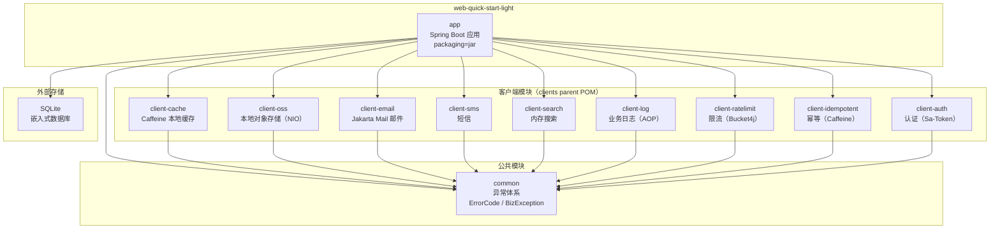

# 系统全景

> 🟢 Contract 轨 — 100% 反映代码现状

## 📋 目录

- [概述](#概述)
- [C4 Container 图](#c4-container-图)
- [技术栈概要](#技术栈概要)
- [JVM 内存配置](#jvm-内存配置)
- [系统设计目标](#系统设计目标)
- [相关文档](#相关文档)
- [变更历史](#变更历史)

## 概述

本项目的系统全景视图，包含 C4 架构图和技术栈概要。项目是一个轻量级 Web 脚手架，基于 Spring Boot 4.x + Java 25，采用多模块 Maven 结构和四层架构。设计目标是在 1G JVM 内存约束下，实现零外部运行时依赖（SQLite + Caffeine）、可水平扩展的技术客户端体系。

## C4 Container 图

> 箭头方向表示 Maven 依赖方向（A → B 表示 A 依赖 B）。

## 技术栈概要

| 类别 | 技术 | 版本 |
|------|------|------|
| 语言 | Java | 25 |
| 框架 | Spring Boot | 4.x |
| ORM | MyBatis-Plus | 3.5.x |
| 分页 | mybatis-plus-jsqlparser | 跟随 MyBatis-Plus |
| 对象转换 | MapStruct | 1.6.x |
| 参数校验 | Bean Validation (JSR 380) | - |
| API 文档 | SpringDoc OpenAPI | 3.0.x |
| 缓存 | Caffeine | Spring Boot BOM |
| 认证 | Sa-Token | 1.45.x |
| 限流 | Bucket4j | 8.17.x |
| 工具库 | Hutool | 5.8.x |
| 序列化 | Jackson / Kryo | 5.6.x |
| 数据库 | SQLite | 3.x |
| 测试 | JUnit 5 + Mockito + ArchUnit | - |
| 代码覆盖率 | JaCoCo | 0.8.x |
| 构建 | Maven 多模块 | - |

## JVM 内存配置

项目针对 1G 总内存环境进行了精细化的 JVM 参数调优，分配方案如下：

| 区域 | 大小 | 参数 | 说明 |
|------|------|------|------|
| 堆内存 | 512MB (50%) | `-Xms512m -Xmx512m` | 业务对象 + Caffeine 缓存 + MyBatis |
| 元空间 | 128MB (13%) | `-XX:MaxMetaspaceSize=128m` | Spring Boot 类加载 |
| 代码缓存 | 64MB (6%) | `-XX:ReservedCodeCacheSize=64m` | JIT 编译缓存 |
| 直接内存 | 64MB (6%) | `-XX:MaxDirectMemorySize=64m` | NIO 操作 |
| 线程栈 | ~100MB (10%) | `-Xss512k` | ~200 线程 × 512KB |
| GC + JVM | ~90MB (9%) | **Serial GC** | 零额外开销，小内存最优 |
| **合计** | **~958MB ≈ 1G** | | |

### GC 选型理由

512MB 堆属于小内存场景，**Serial GC** 的优势：

- **零额外内存开销**：无 remembered sets / region tables / barriers
- **吞吐量最高**：无并发协调开销
- **Full GC 暂停短**：512MB 堆下通常 <100ms

对比其他 GC 在此场景的劣势：
- G1GC 额外占用 ~50-100MB（region tables + remembered sets）
- ZGC 不支持压缩指针（compressed oops），额外浪费 ~80-120MB

> 配置文件位置：`.mvn/jvm.config`（Maven 构建）、`app/pom.xml`（开发运行）、`scripts/start.sh`（生产部署）

## 系统设计目标

### 1. 轻量级 — 1G JVM 即可运行

- 总内存预算 ~958MB，留有余量
- Serial GC 零额外开销，最大化可用内存
- SQLite 嵌入式数据库，无需外部数据库服务

### 2. 零外部运行时依赖

| 能力 | 实现方案 | 外部依赖 |
|------|---------|---------|
| 数据库 | SQLite | 无 |
| 缓存 | Caffeine（本地） | 无 |
| 搜索 | SimpleSearchClient（ConcurrentHashMap） | 无 |
| 对象存储 | LocalOssClient（NIO + 文件系统） | 无 |
| 邮件/短信 | NoOp 默认实现（条件装配） | 可选 |

### 3. 可扩展 — Template Method + 条件装配

- **Template Method 模式**：每个客户端通过 `AbstractXxxClient` 提供统一骨架，子类只需实现 `do*` 扩展点
- **条件装配**：`@AutoConfiguration` + `@ConditionalOnClass` + `@ConditionalOnProperty`，按需加载客户端
- **NoOp 默认实现**：email / sms / auth 提供 NoOp 实现，无对应依赖时也能正常启动

## 系统边界

### 包含

系统覆盖以下能力域，所有功能均可在零外部运行时依赖下运行：

| 能力域 | 实现方案 | 详情 |
|--------|---------|------|
| Web 层 | Controller / Facade / Service / Repository 四层架构 | 详见[模块结构](module-structure.md) |
| 持久层 | MyBatis-Plus + SQLite | 嵌入式数据库，无需外部服务 |
| 本地缓存 | Caffeine | 详见[缓存客户端](../modules/client-cache.md) |
| 本地对象存储 | NIO + 文件系统 | 详见[对象存储客户端](../modules/client-oss.md) |
| 邮件发送 | Jakarta Mail + NoOp 默认实现 | 详见[邮件客户端](../modules/client-email.md) |
| 短信发送 | 接口 + NoOp 默认实现 | 详见[短信客户端](../modules/client-sms.md) |
| 内存搜索 | 基于 Java Collection | 详见[搜索客户端](../modules/client-search.md) |
| 业务日志 | SLF4J + Micrometer | 详见[日志客户端](../modules/client-log.md) |
| 限流 | Bucket4j | 详见[限流客户端](../modules/client-ratelimit.md) |
| 幂等保护 | Caffeine | 详见[幂等客户端](../modules/client-idempotent.md) |
| 认证 | Sa-Token + NoOp 默认实现 | 详见[认证模块](../modules/auth.md) |

### 不包含

以下能力不在本系统设计范围内。如需引入，需自行扩展：

| 能力 | 说明 |
|------|------|
| 消息队列（MQ） | 如 RabbitMQ、Kafka、RocketMQ |
| 分布式缓存 | 如 Redis、Memcached |
| 分布式事务 | 如 Seata、XA 两阶段提交 |
| 微服务注册发现 | 如 Nacos、Consul、Eureka |
| 容器编排 | 如 Kubernetes、Docker Compose 编排 |
| CDN / 反向代理 | 如 Nginx、CloudFront |
| 日志聚合 | 如 ELK（Elasticsearch + Logstash + Kibana）、Loki |
| APM 监控 | 如 SkyWalking、Zipkin、Jaeger |
| 分布式文件存储 | 如 MinIO、阿里云 OSS、S3 |

> **设计意图**：本骨架定位为轻量级单体应用（1G JVM 即可运行），通过 Template Method + 条件装配模式为上述能力预留扩展点，但不引入运行时外部依赖。

## 相关文档

| 文档 | 说明 |
|------|------|
| [模块结构](module-structure.md) | Maven 多模块和四层架构详解 |
| [请求流转](request-lifecycle.md) | HTTP 请求处理链路 |
| [设计模式](design-patterns.md) | Template Method 与条件装配 |
| [线程上下文](thread-context.md) | ScopedValue 上下文传递机制 |

## 变更历史

| 日期 | 变更内容 |
|------|---------|
| 2026-04-14 | 初始创建 |
