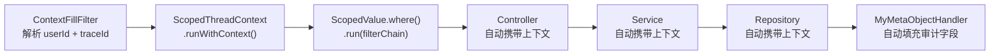
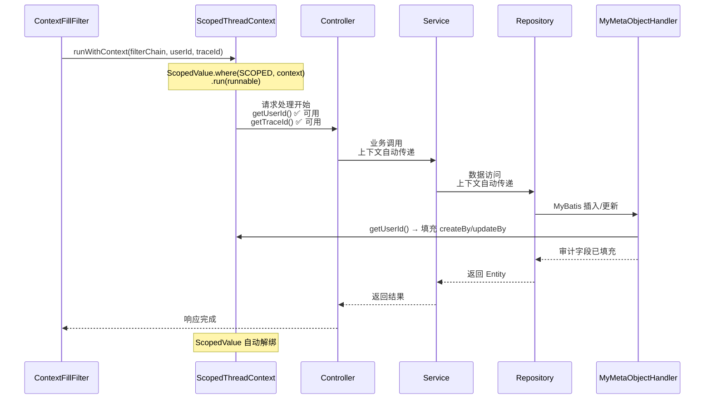
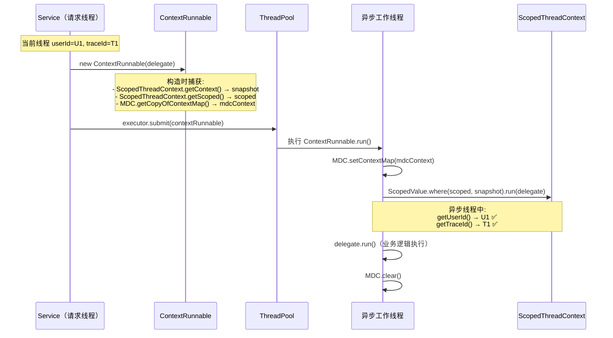

# 线程上下文

> 🟢 Contract 轨 — 100% 反映代码现状

## 📋 目录

- [概述](#概述)
- [ScopedValue 传递链](#scopedvalue-传递链)
- [同步场景](#同步场景)
- [异步场景](#异步场景)
- [API 参考](#api-参考)
- [使用示例](#使用示例)
- [相关文档](#相关文档)
- [变更历史](#变更历史)

## 概述

基于 Java 25 `ScopedValue` 的线程上下文传递机制。项目使用 `ScopedThreadContext` 管理请求级别的 `userId` 和 `traceId`，在同步场景中通过 `ScopedValue.where().run()` 自动传递，在异步场景中通过 `ContextRunnable` / `ContextCallable` 包装器捕获并恢复上下文。同时配合 SLF4J MDC 实现日志上下文传递。

## ScopedValue 传递链

### 核心特性

`java.lang.ScopedValue` 是 Java 25 正式引入的**不可变、线程安全**的 scoped value 机制，相比 `ThreadLocal` 的优势：

| 特性 | ScopedValue | ThreadLocal |
|------|-------------|-------------|
| 可变性 | 不可变（immutable） | 可变（mutable） |
| 生命周期 | 自动绑定/解绑（scope-based） | 需手动 remove |
| 线程安全 | 天然安全 | 需注意内存泄漏 |
| 性能 | JIT 优化后接近局部变量访问 | 有间接寻址开销 |
| 跨线程 | 需显式传递 | 需 InheritableThreadLocal 或手动传递 |

### 传递链路



### Context 数据结构

```java
// ScopedThreadContext 内部定义
public record Context(String userId, String traceId) {}

// 通过 ScopedValue 绑定到当前线程
private static final ScopedValue<Context> SCOPED = ScopedValue.newInstance();
```

## 同步场景

在同步请求处理中，上下文通过 `ScopedValue.where().run()` 自动在整个调用链中可用：



### 关键点

- **自动绑定/解绑**：`ScopedValue.where(SCOPED, context).run(runnable)` 在 runnable 执行完毕后自动解绑，无需手动清理
- **只读访问**：同一 scope 内所有代码通过 `getUserId()` / `getTraceId()` 只读访问
- **线程隔离**：每个请求线程有独立的 ScopedValue 绑定

## 异步场景

在异步任务中，需要使用 `ContextRunnable` / `ContextCallable` 包装器手动捕获并传递上下文：



### ContextRunnable 工作原理

```java
public class ContextRunnable implements Runnable {

    private final Runnable delegate;
    private final ScopedThreadContext.Context snapshot;   // 捕获时的上下文快照
    private final ScopedValue<ScopedThreadContext.Context> scoped;  // ScopedValue 实例引用
    private final Map<String, String> mdcContext;         // MDC 上下文副本

    public ContextRunnable(Runnable delegate) {
        this.delegate = delegate;
        this.snapshot = ScopedThreadContext.getContext();  // 捕获当前 userId + traceId
        this.scoped = ScopedThreadContext.getScoped();     // 获取 ScopedValue 实例
        this.mdcContext = MDC.getCopyOfContextMap();       // 捕获 MDC 日志上下文
    }

    @Override
    public void run() {
        if (mdcContext != null) {
            MDC.setContextMap(mdcContext);  // 恢复 MDC
        }
        try {
            if (snapshot != null) {
                ScopedValue.where(scoped, snapshot).run(delegate);  // 恢复 ScopedValue
            } else {
                delegate.run();
            }
        } finally {
            MDC.clear();  // 清理 MDC，防止线程池复用污染
        }
    }
}
```

### ContextCallable 工作原理

`ContextCallable<V>` 与 `ContextRunnable` 类似，额外处理了 `Callable<V>` 的返回值和受检异常：

- 捕获阶段：与 `ContextRunnable` 相同
- 执行阶段：通过 `ScopedValue.where(scoped, snapshot).run()` 内部调用 `delegate.call()`
- 异常传播：受检异常通过数组传递，在 `run()` 外重新抛出
- 清理阶段：`finally` 中 `MDC.clear()`

## API 参考

| 类 / 方法 | 说明 |
|----------|------|
| **ScopedThreadContext** | 基于 ScopedValue 的上下文管理器（不可实例化，私有构造器） |
| `.runWithContext(Runnable, userId, traceId)` | 在指定上下文中执行代码块 |
| `.getUserId()` | 获取当前线程绑定的 userId，未绑定时返回 null |
| `.getTraceId()` | 获取当前线程绑定的 traceId，未绑定时返回 null |
| `.getContext()` | 获取完整的 `Context` record，未绑定时返回 null |
| `.getScoped()` | 获取 `ScopedValue<Context>` 实例（package-private，供包装器使用） |
| **Context record** | `record Context(String userId, String traceId)` |
| **ContextRunnable** | `Runnable` 包装器，构造时捕获上下文快照，执行时恢复 |
| **ContextCallable\<V\>** | `Callable<V>` 包装器，构造时捕获上下文快照，执行时恢复 |

## 使用示例

### 同步场景（自动传递）

```java
// ContextFillFilter 中自动绑定上下文
@Override
protected void doFilterInternal(HttpServletRequest request, HttpServletResponse response,
                                FilterChain filterChain) {
    String traceId = resolveTraceId(request);
    String userId = resolveUserId();
    ScopedThreadContext.runWithContext(() -> {
        filterChain.doFilter(request, response);
    }, userId, traceId);
}

// 任意下游代码中直接读取
public void someServiceMethod() {
    String userId = ScopedThreadContext.getUserId();   // 当前请求用户
    String traceId = ScopedThreadContext.getTraceId();  // 当前请求追踪 ID
}
```

### 异步场景（手动包装）

```java
// 在 Service 中提交异步任务
public void asyncOperation() {
    // 使用 ContextRunnable 包装，自动捕获并传递上下文
    executor.submit(new ContextRunnable(() -> {
        // 此处 ScopedThreadContext.getUserId() / getTraceId() 可用
        doSomethingAsync();
    }));

    // 或使用 ContextCallable 获取返回值
    Future<String> future = executor.submit(new ContextCallable<>(() -> {
        String userId = ScopedThreadContext.getUserId();
        return processAsync(userId);
    }));
}
```

### 审计字段自动填充

```java
// MyMetaObjectHandler 中从 ScopedThreadContext 获取当前用户
public class MyMetaObjectHandler implements MetaObjectHandler {
    @Override
    public void insertFill(MetaObject metaObject) {
        String userId = ScopedThreadContext.getUserId();
        this.setFieldValByName("createBy", userId, metaObject);
        this.setFieldValByName("updateBy", userId, metaObject);
    }

    @Override
    public void updateFill(MetaObject metaObject) {
        String userId = ScopedThreadContext.getUserId();
        this.setFieldValByName("updateBy", userId, metaObject);
    }
}
```

## 设计考量

### ScopedValue vs ThreadLocal

**驱动力**：需要在请求线程（含虚拟线程）之间传递 userId / traceId 等上下文信息，且要求生命周期自动管理。

**备选方案**：

| 方案 | 特点 | 局限 |
|------|------|------|
| ThreadLocal | Java 1.2+ 可用，生态成熟 | 需要手动 `remove()` 防止内存泄漏；值可变，存在"中途被改写"风险；不支持虚拟线程 |
| InheritableThreadLocal | 子线程自动继承父线程值 | 继承的是创建时刻的快照，线程池场景下值会过期 |
| TransmittableThreadLocal (TTL) | 阿里开源，支持线程池传递 | 需要额外依赖；非 JDK 标准 API |
| ScopedValue（当前选择） | Java 21+ 引入，为虚拟线程设计 | 需要 Java 21+ |

**选择 ScopedValue 的理由**：

1. **不可变性**：ScopedValue 绑定后不可修改，避免了 ThreadLocal 的"中途被改写"问题，上下文数据在整个请求生命周期内保持一致
2. **生命周期自动管理**：ScopedValue 通过 `ScopedValue.where(...).run(...)` 的 try-with-resources 模式自动清理，不会因遗漏 `remove()` 导致内存泄漏
3. **虚拟线程友好**：ScopedValue 是 Java 21+ 专为虚拟线程（Virtual Threads / Project Loom）设计的替代方案，虚拟线程会被 pin 在载体线程上，而 ScopedValue 不会产生 pin 问题
4. **类型安全**：泛型参数 `ScopedValue<Context>` 在编译期保证了类型安全，避免了 ThreadLocal 的强制类型转换
5. **绑定范围可控**：每个 `run(...)` / `call(...)` 创建独立的绑定作用域，嵌套调用时外层绑定不会被内层覆盖

> **注意**：ScopedValue 在 Java 21 中为 Preview 特性，Java 25 中已转正为正式 API。本骨架要求 Java 25，因此可直接使用。

## 相关文档

| 文档 | 说明 |
|------|------|
| [系统全景](system-overview.md) | C4 架构图与技术栈概要 |
| [请求流转](request-lifecycle.md) | ContextFillFilter 如何绑定上下文 |
| [设计模式](design-patterns.md) | Template Method 与条件装配 |
| [Java 编码规范](../conventions/java-conventions.md) | 线程上下文使用规范 |

## 变更历史

| 日期 | 变更内容 |
|------|---------|
| 2026-04-14 | 初始创建 |
