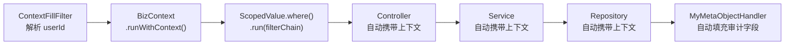
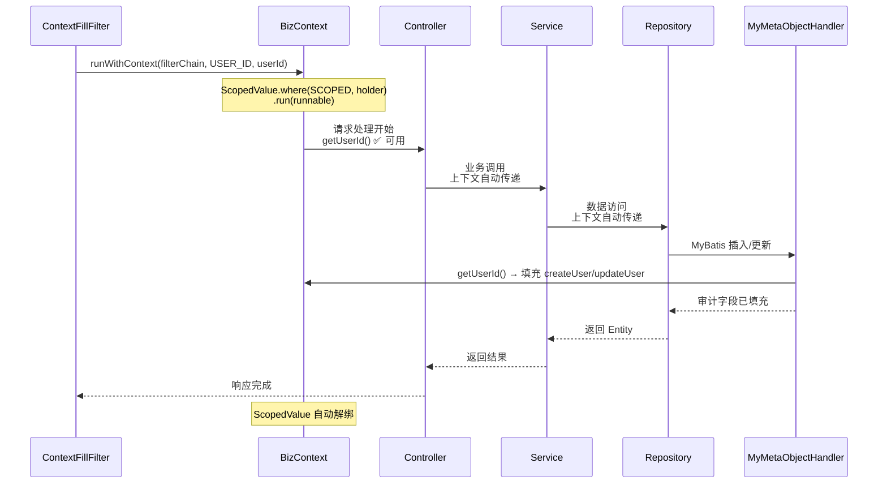
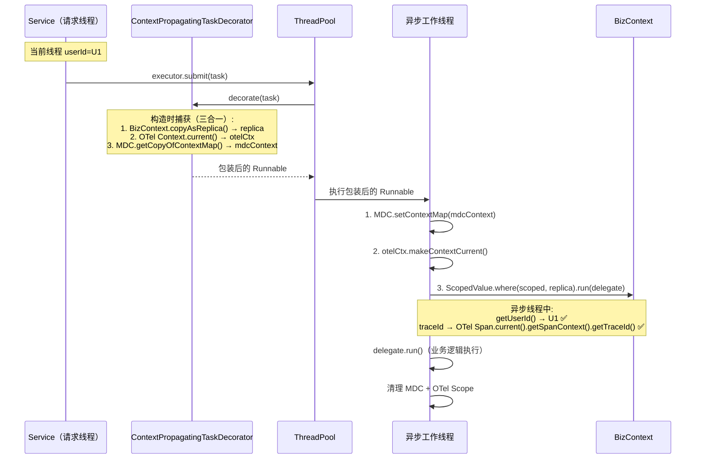

# 线程上下文

> 🟢 Contract 轨 — 100% 反映代码现状

## 📋 目录

- [概述](#概述)
- [ScopedValue 传递链](#scopedvalue-传递链)
- [同步场景](#同步场景)
- [异步场景](#异步场景)
- [API 参考](#api-参考)
- [使用示例](#使用示例)
- [相关文档](#相关文档)
- [变更历史](#变更历史)

## 概述

基于 Java 25 `ScopedValue` 的线程上下文传递机制。项目使用 `BizContext`（`org.smm.archetype.shared.util.context.BizContext`）管理请求级别的 `userId`，在同步场景中通过 `ScopedValue.where().run()` 自动传递，在异步场景中通过 `ContextPropagatingTaskDecorator`（三合一：BizContext + OTel Context + MDC）自动传播上下文。`BizContext.Key.USER_ID` 标记为 `propagated=true`，设置值时自动同步至 OTel Baggage。traceId 由 OTel Span 全权管理，不属于 BizContext 职责。

## ScopedValue 传递链

### 核心特性

`java.lang.ScopedValue` 是 Java 25 正式引入的**不可变、线程安全**的 scoped value 机制，相比 `ThreadLocal` 的优势：

| 特性 | ScopedValue | ThreadLocal |
|------|-------------|-------------|
| 可变性 | 不可变（immutable） | 可变（mutable） |
| 生命周期 | 自动绑定/解绑（scope-based） | 需手动 remove |
| 线程安全 | 天然安全 | 需注意内存泄漏 |
| 性能 | JIT 优化后接近局部变量访问 | 有间接寻址开销 |
| 跨线程 | 需显式传递 | 需 InheritableThreadLocal 或手动传递 |

### 传递链路


```mermaid
flowchart LR
    A["ContextFillFilter<br/>解析 userId"] --> B["BizContext<br/>.runWithContext()"]
    B --> C["ScopedValue.where()<br/>.run(filterChain)"]
    C --> D["Controller<br/>自动携带上下文"]
    D --> E["Service<br/>自动携带上下文"]
    E --> F["Repository<br/>自动携带上下文"]
    F --> G["MyMetaObjectHandler<br/>自动填充审计字段"]
```

### Holder 数据结构

```java
// BizContext 内部定义
public static final class Holder {
    final EnumMap<Key, String> map;    // 存储所有上下文键值
    final boolean replica;              // 是否为副本（异步传播时为 true）
}

// 通过 ScopedValue 绑定到当前线程
private static final ScopedValue<Holder> SCOPED = ScopedValue.newInstance();
```

## 同步场景

在同步请求处理中，上下文通过 `ScopedValue.where().run()` 自动在整个调用链中可用：


```mermaid
sequenceDiagram
    participant Filter as ContextFillFilter
    participant Ctx as BizContext
    participant Ctrl as Controller
    participant Svc as Service
    participant Repo as Repository
    participant MH as MyMetaObjectHandler

    Filter->>Ctx: runWithContext(filterChain, USER_ID, userId)
    Note over Ctx: ScopedValue.where(SCOPED, holder)<br/>.run(runnable)
    Ctx->>Ctrl: 请求处理开始<br/>getUserId() ✅ 可用
    Ctrl->>Svc: 业务调用<br/>上下文自动传递
    Svc->>Repo: 数据访问<br/>上下文自动传递
    Repo->>MH: MyBatis 插入/更新
    MH->>Ctx: getUserId() → 填充 createUser/updateUser
    MH-->>Repo: 审计字段已填充
    Repo-->>Svc: 返回 Entity
    Svc-->>Ctrl: 返回结果
    Ctrl-->>Filter: 响应完成
    Note over Ctx: ScopedValue 自动解绑
```

### 关键点

- **自动绑定/解绑**：`ScopedValue.where(SCOPED, holder).run(runnable)` 在 runnable 执行完毕后自动解绑，无需手动清理
- **只读访问**：同一 scope 内所有代码通过 `BizContext.getUserId()` 只读访问
- **线程隔离**：每个请求线程有独立的 ScopedValue 绑定
- **OTel Baggage 同步**：`USER_ID` 键标记为 `propagated=true`，调用 `Key.set()` 时自动写入 OTel Baggage（`userId`），便于跨服务传播

## 异步场景

在异步任务中，通过 `ContextPropagatingTaskDecorator`（位于 `ThreadPoolConfigure` 内部类）自动传播上下文，无需手动包装：


```mermaid
sequenceDiagram
    participant Svc as Service（请求线程）
    participant TD as ContextPropagatingTaskDecorator
    participant Pool as ThreadPool
    participant AW as 异步工作线程
    participant Ctx as BizContext

    Note over Svc: 当前线程 userId=U1
    Svc->>Pool: executor.submit(task)
    Pool->>TD: decorate(task)
    Note over TD: 构造时捕获（三合一）:<br/>1. BizContext.copyAsReplica() → replica<br/>2. OTel Context.current() → otelCtx<br/>3. MDC.getCopyOfContextMap() → mdcContext
    TD-->>Pool: 包装后的 Runnable
    Pool->>AW: 执行包装后的 Runnable
    AW->>AW: 1. MDC.setContextMap(mdcContext)
    AW->>AW: 2. otelCtx.makeContextCurrent()
    AW->>Ctx: 3. ScopedValue.where(scoped, replica).run(delegate)
    Note over AW,Ctx: 异步线程中:<br/>getUserId() → U1 ✅<br/>traceId → OTel Span.current().getSpanContext().getTraceId() ✅
    AW->>AW: delegate.run()（业务逻辑执行）
    AW->>AW: 清理 MDC + OTel Scope
```

### ContextPropagatingTaskDecorator 工作原理

`ContextPropagatingTaskDecorator` 是 `ThreadPoolConfigure` 的内部类，实现了 Spring 的 `TaskDecorator` 接口，一次性处理三种上下文传播：

| 传播维度 | 捕获方式 | 恢复方式 |
|----------|---------|---------|
| BizContext | `BizContext.copyAsReplica()` → 返回 `Holder`（`replica=true`） | `ScopedValue.where(scoped, replica).run(delegate)` |
| OTel Context | `Context.current()` | `ctx.makeContextCurrent()` + `Scope.close()` |
| MDC | `MDC.getCopyOfContextMap()` | `MDC.setContextMap()` + `MDC.clear()` |

> **注意**：`replica=true` 标记的 Holder 在调用 `Key.set()` 时不会同步 OTel Baggage（避免异步线程重复写入），只保留读取能力。

## API 参考

| 类 / 方法 | 说明 |
|----------|------|
| **BizContext** | 基于 ScopedValue 的上下文管理器（`org.smm.archetype.shared.util.context.BizContext`） |
| `.runWithContext(Runnable, EnumMap<Key, String>)` | 在指定上下文中执行代码块 |
| `.runWithContext(Runnable, Key, String)` | 便捷方法：设置单个键值后执行代码块 |
| `.getContext()` | 获取当前线程绑定的 `EnumMap<Key, String>`，未绑定时返回 null |
| `.copyContext()` | 复制当前上下文为新的 `EnumMap<Key, String>` |
| `.copyAsReplica()` | 复制当前上下文为 `Holder`（`replica=true`），供 `TaskDecorator` 使用 |
| `.getScoped()` | 获取 `ScopedValue<Holder>` 实例，供 `TaskDecorator` 使用 |
| `.getUserId()` | 便捷方法：获取当前线程绑定的 userId，未绑定时返回 null |
| **BizContext.Holder** | 上下文持有器，包含 `EnumMap<Key, String> map` 和 `boolean replica` |
| **BizContext.Key** | 上下文键枚举，`USER_ID("userId", true)` 标记为 propagated |

## 使用示例

### 同步场景（自动传递）

```java
// ContextFillFilter 中自动绑定上下文
@Override
protected void doFilterInternal(HttpServletRequest request, HttpServletResponse response,
                                FilterChain filterChain) {
    String userId = authComponent.getCurrentUserId();
    BizContext.runWithContext(() -> {
        filterChain.doFilter(request, response);
    }, BizContext.Key.USER_ID, userId);
}

// 任意下游代码中直接读取
public void someServiceMethod() {
    String userId = BizContext.getUserId();   // 当前请求用户
    // traceId 由 OTel Span 管理：
    String traceId = Span.current().getSpanContext().getTraceId();
}
```

### 异步场景（TaskDecorator 自动传播）

```java
// 在 Service 中提交异步任务 — 无需手动包装
public void asyncOperation() {
    // ContextPropagatingTaskDecorator 自动传播 BizContext + OTel + MDC
    executor.submit(() -> {
        // 此处 BizContext.getUserId() 可用
        doSomethingAsync();
    });
}
```

> **注意**：只需确保线程池配置了 `ContextPropagatingTaskDecorator`（`ThreadPoolConfigure` 自动注册），无需手动创建包装器。

### 审计字段自动填充

```java
// MyMetaObjectHandler 中从 BizContext 获取当前用户
public class MyMetaObjectHandler implements MetaObjectHandler {
    @Override
    public void insertFill(MetaObject metaObject) {
        String userId = BizContext.getUserId();
        this.setFieldValByName("createUser", userId, metaObject);
        this.setFieldValByName("updateUser", userId, metaObject);
    }

    @Override
    public void updateFill(MetaObject metaObject) {
        String userId = BizContext.getUserId();
        this.setFieldValByName("updateUser", userId, metaObject);
    }
}
```

## 设计考量

### ScopedValue vs ThreadLocal

**驱动力**：需要在请求线程（含虚拟线程）之间传递 userId 等上下文信息，且要求生命周期自动管理。

**备选方案**：

| 方案 | 特点 | 局限 |
|------|------|------|
| ThreadLocal | Java 1.2+ 可用，生态成熟 | 需要手动 `remove()` 防止内存泄漏；值可变，存在"中途被改写"风险；不支持虚拟线程 |
| InheritableThreadLocal | 子线程自动继承父线程值 | 继承的是创建时刻的快照，线程池场景下值会过期 |
| TransmittableThreadLocal (TTL) | 阿里开源，支持线程池传递 | 需要额外依赖；非 JDK 标准 API |
| ScopedValue（当前选择） | Java 21+ 引入，为虚拟线程设计 | 需要 Java 21+ |

**选择 ScopedValue 的理由**：

1. **不可变性**：ScopedValue 绑定后不可修改，避免了 ThreadLocal 的"中途被改写"问题，上下文数据在整个请求生命周期内保持一致
2. **生命周期自动管理**：ScopedValue 通过 `ScopedValue.where(...).run(...)` 的 try-with-resources 模式自动清理，不会因遗漏 `remove()` 导致内存泄漏
3. **虚拟线程友好**：ScopedValue 是 Java 21+ 专为虚拟线程（Virtual Threads / Project Loom）设计的替代方案，虚拟线程会被 pin 在载体线程上，而 ScopedValue 不会产生 pin 问题
4. **类型安全**：泛型参数 `ScopedValue<Holder>` 在编译期保证了类型安全，避免了 ThreadLocal 的强制类型转换
5. **绑定范围可控**：每个 `run(...)` / `call(...)` 创建独立的绑定作用域，嵌套调用时外层绑定不会被内层覆盖

> **注意**：ScopedValue 在 Java 21 中为 Preview 特性，Java 25 中已转正为正式 API。本骨架要求 Java 25，因此可直接使用。

### 职责分离：BizContext vs OTel

| 职责 | 负责方 | 说明 |
|------|--------|------|
| userId 传递 | `BizContext`（ScopedValue） | 请求线程内业务上下文 |
| userId 跨服务传播 | OTel Baggage | `BizContext.Key.USER_ID`（propagated=true）自动同步 |
| traceId 生成与传播 | OTel Span | `Span.current().getSpanContext().getTraceId()` |
| 日志关联 | MDC + OTel | OTel auto-instrumentation 自动将 traceId/spanId 写入 MDC |

## 相关文档

| 文档 | 说明 |
|------|------|
| [系统全景](system-overview.md) | C4 架构图与技术栈概要 |
| [请求流转](request-lifecycle.md) | ContextFillFilter 如何绑定上下文 |
| [设计模式](design-patterns.md) | Template Method 与条件装配 |
| [Java 编码规范](../conventions/java-conventions.md) | 线程上下文使用规范 |

## 变更历史

| 日期 | 变更内容 |
|------|---------|
| 2026-05-11 | 重写：ScopedThreadContext → BizContext；ContextRunnable/ContextCallable → ContextPropagatingTaskDecorator；补充 OTel Baggage 集成；审计字段 createBy/updateBy → createUser/updateUser；traceId 职责移交 OTel Span |
| 2026-04-14 | 初始创建 |
