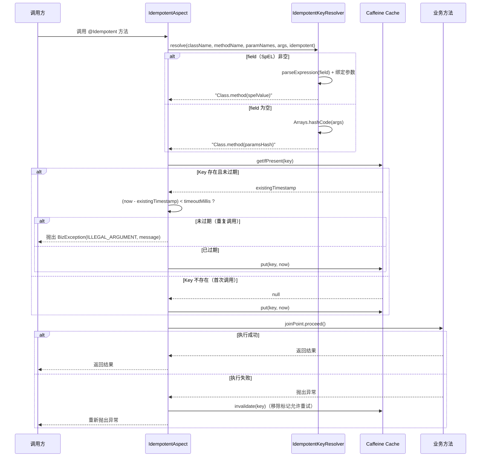
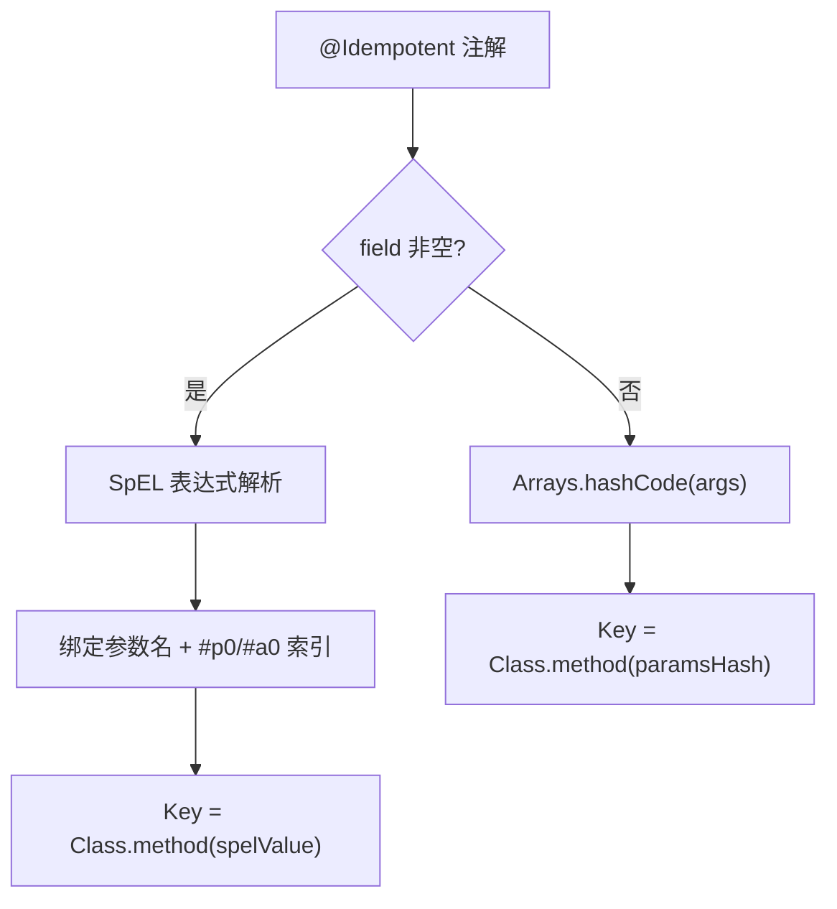

# 幂等客户端（client-idempotent） — Contract 轨

> 代码变更时必须同步更新本文档

## 📋 目录

- [概述](#概述)
- [业务场景](#业务场景)
- [技术设计](#技术设计)
- [API 参考](#api-参考)
- [配置参考](#配置参考)
- [使用指南](#使用指南)
- [相关文档](#相关文档)
- [变更历史](#变更历史)

## 概述

幂等客户端（`client-idempotent`）基于 Caffeine 本地缓存实现接口级幂等保护。通过 `@Idempotent` 注解声明式标记需要幂等保护的方法，AOP 切面自动完成幂等 Key 解析、重复调用检测和结果缓存。

核心特性：

- **声明式幂等**：`@Idempotent` 注解标注方法，AOP 切面自动拦截
- **Caffeine 本地缓存**：基于内存缓存存储幂等 Key，无外部依赖
- **SpEL Key 解析**：`IdempotentKeyResolver` 支持通过 SpEL 表达式从方法参数提取幂等维度
- **执行失败自动移除**：方法执行异常时自动移除幂等标记，允许重试
- **可配置超时窗口**：通过 `timeout` 和 `timeUnit` 控制幂等窗口时长
- **条件装配**：`middleware.idempotent.enabled=true` 时启用（默认 false，需显式开启）

## 业务场景

### 1. 接口幂等保护

防止因网络抖动、前端重试等原因导致的重复提交。例如：创建订单、支付请求、数据导入等写操作。

### 2. 自定义幂等 Key

通过 SpEL 表达式指定幂等判定的维度：
- 按业务 ID 去重（如 `#request.orderId`）
- 按参数组合去重（默认 `className.methodName(paramsHash)`）

### 3. 执行失败容错

方法执行抛出异常时，切面自动移除幂等标记（`cache.invalidate(key)`），确保客户端可以安全重试，不会因临时故障导致接口永久不可用。

## 技术设计

### 幂等检查流程时序图



### Key 解析策略



## API 参考

### @Idempotent 注解

> 包路径：`org.smm.archetype.client.idempotent.Idempotent`

| 属性 | 类型 | 默认值 | 说明 |
|------|------|--------|------|
| `timeout` | `long` | `3000` | 幂等窗口超时时间 |
| `timeUnit` | `TimeUnit` | `TimeUnit.MILLISECONDS` | 超时时间单位 |
| `field` | `String` | `""` | SpEL 表达式，用于提取幂等 Key 字段。支持 `#p0`、`#p1`（按参数索引）、`#参数名`（需编译时保留参数名）。为空时使用 `className.methodName(paramsHash)` |
| `message` | `String` | `"请勿重复操作"` | 重复调用时抛出的异常消息 |

### IdempotentKeyResolver

> 包路径：`org.smm.archetype.client.idempotent.IdempotentKeyResolver`

```java
public String resolve(String className, String methodName,
                      String[] paramNames, Object[] args, Idempotent idempotent)
```

| 参数 | 说明 |
|------|------|
| `className` | 类全限定名 |
| `methodName` | 方法名 |
| `paramNames` | 参数名数组（可能为 null） |
| `args` | 参数值数组 |
| `idempotent` | `@Idempotent` 注解实例 |
| **返回** | 幂等 Key，格式为 `className.methodName(fieldValue)` |

### IdempotentAspect 切面

> 包路径：`org.smm.archetype.client.idempotent.IdempotentAspect`

| 方法 | 签名 | 说明 |
|------|------|------|
| `around` | `Object around(ProceedingJoinPoint, Idempotent)` | 幂等校验切面（Around 通知） |
| `resolveKey` | `String resolveKey(ProceedingJoinPoint, Idempotent)` | 解析幂等 Key（委托给 IdempotentKeyResolver，package 访问级别） |

### Caffeine 缓存配置

| 配置项 | 值 | 说明 |
|--------|-----|------|
| `maximumSize` | `10,000` | 最大缓存条目数 |
| `expireAfterWrite` | `10 分钟` | 写入后过期时间（兜底清理机制，实际过期由切面内时间戳检查控制） |

> **注意**：Caffeine 的 `expireAfterWrite` 是兜底清理机制。实际幂等窗口由切面内 `System.currentTimeMillis()` 时间戳差值判断控制，精度为毫秒级。

## 配置参考

> 配置前缀：`middleware.idempotent`

| 配置项 | 类型 | 默认值 | 说明 |
|--------|------|--------|------|
| `middleware.idempotent.enabled` | `boolean` | `false` | 是否启用幂等防护（需显式开启） |

### 配置示例

```yaml
middleware:
  idempotent:
    enabled: true
```

## 使用指南

### 1. 基础幂等（按参数哈希）

```java
import org.smm.archetype.client.idempotent.Idempotent;

@RestController
@RequestMapping("/api/orders")
public class OrderController {

    // 默认 3 秒幂等窗口，按参数哈希去重
    @Idempotent
    @PostMapping
    public Result createOrder(@RequestBody CreateOrderRequest request) {
        return orderService.create(request);
    }
}
```

### 2. 按业务 ID 幂等

```java
// 按订单号幂等，10 秒窗口
@Idempotent(field = "#request.orderId", timeout = 10, timeUnit = TimeUnit.SECONDS,
            message = "订单正在处理中，请勿重复提交")
public Result payOrder(PayOrderRequest request) {
    // ...
}
```

### 3. 按参数索引幂等

```java
// 使用 #p0 引用第一个参数
@Idempotent(field = "#p0", timeout = 5, timeUnit = TimeUnit.SECONDS)
public Result cancelOrder(Long orderId) {
    // ...
}
```

### 4. 自定义超时窗口

```java
// 1 分钟幂等窗口
@Idempotent(timeout = 60, timeUnit = TimeUnit.SECONDS, message = "操作过于频繁")
public Result importData(ImportRequest request) {
    // ...
}
```

### 5. 执行失败自动重试机制

```java
@Idempotent(field = "#request.orderId", timeout = 10, timeUnit = TimeUnit.SECONDS)
public Result createOrder(CreateOrderRequest request) {
    // 首次调用：正常执行
    // 10 秒内重复调用：抛出 BizException("订单正在处理中，请勿重复提交")
    // 如果首次调用抛异常：自动移除幂等标记，客户端可重试
    // 10 秒后：幂等窗口过期，可正常调用
}
```

### 6. 关闭幂等

```yaml
middleware:
  idempotent:
    enabled: false
```

### 7. 自动配置条件

幂等客户端自动装配需满足以下条件：

- `middleware.idempotent.enabled=true`（默认 false，**需显式开启**）
- classpath 中存在 `com.github.benmanes.caffeine.cache.Caffeine`（Caffeine）
- classpath 中存在 `org.aspectj.lang.annotation.Aspect`（AspectJ）

> **重要**：幂等功能默认关闭，生产环境使用前务必确认已开启配置。

## 相关文档

### 上游依赖

| 文档 | 链接 | 关系 |
|------|------|------|
| 设计模式 | [architecture/design-patterns.md](../architecture/design-patterns.md) | Template Method 模式的完整说明（本模块未直接使用，但作为客户端模块通用设计模式参考） |

### 设计依据

| 文档 | 链接 | 关系 |
|------|------|------|
| 幂等保护 Intent | [openspec/specs/idempotent-protection/spec.md](../../openspec/specs/idempotent-protection/spec.md) | `@Idempotent` 注解 + Caffeine 缓存 + SpEL Key + 失败自动移除的设计意图 |

## 变更历史
| 日期 | 变更内容 |
|------|---------|
| 2025-04-14 | 初始创建 |
