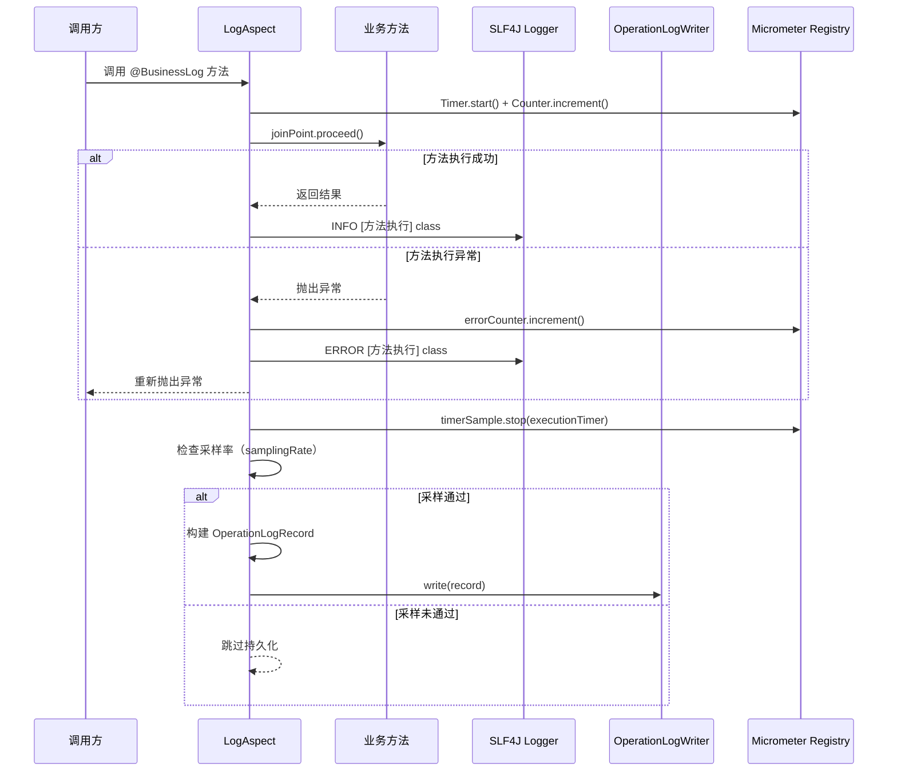
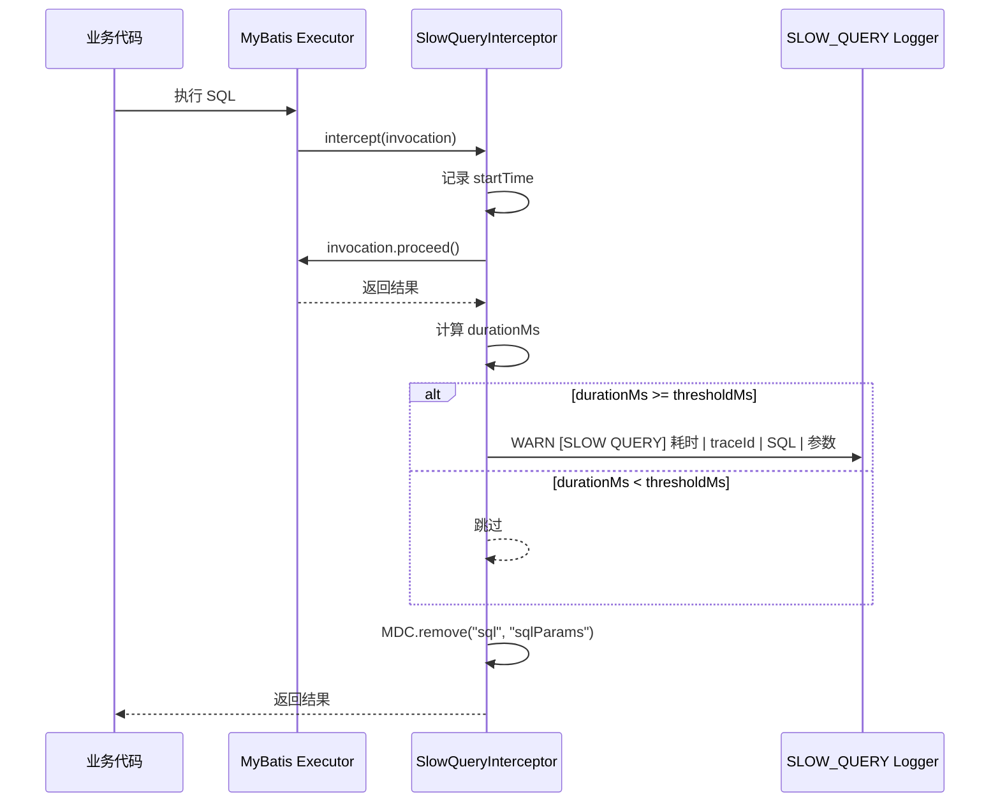

# 日志客户端（client-log） — Contract 轨

> 代码变更时必须同步更新本文档

## 📋 目录

- [概述](#概述)
- [业务场景](#业务场景)
- [技术设计](#技术设计)
- [API 参考](#api-参考)
- [配置参考](#配置参考)
- [使用指南](#使用指南)
- [相关文档](#相关文档)
- [变更历史](#变更历史)

## 概述

日志客户端（`client-log`）提供业务日志记录能力，通过 `@BusinessLog` 注解实现声明式操作日志采集。核心职责包括：

- **注解驱动日志**：`@BusinessLog` 标注业务方法，AOP 切面自动记录执行信息
- **Micrometer 指标**：方法执行耗时（Timer）、执行次数（Counter）、错误次数（Counter）
- **操作日志持久化**：通过 `OperationLogWriter` SPI 接口，由 app 模块实现数据库写入
- **高并发采样**：`SamplingTurboFilter` 按 Logback TurboFilter 机制采样，ERROR 级别始终放行
- **慢 SQL 监控**：`SlowQueryInterceptor` 拦截 MyBatis 执行，超过阈值记录到专用 Logger
- **脱敏工具**：`SensitiveLogUtils` 基于 Hutool StrUtil 实现数据脱敏

### 日志体系

| Appender | 说明 | 环境限制 |
|----------|------|----------|
| CONSOLE | 控制台输出 | 全环境 |
| ASYNC_FILE | 滚动文件日志 | 全环境 |
| ASYNC_JSON_FILE | JSON 格式滚动文件 | 仅 prod |
| ASYNC_CURRENT | 当前日期日志 | 全环境 |
| ERROR_FILE | ERROR 级别专用文件 | 全环境 |
| WARN_FILE | WARN 级别专用文件 | 全环境 |
| SLOW_QUERY_FILE | 慢 SQL 专用文件 | 全环境 |
| AUDIT_FILE | 审计日志专用文件 | 全环境 |

## 业务场景

### 1. 业务方法日志记录

在 Service/Facade 方法上添加 `@BusinessLog` 注解，切面自动记录方法名、参数、返回值、执行耗时和状态。成功输出 INFO 日志，失败输出 ERROR 日志并递增 Micrometer 错误计数器。

### 2. 操作日志持久化

`LogAspect` 通过 `OperationLogWriter` 接口将结构化操作日志异步写入持久层。`OperationLogRecord` 包含 traceId、userId、module、operationType、method、params、result、executionTime、ip、status、errorMessage 字段。app 模块实现 `OperationLogWriter` 时可填充 traceId、userId、ip 等上下文信息。

### 3. 高并发采样

通过 `SamplingTurboFilter`（Logback TurboFilter）在框架层面过滤非 ERROR 日志，按采样率（如 10%）放行。ERROR 级别日志始终放行，确保异常不丢失。基于 `AtomicInteger` 计数器实现高效采样。

### 4. 慢 SQL 监控

`SlowQueryInterceptor` 作为 MyBatis 插件，拦截 `Executor.query` 和 `Executor.update` 方法，记录超过阈值的 SQL 到 `SLOW_QUERY` Logger。日志包含执行耗时、traceId、SQL ID 和参数。

## 技术设计

### @BusinessLog 处理链路时序图



### 慢 SQL 拦截流程



## API 参考

### @BusinessLog 注解

> 包路径：`org.smm.archetype.client.log.BusinessLog`

| 属性 | 类型 | 默认值 | 说明 |
|------|------|--------|------|
| `value` | `String` | `""` | 业务描述，记录到日志中 |
| `module` | `String` | `""` | 业务模块名，写入 OperationLogRecord |
| `operation` | `OperationType` | `OperationType.QUERY` | 操作类型枚举 |
| `samplingRate` | `double` | `1.0` | 操作日志持久化采样率（0.0~1.0），1.0 表示全部持久化 |

### OperationType 枚举

> 包路径：`org.smm.archetype.client.log.OperationType`

| 枚举值 | code | 描述 |
|--------|------|------|
| `CREATE` | `"CREATE"` | 新增 |
| `UPDATE` | `"UPDATE"` | 修改 |
| `DELETE` | `"DELETE"` | 删除 |
| `QUERY` | `"QUERY"` | 查询 |
| `EXPORT` | `"EXPORT"` | 导出 |
| `IMPORT` | `"IMPORT"` | 导入 |

### OperationLogWriter 接口

> 包路径：`org.smm.archetype.client.log.OperationLogWriter`

```java
public interface OperationLogWriter {
    void write(OperationLogRecord record);
}
```

由 app 模块实现，LogAspect 在方法执行后调用此接口持久化操作日志。

### OperationLogRecord record

> 包路径：`org.smm.archetype.client.log.OperationLogRecord`

```java
public record OperationLogRecord(
    String traceId,        // 链路追踪 ID（由 app 模块 writer 填充）
    String userId,         // 操作用户 ID（由 app 模块 writer 填充）
    String module,         // 业务模块名（来自 @BusinessLog.module）
    String operationType,  // 操作类型（来自 @BusinessLog.operation().code()）
    String description,    // 业务描述（来自 @BusinessLog.value()）
    String method,         // 方法签名（class#method）
    String params,         // 方法参数 JSON（最大 2048 字符，超出截断）
    String result,         // 返回值 JSON（最大 2048 字符，超出截断）
    long executionTime,    // 执行耗时（毫秒）
    String ip,             // 请求 IP（由 app 模块 writer 填充）
    String status,         // 执行状态："SUCCESS" / "ERROR"
    String errorMessage    // 错误信息（仅 ERROR 状态有值）
) {}
```

### SensitiveLogUtils 工具类

> 包路径：`org.smm.archetype.client.log.logging.SensitiveLogUtils`

| 方法 | 签名 | 说明 |
|------|------|------|
| `mask` | `static String mask(String value)` | 脱敏，默认保留 25% 原始字符 |
| `mask` | `static String mask(String value, double ratio)` | 脱敏，ratio 控制遮盖比例（0.0~1.0） |

### LogMarkers 标记常量

> 包路径：`org.smm.archetype.client.log.logging.LogMarkers`

| 常量 | Marker 名 | 用途 |
|------|-----------|------|
| `ORDER` | `"ORDER"` | 订单相关日志 |
| `PAYMENT` | `"PAYMENT"` | 支付相关日志 |
| `USER` | `"USER"` | 用户相关日志 |
| `SECURITY` | `"SECURITY"` | 安全相关日志 |
| `AUDIT` | `"AUDIT"` | 审计相关日志 |

## 配置参考

> 配置前缀：`logging`（⚠️ 不是 `middleware.logging`，因为日志模块是 Spring Boot 日志体系的扩展）

### SlowQuery 配置

| 配置项 | 类型 | 默认值 | 说明 |
|--------|------|--------|------|
| `logging.slow-query.enabled` | `boolean` | `false` | 是否启用慢 SQL 监控 |
| `logging.slow-query.threshold-ms` | `long` | `1000` | 慢 SQL 阈值（毫秒） |

### Sampling 配置

| 配置项 | 类型 | 默认值 | 说明 |
|--------|------|--------|------|
| `logging.sampling.enabled` | `boolean` | `false` | 是否启用日志采样 |
| `logging.sampling.rate` | `double` | `0.1` | 采样率（0.0~1.0），ERROR 级别始终放行 |

### 日志目录配置

| 配置项 | 类型 | 默认值 | 说明 |
|--------|------|--------|------|
| `logging.file.path` | `String` | `.logs` | 日志文件输出目录，启动时自动创建并检查磁盘空间 |

### 配置示例

```yaml
logging:
  file:
    path: .logs
  slow-query:
    enabled: true
    threshold-ms: 500
  sampling:
    enabled: true
    rate: 0.1
```

## 使用指南

### 1. 在业务方法上使用 @BusinessLog

```java
import org.smm.archetype.client.log.BusinessLog;
import org.smm.archetype.client.log.OperationType;

@Service
public class OrderService {

    @BusinessLog(value = "创建订单", module = "ORDER", operation = OperationType.CREATE)
    public Order createOrder(CreateOrderRequest request) {
        // 业务逻辑
        return order;
    }

    @BusinessLog(value = "查询订单", module = "ORDER", operation = OperationType.QUERY, samplingRate = 0.5)
    public Order getOrder(Long orderId) {
        // 采样率 50% 持久化操作日志
        return orderRepository.getById(orderId);
    }
}
```

### 2. 实现 OperationLogWriter（app 模块）

```java
@Component
public class MyBatisOperationLogWriter implements OperationLogWriter {

    private final OperationLogMapper mapper;
    private final ScopedThreadContext threadContext;

    @Override
    public void write(OperationLogRecord record) {
        // 填充上下文信息
        OperationLogDO logDO = new OperationLogDO();
        logDO.setTraceId(threadContext.getTraceId());
        logDO.setUserId(threadContext.getUserId());
        logDO.setModule(record.module());
        logDO.setOperationType(record.operationType());
        logDO.setDescription(record.description());
        logDO.setMethod(record.method());
        logDO.setParams(record.params());
        logDO.setResult(record.result());
        logDO.setExecutionTime(record.executionTime());
        logDO.setStatus(record.status());
        logDO.setErrorMessage(record.errorMessage());
        logDO.setCreateTime(Instant.now());

        mapper.insert(logDO);
    }
}
```

> **注意**：`LogAutoConfiguration` 默认不注入 `OperationLogWriter`。app 模块注册 Bean 后，需通过构造函数注入或自定义 `LogAspect` Bean 覆盖默认配置。

### 3. 使用 SensitiveLogUtils 脱敏

```java
import org.smm.archetype.client.log.logging.SensitiveLogUtils;

// 默认脱敏（保留 25%）
String masked = SensitiveLogUtils.mask("13812345678");
// 输出：138******78

// 自定义脱敏比例
String masked2 = SensitiveLogUtils.mask("zhangsan@163.com", 0.5);
// 输出：zha*****@163.com
```

### 4. 使用 LogMarkers 标记日志

```java
import org.smm.archetype.client.log.logging.LogMarkers;
import lombok.extern.slf4j.Slf4j;

@Slf4j
public class PaymentService {

    public void processPayment(PaymentRequest request) {
        log.info(LogMarkers.PAYMENT, "处理支付：orderId={}, amount={}",
                request.getOrderId(), request.getAmount());
    }
}
```

### 5. 自动配置条件

日志客户端自动装配需满足以下条件：

- classpath 中存在 `io.micrometer.core.instrument.MeterRegistry`（Micrometer）
- classpath 中存在 `org.aspectj.lang.annotation.Aspect`（AspectJ）

无需额外配置即可启用 `@BusinessLog` 注解和基础日志功能。慢 SQL 监控和采样功能需显式开启对应配置项。

## 相关文档

### 上游依赖

| 文档 | 链接 | 关系 |
|------|------|------|
| 设计模式 | [architecture/design-patterns.md](../architecture/design-patterns.md) | Template Method 模式的完整说明（本模块未直接使用，但作为客户端模块通用设计模式参考） |

### 下游消费者

| 文档 | 链接 | 关系 |
|------|------|------|
| 操作日志模块 | [modules/operation-log.md](operation-log.md) | 使用 `@BusinessLog` + `OperationLogWriter` 实现操作日志的持久化与分页查询 |

### 设计依据

| 文档 | 链接 | 关系 |
|------|------|------|
| 日志增强 Intent | [openspec/specs/logging-enhancement/spec.md](../../openspec/specs/logging-enhancement/spec.md) | `@BusinessLog` 注解 + Micrometer 指标 + 采样功能的设计意图 |
| 日志系统替换 Intent | [openspec/specs/logging-system-replacement/spec.md](../../openspec/specs/logging-system-replacement/spec.md) | 8 Appender 日志体系 + 慢 SQL 监控的设计意图 |

## 变更历史
| 日期 | 变更内容 |
|------|---------|
| 2025-04-14 | 初始创建 |
