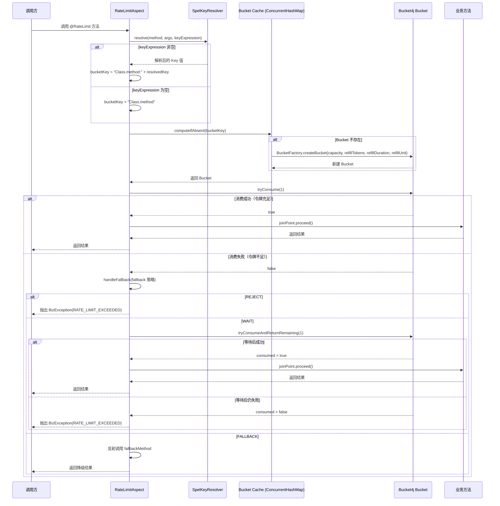
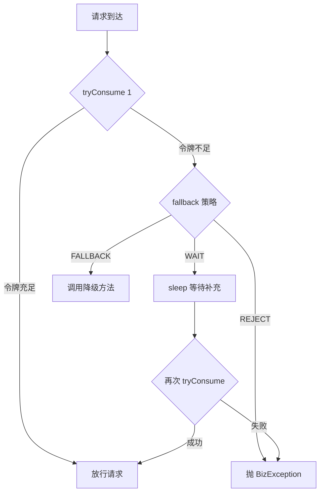

# 限流客户端（client-ratelimit） — Contract 轨

> 代码变更时必须同步更新本文档

## 📋 目录

- [概述](#概述)
- [业务场景](#业务场景)
- [技术设计](#技术设计)
- [API 参考](#api-参考)
- [配置参考](#配置参考)
- [使用指南](#使用指南)
- [相关文档](#相关文档)
- [变更历史](#变更历史)

## 概述

限流客户端（`client-ratelimit`）基于 Bucket4j 令牌桶算法 + Caffeine 缓存，提供方法级别的接口限流能力。通过 `@RateLimit` 注解声明式配置限流规则，支持 SpEL 表达式自定义限流维度（如按用户 ID、IP 等）。

核心特性：

- **声明式限流**：`@RateLimit` 注解标注方法，AOP 切面自动拦截
- **令牌桶算法**：基于 Bucket4j 实现，支持容量和补充速率自定义
- **SpEL Key 解析**：`SpelKeyResolver` 支持通过 SpEL 表达式从方法参数提取限流维度
- **三种降级策略**：REJECT（拒绝）、WAIT（等待）、FALLBACK（降级方法）
- **条件装配**：`middleware.ratelimit.enabled=true` 时启用（默认 true）

## 业务场景

### 1. 接口限流

对高频接口进行流量控制，防止突发流量压垮后端服务。例如：登录接口限制每秒 10 次、查询接口限制每分钟 100 次。

### 2. 多维度限流

通过 SpEL 表达式实现不同维度的独立限流：按用户 ID 限流（防止单用户刷接口）、按 IP 限流（防爬虫）、按租户限流（SaaS 多租户隔离）。

### 3. 降级策略

当请求超过限流阈值时，支持三种处理方式：
- **REJECT**：直接拒绝，抛出 `BizException(RATE_LIMIT_EXCEEDED)`
- **WAIT**：阻塞等待令牌补充，超时仍抛异常
- **FALLBACK**：调用自定义降级方法返回兜底数据

## 技术设计

### 限流检查流程时序图



### Bucket4j 令牌桶模型



## API 参考

### @RateLimit 注解

> 包路径：`org.smm.archetype.client.ratelimit.RateLimit`

| 属性 | 类型 | 默认值 | 说明 |
|------|------|--------|------|
| `capacity` | `double` | `10` | 令牌桶容量（最大突发请求数） |
| `refillTokens` | `double` | `10` | 每次补充的令牌数 |
| `refillDuration` | `long` | `1` | 补充令牌的时间窗口长度 |
| `refillUnit` | `TimeUnit` | `TimeUnit.SECONDS` | 补充令牌的时间单位 |
| `key` | `String` | `""` | 限流 Key 的 SpEL 表达式，如 `#userId`、`#request.id`。为空时使用方法全限定名 |
| `fallback` | `LimitFallback` | `LimitFallback.REJECT` | 限流时的降级策略 |
| `fallbackMethod` | `String` | `""` | 降级方法名（仅 fallback=FALLBACK 时生效），必须在同一个 Bean 中 |

### LimitFallback 枚举

> 包路径：`org.smm.archetype.client.ratelimit.LimitFallback`

| 枚举值 | 说明 |
|--------|------|
| `REJECT` | 拒绝请求，抛出 `BizException(RATE_LIMIT_EXCEEDED)` |
| `WAIT` | 阻塞等待令牌补充，等待后再次尝试消费 |
| `FALLBACK` | 执行降级方法（由 `fallbackMethod` 指定） |

### BucketFactory 工厂类

> 包路径：`org.smm.archetype.client.ratelimit.BucketFactory`

```java
public static Bucket createBucket(double capacity, double refillTokens,
                                   long refillDuration, TimeUnit refillUnit)
```

创建 Bucket4j 令牌桶实例。使用 `refillGreedy`（贪婪补充）策略，容量最小为 1。

### SpelKeyResolver 工具类

> 包路径：`org.smm.archetype.client.ratelimit.SpelKeyResolver`

```java
public static String resolve(Method method, Object[] args, String keyExpression)
```

解析 SpEL 表达式，将方法参数绑定到 SpEL 上下文。支持参数名引用（需编译时保留参数名 `-parameters`），解析失败时返回原始表达式字符串。

### RateLimitAspect 切面

> 包路径：`org.smm.archetype.client.ratelimit.RateLimitAspect`

| 方法 | 签名 | 说明 |
|------|------|------|
| `buildBucketKey` | `static String buildBucketKey(Method, Object[], String)` | 构建 Bucket Key（公开静态方法，可测试） |
| `putBucket` | `void putBucket(String, Bucket)` | 测试辅助方法，注入 mock Bucket |

## 配置参考

> 配置前缀：`middleware.ratelimit`

| 配置项 | 类型 | 默认值 | 说明 |
|--------|------|--------|------|
| `middleware.ratelimit.enabled` | `boolean` | `true` | 是否启用限流功能 |
| `middleware.ratelimit.default-capacity` | `double` | `10` | 默认桶容量（最大突发请求数） |
| `middleware.ratelimit.default-refill-tokens` | `double` | `10` | 默认每次补充的令牌数 |
| `middleware.ratelimit.default-refill-duration` | `long` | `1` | 默认补充令牌的时间窗口长度（秒） |

### 配置示例

```yaml
middleware:
  ratelimit:
    enabled: true
    default-capacity: 10
    default-refill-tokens: 10
    default-refill-duration: 1
```

## 使用指南

### 1. 基础限流（按方法）

```java
import org.smm.archetype.client.ratelimit.RateLimit;

@RestController
@RequestMapping("/api/test")
public class TestController {

    // 每秒最多 10 次调用，超出直接拒绝
    @RateLimit(capacity = 10, refillTokens = 10, refillDuration = 1)
    @GetMapping("/ping")
    public String ping() {
        return "pong";
    }
}
```

### 2. 按用户 ID 限流

```java
// 每个用户每分钟最多 5 次调用
@RateLimit(capacity = 5, refillTokens = 5, refillDuration = 1,
           refillUnit = TimeUnit.MINUTES, key = "#userId")
public Response createUser(Long userId, CreateRequest request) {
    // ...
}
```

### 3. 按请求参数字段限流

```java
// 按订单 ID 限流，每个订单每秒最多 3 次查询
@RateLimit(capacity = 3, refillTokens = 3, refillDuration = 1, key = "#request.orderId")
public OrderDTO getOrder(GetOrderRequest request) {
    // ...
}
```

### 4. WAIT 等待策略

```java
// 令牌不足时阻塞等待，而非直接拒绝
@RateLimit(capacity = 10, refillTokens = 10, refillDuration = 1,
           fallback = LimitFallback.WAIT)
public Response doSomething() {
    // ...
}
```

### 5. FALLBACK 降级策略

```java
// 令牌不足时调用降级方法返回兜底数据
@RateLimit(capacity = 10, refillTokens = 10, refillDuration = 1,
           fallback = LimitFallback.FALLBACK, fallbackMethod = "doSomethingFallback")
public Response doSomething() {
    return new Response("normal data");
}

// 降级方法必须无参、在同一个 Bean 中
public Response doSomethingFallback() {
    return new Response("fallback data");
}
```

### 6. 关闭限流

```yaml
middleware:
  ratelimit:
    enabled: false
```

### 7. 自动配置条件

限流客户端自动装配需满足以下条件：

- classpath 中存在 `io.github.bucket4j.Bucket`（Bucket4j）
- classpath 中存在 `org.aspectj.lang.annotation.Aspect`（AspectJ）
- `middleware.ratelimit.enabled=true`（默认 true，`matchIfMissing=true`）

## 相关文档

### 上游依赖

| 文档 | 链接 | 关系 |
|------|------|------|
| 设计模式 | [architecture/design-patterns.md](../architecture/design-patterns.md) | Template Method 模式的完整说明（本模块未直接使用，但作为客户端模块通用设计模式参考） |
| 请求流转 | [architecture/request-lifecycle.md](../architecture/request-lifecycle.md) | 限流切面在过滤器链中的位置与执行顺序 |

### 设计依据

| 文档 | 链接 | 关系 |
|------|------|------|
| 限流功能 Intent | [openspec/specs/rate-limiting/spec.md](../../openspec/specs/rate-limiting/spec.md) | `@RateLimit` 注解 + Bucket4j + SpEL Key + 三种降级策略的设计意图 |

## 变更历史
| 日期 | 变更内容 |
|------|---------|
| 2025-04-14 | 初始创建 |
