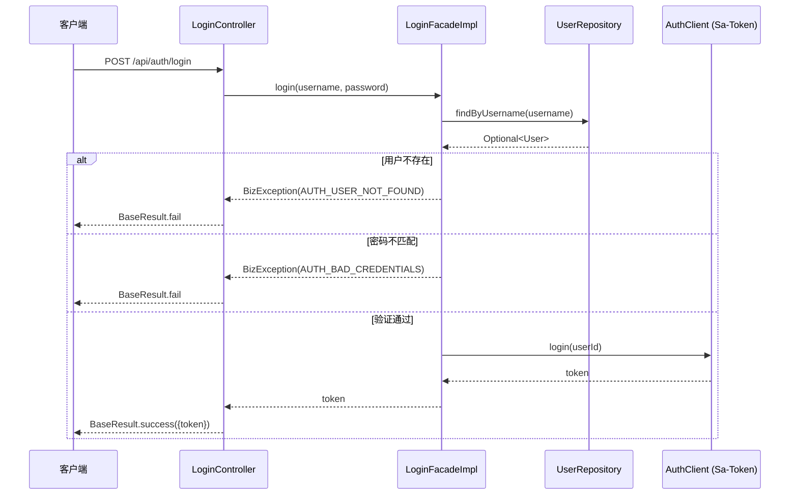
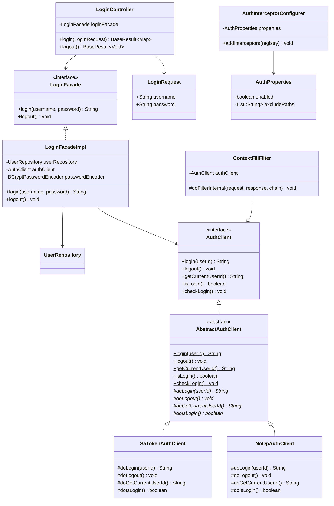

# 认证模块 — Contract 轨

> 代码变更时必须同步更新本文档

## 📋 目录

- [概述](#概述)
- [业务场景](#业务场景)
- [技术设计](#技术设计)
- [API 参考](#api-参考)
- [配置参考](#配置参考)
- [使用指南](#使用指南)
- [相关文档](#相关文档)
- [变更历史](#变更历史)

## 概述

基于 Sa-Token 的认证模块，提供登录/注销/会话管理功能，通过 `AuthClient` 抽象接口与路由拦截实现统一的认证管控。

## 业务场景

1. **用户登录**：接收用户名和密码，通过 BCrypt 验证后调用 Sa-Token 创建会话，返回 Token
2. **用户注销**：调用 Sa-Token 销毁当前会话
3. **路由拦截**：通过 `AuthInterceptorConfigurer` 配置需要认证的路由，排除白名单路径
4. **上下文填充**：`ContextFillFilter` 在请求入口注入 `AuthClient`，解析当前用户 ID 并写入 `ScopedThreadContext`

## 技术设计

### 登录时序图



### 类图



### 关键类说明

| 类 | 位置 | 职责 |
|---|---|---|
| `LoginController` | `app/.../controller/auth/` | REST 入口，定义 `/api/auth/login` 和 `/api/auth/logout` 端点 |
| `LoginFacade` | `app/.../service/auth/` | 登录门面接口，解耦 Controller 与底层认证实现 |
| `LoginFacadeImpl` | `app/.../service/auth/` | 登录门面实现，负责用户查找、BCrypt 密码验证、调用 AuthClient 创建会话 |
| `AuthClient` | `clients/client-auth/` | 认证客户端接口，定义 login/logout/getCurrentUserId/isLogin/checkLogin 五个方法 |
| `AbstractAuthClient` | `clients/client-auth/` | 认证客户端抽象基类，Template Method 模式，公开方法为 final，子类实现 do* 扩展点 |
| `SaTokenAuthClient` | `clients/client-auth/` | 基于 Sa-Token 的认证实现，使用 `StpUtil` 管理会话 |
| `NoOpAuthClient` | `clients/client-auth/` | 空操作认证实现，isLogin 始终返回 true，用于开发/测试环境 |
| `AuthProperties` | `clients/client-auth/` | 认证配置属性（`middleware.auth.*`），含 enabled 和 excludePaths |
| `AuthInterceptorConfigurer` | `clients/client-auth/` | Sa-Token 路由拦截器，自动配置 `SaInterceptor`，拦截 `/**` 并排除白名单 |
| `AuthAutoConfiguration` | `clients/client-auth/` | 认证自动配置，条件装配 SaTokenAuthClient 或 NoOpAuthClient |
| `ContextFillFilter` | `app/.../controller/global/` | 全局过滤器，解析 traceId 和 userId 写入 ScopedThreadContext |

## API 参考

### POST /api/auth/login

用户登录。

**请求体**（`LoginRequest`）：

| 字段 | 类型 | 必填 | 校验规则 | 说明 |
|---|---|---|---|---|
| `username` | String | 是 | `@NotBlank` | 用户名 |
| `password` | String | 是 | `@NotBlank` | 密码 |

**响应**（`BaseResult<Map<String, String>>`）：

```json
{
  "code": 0,
  "success": true,
  "message": "操作成功",
  "data": {
    "token": "eyJ0eXAiOiJKV1QiLCJhbGciOiJIUzI1NiJ9..."
  },
  "traceId": "abc123",
  "time": "2026-04-14T10:00:00Z"
}
```

**错误码**：

| 场景 | 错误码 | 说明 |
|---|---|---|
| 用户不存在 | `AUTH_USER_NOT_FOUND` | 用户名在数据库中不存在 |
| 密码错误 | `AUTH_BAD_CREDENTIALS` | BCrypt 验证失败 |

---

### POST /api/auth/logout

用户注销，销毁当前会话。

**请求**：无请求体（Token 从 Header 中获取）

**响应**（`BaseResult<Void>`）：

```json
{
  "code": 0,
  "success": true,
  "message": "操作成功",
  "data": null,
  "traceId": "abc123",
  "time": "2026-04-14T10:00:00Z"
}
```

## 配置参考

| 配置项 | 类型 | 默认值 | 说明 |
|---|---|---|---|
| `middleware.auth.enabled` | boolean | `true` | 是否启用认证功能。设为 false 时不注册拦截器 |
| `middleware.auth.exclude-paths` | List\<String\> | `[]` | 不需要认证的路径列表（如 `/api/auth/login`） |

**条件装配规则**：
- `middleware.auth.enabled=true`（默认）且 classpath 中存在 Sa-Token 时 → 注册 `SaTokenAuthClient`
- `middleware.auth.enabled=true` 但 classpath 中无 Sa-Token → 注册 `NoOpAuthClient`
- `middleware.auth.enabled=false` → 不注册任何 AuthClient Bean

## 使用指南

### 集成步骤

1. **引入依赖**：在 `app/pom.xml` 中确保已引入 `client-auth` 模块

```xml
<dependency>
    <groupId>org.smm.archetype</groupId>
    <artifactId>client-auth</artifactId>
</dependency>
```

2. **配置白名单路径**：在 `application.yaml` 中配置不需要认证的路径

```yaml
middleware:
  auth:
    enabled: true
    exclude-paths:
      - /api/auth/login
      - /api/test/**
      - /doc.html
      - /swagger-ui/**
      - /v3/api-docs/**
```

3. **使用 AuthClient**：在 Service 层注入 `AuthClient` 获取当前用户信息

```java
@Service
@RequiredArgsConstructor
public class SomeService {

    private final AuthClient authClient;

    public void doSomething() {
        // 获取当前登录用户 ID
        String userId = authClient.getCurrentUserId();

        // 校验登录状态（未登录抛 BizException）
        authClient.checkLogin();

        // 判断是否已登录
        boolean loggedIn = authClient.isLogin();
    }
}
```

4. **获取上下文信息**：通过 `ScopedThreadContext` 在任意层获取 traceId 和 userId

```java
String userId = ScopedThreadContext.getUserId();
String traceId = ScopedThreadContext.getTraceId();
```

### 在 Controller 层使用认证守卫

在需要认证保护的 Controller 方法中，通过 `AuthClient` 校验登录状态并获取用户信息：

```java
@RestController
@RequestMapping("/api/user")
@RequiredArgsConstructor
public class UserController {

    private final AuthClient authClient;
    private final UserFacade userFacade;

    @GetMapping("/profile")
    public BaseResult<UserProfileVO> getProfile() {
        // 校验登录状态（未登录自动抛 BizException）
        authClient.checkLogin();

        // 获取当前用户 ID，查询个人信息
        String currentUserId = authClient.getCurrentUserId();
        UserProfileVO profile = userFacade.getProfile(currentUserId);
        return BaseResult.success(profile);
    }
}
```

> **提示**：`checkLogin()` 在用户未登录时抛出 `BizException`，由 `WebExceptionAdvise` 统一处理返回 401 响应，无需手动判断。

## 相关文档

### 上游依赖
- [docs/modules/client-auth.md](client-auth.md) — AuthClient 接口定义与 Sa-Token/NoOp 两种实现
- [docs/architecture/request-lifecycle.md](../architecture/request-lifecycle.md) — 认证拦截链路（AuthInterceptorConfigurer → ContextFillFilter）
- [docs/conventions/error-handling.md](../conventions/error-handling.md) — 错误码 i18n 与 BizException 处理

### 下游消费者
- **所有需要认证的 Controller**：通过 `AuthInterceptorConfigurer` 拦截器统一管控
- **所有需要获取当前用户的 Service**：通过 `AuthClient.getCurrentUserId()` 获取
- `ScopedThreadContext`：`ContextFillFilter` 写入 userId/traceId，全链路可用

### 设计依据
- [openspec/specs/auth/spec.md](../../openspec/specs/auth/spec.md) — 认证功能设计意图（🔴 Intent 轨）

## 变更历史
| 日期 | 变更内容 |
|------|---------|
| 2025-04-14 | 初始创建 |
