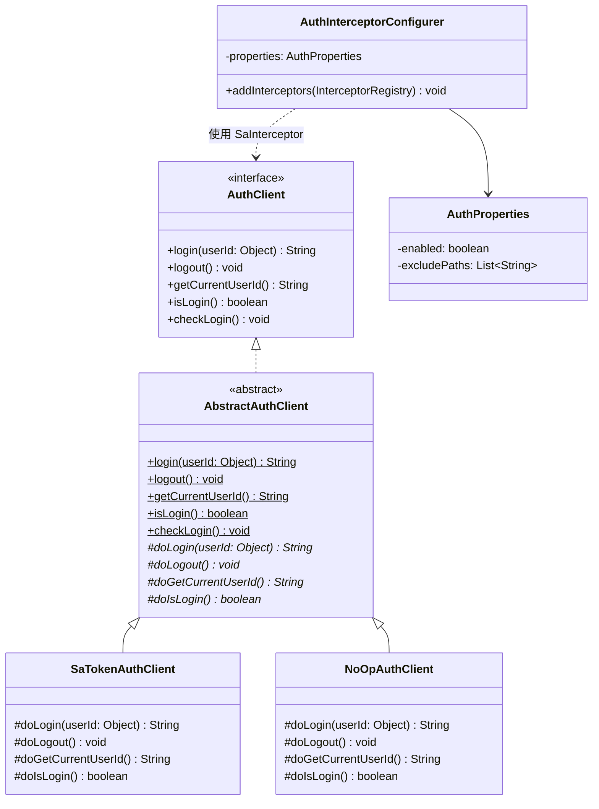
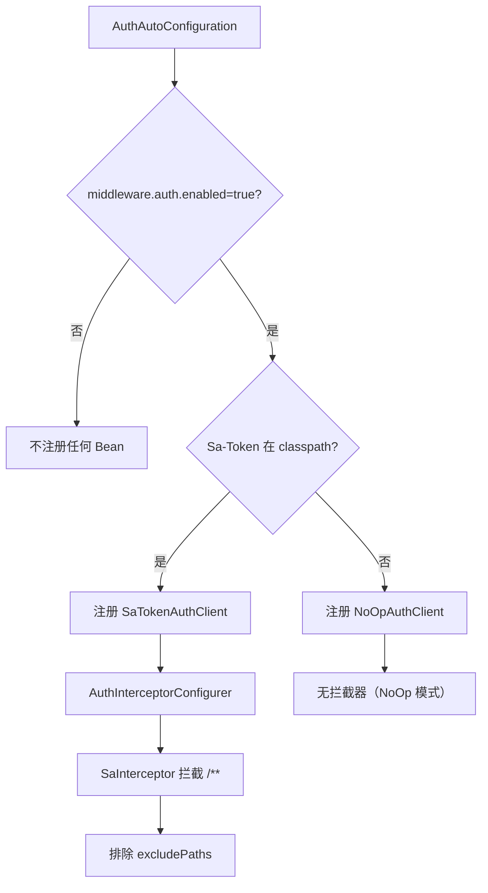
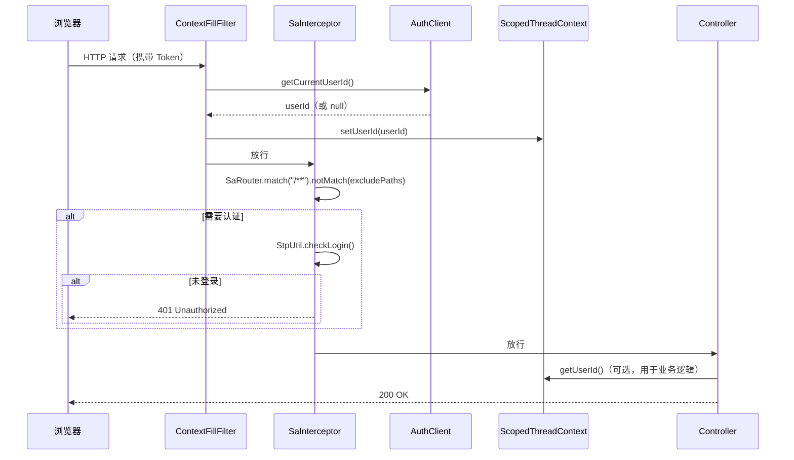

# 认证客户端（client-auth） — Contract 轨

> 代码变更时必须同步更新本文档

## 📋 目录

- [概述](#概述)
- [业务场景](#业务场景)
- [技术设计](#技术设计)
- [API 参考](#api-参考)
- [配置参考](#配置参考)
- [使用指南](#使用指南)
- [相关文档](#相关文档)
- [变更历史](#变更历史)

## 概述

认证客户端（`client-auth`）提供统一的认证接口，基于 Template Method 模式实现可扩展的认证体系。默认使用 Sa-Token 框架实现会话管理，当 Sa-Token 不在 classpath 时自动降级为 NoOp 实现。

核心特性：

- **统一接口**：`AuthClient` 接口定义 login/logout/getCurrentUserId/isLogin/checkLogin 五个标准操作
- **Template Method 模式**：`AbstractAuthClient` 公开方法为 `final`，子类实现 `do*` 扩展点
- **条件装配**：Sa-Token 存在时注册 `SaTokenAuthClient`，否则注册 `NoOpAuthClient`
- **路由拦截**：`AuthInterceptorConfigurer` 基于 Sa-Token SaInterceptor 自动配置 Web 拦截器
- **路径排除**：通过 `middleware.auth.exclude-paths` 配置不需要认证的路径

## 业务场景

### 1. 用户认证

提供登录（`login`）、注销（`logout`）等基础认证操作。`login` 接收 userId 返回 token，`logout` 注销当前会话。

### 2. 路由拦截

`AuthInterceptorConfigurer` 拦截所有 HTTP 请求，校验登录状态。支持配置排除路径（如 `/api/auth/login`、健康检查端点等）。

### 3. 上下文填充

app 模块的 `ContextFillFilter` 注入 `AuthClient`，在请求入口处调用 `getCurrentUserId()` 获取当前用户 ID 并填充到 `ScopedThreadContext`，供下游 Service 层使用。

### 4. 开发/测试降级

当 Sa-Token 不在 classpath 时（如纯单元测试场景），自动注册 `NoOpAuthClient`，`isLogin` 始终返回 `true`，避免认证逻辑阻塞开发和测试。

## 技术设计

### AuthClient 接口继承体系



### 条件装配流程



### 认证请求处理流程



## API 参考

### AuthClient 接口

> 包路径：`org.smm.archetype.client.auth.AuthClient`

| 方法 | 签名 | 返回值 | 说明 |
|------|------|--------|------|
| `login` | `String login(Object userId)` | `String`（token 值） | 登录，userId 为 null 时 AbstractAuthClient 抛出 BizException |
| `logout` | `void logout()` | `void` | 注销当前会话 |
| `getCurrentUserId` | `String getCurrentUserId()` | `String`（用户 ID），未登录返回 `null` | 获取当前登录用户 ID |
| `isLogin` | `boolean isLogin()` | `boolean` | 判断当前是否已登录 |
| `checkLogin` | `void checkLogin()` | `void` | 校验登录状态，未登录抛出 `BizException(AUTH_UNAUTHORIZED)` |

### AbstractAuthClient 抽象基类

> 包路径：`org.smm.archetype.client.auth.AbstractAuthClient`

公开方法均为 `final`，完成参数校验与异常处理。子类实现以下 `do*` 扩展点：

| 扩展点 | 签名 | 说明 |
|--------|------|------|
| `doLogin` | `protected abstract String doLogin(Object userId)` | 执行登录逻辑，返回 token |
| `doLogout` | `protected abstract void doLogout()` | 执行注销逻辑 |
| `doGetCurrentUserId` | `protected abstract String doGetCurrentUserId()` | 获取当前用户 ID |
| `doIsLogin` | `protected abstract boolean doIsLogin()` | 判断是否已登录 |

### SaTokenAuthClient 实现

> 包路径：`org.smm.archetype.client.auth.SaTokenAuthClient`

基于 Sa-Token `StpUtil` 实现：
- `doLogin` → `StpUtil.login(userId)` + `StpUtil.getTokenValue()`
- `doLogout` → `StpUtil.logout()`
- `doGetCurrentUserId` → `StpUtil.getLoginIdDefaultNull()`（返回 String，未登录返回 null）
- `doIsLogin` → `StpUtil.isLogin()`

### NoOpAuthClient 实现

> 包路径：`org.smm.archetype.client.auth.NoOpAuthClient`

空操作实现，适用于 Sa-Token 不在 classpath 或认证功能被禁用的场景：
- `doLogin` → 返回 `null`
- `doLogout` → 无操作
- `doGetCurrentUserId` → 返回 `null`
- `doIsLogin` → 始终返回 `true`

### AuthInterceptorConfigurer

> 包路径：`org.smm.archetype.client.auth.AuthInterceptorConfigurer`

实现 `WebMvcConfigurer`，注册 Sa-Token 拦截器：
- 拦截路径：`/**`
- 排除路径：从 `AuthProperties.excludePaths` 读取
- 校验逻辑：`StpUtil.checkLogin()`

## 配置参考

> 配置前缀：`middleware.auth`

| 配置项 | 类型 | 默认值 | 说明 |
|--------|------|--------|------|
| `middleware.auth.enabled` | `boolean` | `true` | 是否启用认证功能 |
| `middleware.auth.exclude-paths` | `List<String>` | `[]` | 不需要认证的路径列表（Ant 风格匹配） |

### 配置示例

```yaml
middleware:
  auth:
    enabled: true
    exclude-paths:
      - /api/auth/login
      - /api/auth/register
      - /actuator/**
      - /swagger-ui/**
      - /v3/api-docs/**
```

## 使用指南

### 1. 在 Facade/Service 中使用 AuthClient

```java
import org.smm.archetype.client.auth.AuthClient;

@Service
@RequiredArgsConstructor
public class LoginFacadeImpl implements LoginFacade {

    private final AuthClient authClient;

    @Override
    public LoginResult login(LoginRequest request) {
        // 参数校验
        User user = userRepository.getByUsername(request.getUsername());
        // 登录
        String token = authClient.login(user.getId());
        return new LoginResult(token);
    }

    @Override
    public void logout() {
        authClient.logout();
    }

    @Override
    public UserInfo getCurrentUser() {
        authClient.checkLogin(); // 未登录抛异常
        String userId = authClient.getCurrentUserId();
        return userRepository.getById(Long.parseLong(userId));
    }
}
```

### 2. 在 ContextFillFilter 中使用 AuthClient

```java
@Component
@RequiredArgsConstructor
public class ContextFillFilter extends OncePerRequestFilter {

    private final AuthClient authClient;

    @Override
    protected void doFilterInternal(HttpServletRequest request,
                                     HttpServletResponse response,
                                     FilterChain filterChain) {
        try {
            String userId = authClient.getCurrentUserId();
            ScopedThreadContext.setUserId(userId);
            filterChain.doFilter(request, response);
        } finally {
            ScopedThreadContext.clear();
        }
    }
}
```

### 3. 配置排除路径

在 `application.yaml` 中配置不需要认证的路径：

```yaml
middleware:
  auth:
    enabled: true
    exclude-paths:
      - /api/auth/login
      - /api/auth/register
      - /api/test/**
```

### 4. 关闭认证（开发/测试环境）

```yaml
middleware:
  auth:
    enabled: false
```

关闭后：
- `AuthAutoConfiguration` 不注册任何 Bean
- `AuthInterceptorConfigurer` 不注册拦截器
- 如果代码中直接注入 `AuthClient`，需自行提供 Bean 或使用 `@ConditionalOnBean` 保护

### 5. 自动配置条件

认证客户端自动装配逻辑：

| 条件 | 注册的 Bean | 说明 |
|------|-------------|------|
| `middleware.auth.enabled=true` + Sa-Token 在 classpath | `SaTokenAuthClient` | 正式认证 |
| `middleware.auth.enabled=true` + Sa-Token 不在 classpath | `NoOpAuthClient` | 兜底空操作 |
| `middleware.auth.enabled=true` + Sa-Token 在 classpath | `AuthInterceptorConfigurer` | 路由拦截器 |
| `middleware.auth.enabled=false` | 无 | 认证功能完全关闭 |

> **注意**：`AuthInterceptorConfigurer` 使用 `@ConditionalOnClass(name = "cn.dev33.satoken.stp.StpUtil")` + `@ConditionalOnProperty` 双重条件，仅在 Sa-Token 存在且认证启用时注册拦截器。

## 相关文档

### 上游依赖

| 文档 | 链接 | 关系 |
|------|------|------|
| 设计模式 | [architecture/design-patterns.md](../architecture/design-patterns.md) | Template Method 模式的完整说明（`AbstractAuthClient` → `SaTokenAuthClient`/`NoOpAuthClient` 的设计模式） |

### 下游消费者

| 文档 | 链接 | 关系 |
|------|------|------|
| 认证模块 | [modules/auth.md](auth.md) | 使用 `AuthClient` 接口实现登录/注销/会话管理等认证业务逻辑 |

### 设计依据

| 文档 | 链接 | 关系 |
|------|------|------|
| 认证功能 Intent | [openspec/specs/auth/spec.md](../../openspec/specs/auth/spec.md) | `AuthClient` 接口 + Sa-Token 集成 + NoOp 降级 + 路由拦截的设计意图 |

## 变更历史
| 日期 | 变更内容 |
|------|---------|
| 2025-04-14 | 初始创建 |
