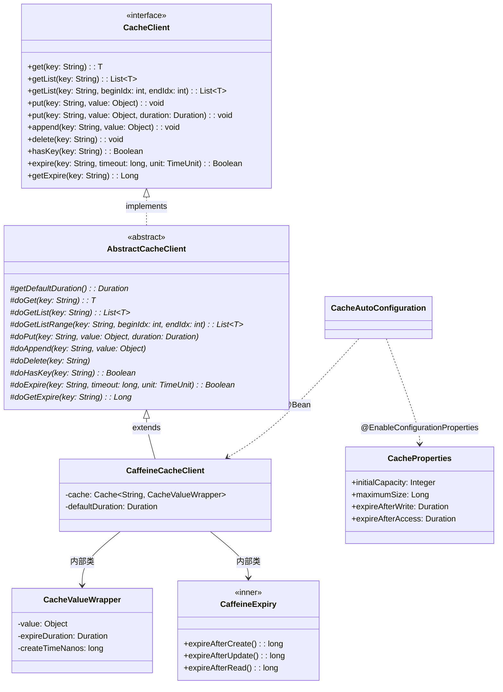

# 缓存客户端（client-cache）— Contract 轨

> 代码变更时必须同步更新本文档

## 📋 目录

- [概述](#概述)
- [业务场景](#业务场景)
- [技术设计](#技术设计)
- [API 参考](#api-参考)
- [配置参考](#配置参考)
- [使用指南](#使用指南)
- [相关文档](#相关文档)
- [变更历史](#变更历史)

## 概述

缓存客户端（`client-cache`）是基于 [Caffeine](https://github.com/ben-manes/caffeine) 的高性能本地缓存组件，提供完整的缓存读写、TTL 过期管理和 List 类型缓存支持。

**核心特性：**

- 基于 Caffeine 的本地缓存，零网络开销
- **Template Method 模式**：抽象基类统一处理参数校验、异常转换与日志记录
- 每个 Entry 独立过期时间，通过自定义 `CaffeineExpiry` 策略实现
- 支持单值和 List 类型缓存，支持子列表范围查询
- 自动装配：classpath 存在 Caffeine 时自动注册 Bean

**模块坐标：** `org.smm.archetype:client-cache`

## 业务场景

| 场景 | 说明 |
|------|------|
| 热点数据缓存 | 将高频访问的业务数据（如系统配置、字典项）缓存到本地内存，减少数据库查询 |
| 会话数据缓存 | 缓存用户会话信息，加速请求处理 |
| 列表数据缓存 | 缓存分页查询结果，支持范围读取避免全量加载 |
| 计算结果缓存 | 缓存耗时计算结果，提升响应速度 |
| 限流/幂等辅助 | 为 `app/.../shared/aspect/ratelimit` 和 `app/.../shared/aspect/idempotent` 提供底层存储支持 |

## 技术设计

### 类继承关系



### 关键类说明

| 类名 | 职责 | 关键方法 |
|------|------|----------|
| `CacheClient` | 缓存操作接口，定义 10 个缓存方法 | `get`, `put`, `delete`, `hasKey`, `expire` 等 |
| `AbstractCacheClient` | 抽象基类，Template Method 模式骨架 | `final` 公开方法 + `do*` 扩展点 |
| `CaffeineCacheClient` | Caffeine 实现，每个 Entry 独立过期 | `CacheValueWrapper` 包装值+过期时间 |
| `CacheValueWrapper` | 缓存值包装器，携带独立过期信息 | `value`, `expireDuration`, `createTimeNanos` |
| `CaffeineExpiry` | Caffeine 自定义过期策略 | `expireAfterCreate`, `expireAfterUpdate` |
| `CacheProperties` | 配置属性类 | `initialCapacity`, `maximumSize` 等 |
| `CacheAutoConfiguration` | Spring Boot 自动配置 | `@ConditionalOnClass(Caffeine.class)` |

### Template Method 模式

本客户端采用 Template Method 模式实现统一的校验/日志骨架。公开方法为 `final`（参数校验+日志），子类实现 `do*` 扩展点。详见 [设计模式](../architecture/design-patterns.md)。

### 条件装配

```yaml
# 自动装配条件
@ConditionalOnClass(Caffeine.class)                    # classpath 存在 Caffeine
@ConditionalOnProperty(                                 # 配置开关
  prefix = "middleware.cache",
  name = "enabled",
  havingValue = "true",
  matchIfMissing = true                                 # 默认启用
)
```

## API 参考

### CacheClient 接口方法（10 个）

| 方法 | 参数 | 返回值 | 说明 |
|------|------|--------|------|
| `get(String key)` | `key` - 缓存键 | `T` | 获取缓存值，不存在返回 `null` |
| `getList(String key)` | `key` - 缓存键 | `List<T>` | 获取 List 类型缓存值 |
| `getList(String key, int beginIdx, int endIdx)` | `key` - 缓存键, `beginIdx` - 起始索引（含）, `endIdx` - 结束索引（不含） | `List<T>` | 获取 List 类型缓存的子列表 |
| `put(String key, Object value)` | `key` - 缓存键, `value` - 缓存值 | `void` | 写入缓存（使用默认过期时间） |
| `put(String key, Object value, Duration duration)` | `key` - 缓存键, `value` - 缓存值, `duration` - 过期时间 | `void` | 写入缓存（指定过期时间） |
| `append(String key, Object value)` | `key` - 缓存键, `value` - 追加元素 | `void` | 追加元素到 List 类型缓存 |
| `delete(String key)` | `key` - 缓存键 | `void` | 删除缓存 |
| `hasKey(String key)` | `key` - 缓存键 | `Boolean` | 判断键是否存在 |
| `expire(String key, long timeout, TimeUnit unit)` | `key` - 缓存键, `timeout` - 超时时间, `unit` - 时间单位 | `Boolean` | 设置过期时间 |
| `getExpire(String key)` | `key` - 缓存键 | `Long` | 获取剩余过期时间（秒），不存在返回 `null` |

## 配置参考

| 配置项 | 类型 | 默认值 | 说明 |
|--------|------|--------|------|
| `middleware.cache.enabled` | `boolean` | `true` | 是否启用缓存客户端 |
| `middleware.cache.initial-capacity` | `Integer` | `1000` | Caffeine 缓存初始容量 |
| `middleware.cache.maximum-size` | `Long` | `10000` | Caffeine 缓存最大条目数 |
| `middleware.cache.expire-after-write` | `Duration` | `30d` | 写入后默认过期时间 |
| `middleware.cache.expire-after-access` | `Duration` | `30d` | 访问后过期时间（配置项存在，当前未使用） |

> **注意**：`expire-after-access` 配置项在 `CacheProperties` 中定义，但当前 `CaffeineCacheClient` 使用自定义 `CaffeineExpiry` 策略实现每个 Entry 独立过期，未使用此配置项。

## 使用指南

### 基础用法

```java
@RequiredArgsConstructor
@Service
public class ConfigService {

    private final CacheClient cacheClient;

    public SystemConfig getConfig(String key) {
        // 先查缓存
        SystemConfig config = cacheClient.get("config:" + key);
        if (config != null) {
            return config;
        }
        // 缓存未命中，查数据库
        config = configMapper.selectByKey(key);
        // 写入缓存，使用默认过期时间
        cacheClient.put("config:" + key, config);
        return config;
    }
}
```

### 自定义过期时间

```java
// 写入缓存，指定 1 小时过期
cacheClient.put("user:profile:" + userId, userProfile, Duration.ofHours(1));

// 设置已存在缓存的过期时间为 30 分钟
cacheClient.expire("user:profile:" + userId, 30, TimeUnit.MINUTES);

// 查询剩余过期时间
Long remainingSeconds = cacheClient.getExpire("user:profile:" + userId);
```

### List 类型缓存

```java
// 写入列表缓存
List<String> tags = List.of("java", "spring", "cache");
cacheClient.put("article:tags:" + articleId, tags);

// 读取列表
List<String> cachedTags = cacheClient.getList("article:tags:" + articleId);

// 读取子列表（分页场景）
List<String> page1 = cacheClient.getList("article:tags:" + articleId, 0, 10);

// 追加元素
cacheClient.append("article:tags:" + articleId, "new-tag");
```

### 缓存失效

```java
// 删除单个键
cacheClient.delete("config:" + key);

// 判断键是否存在
Boolean exists = cacheClient.hasKey("config:" + key);
```

### 配置示例

```yaml
# application.yaml
middleware:
  cache:
    enabled: true
    initial-capacity: 2000
    maximum-size: 50000
    expire-after-write: 1h
```

### 与限流/幂等模块集成

`client-cache` 作为底层存储，为限流（`app/.../shared/aspect/ratelimit`）和幂等（`app/.../shared/aspect/idempotent`）模块提供缓存支持。这些模块在内部注入 `CacheClient` 实现令牌桶状态和幂等 Key 的本地存储：

```java
// 限流模块内部使用示例（无需手动调用）
@RateLimit(key = "#request.userId", maxRequests = 10, period = "1m")
@GetMapping("/api/data")
public BaseResult<List<Data>> getData(DataRequest request) {
    // 限流逻辑由 Bucket4j + CacheClient 自动处理
    return BaseResult.success(dataService.query(request));
}

// 幂等模块内部使用示例（无需手动调用）
@Idempotent(key = "#request.orderId", expireTime = 24)
@PostMapping("/api/orders")
public BaseResult<OrderVO> createOrder(CreateOrderRequest request) {
    // 幂等逻辑由 CacheClient 自动处理
    return BaseResult.success(orderService.create(request));
}
```

## 相关文档

### 上游依赖
- [docs/architecture/design-patterns.md](../architecture/design-patterns.md) — Template Method 模式详细说明（AbstractCacheClient 骨架实现）

### 下游消费者
- `app/.../shared/aspect/ratelimit/` — 限流模块，使用 CacheClient 存储令牌桶状态
- `app/.../shared/aspect/idempotent/` — 幂等模块，使用 CacheClient 存储幂等 Key

### 设计考量

本模块选择 **Caffeine**（本地缓存）而非 **Redis**（分布式缓存），基于以下权衡：

| 维度 | Caffeine（本地缓存） | Redis（分布式缓存） |
|------|---------------------|---------------------|
| 部署复杂度 | 零外部依赖，内嵌运行 | 需要独立部署 Redis 服务 |
| 网络开销 | 无（进程内内存访问） | 每次操作需网络往返 |
| 一致性 | 单 JVM 内一致，多实例间不共享 | 多实例共享，天然一致 |
| 适用场景 | 单实例应用、限流/幂等辅助存储 | 分布式集群、共享会话 |

> 作为脚手架项目的通用基础设施，Caffeine 的零运维成本和纳秒级延迟更适合快速开发场景。如需分布式缓存，可参考 [architecture/design-patterns.md](../architecture/design-patterns.md) 中的 Template Method 模式扩展点，实现基于 Redis 的 `CacheClient` 子类。

## 变更历史
| 日期 | 变更内容 |
|------|---------|
| 2026-04-15 | 补充下游消费者引用（IdempotentAspect 使用 CacheClient 作为幂等 Key 存储后端） |
| 2025-04-14 | 初始创建 |
