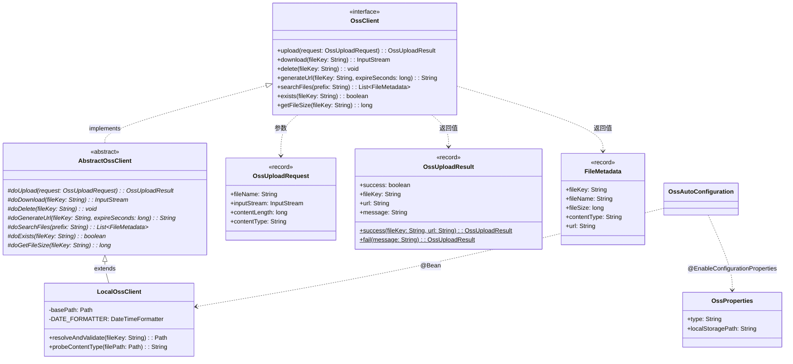

# 对象存储客户端（client-oss） — Contract 轨

> 代码变更时必须同步更新本文档

## 📋 目录

- [概述](#概述)
- [业务场景](#业务场景)
- [技术设计](#技术设计)
- [API 参考](#api-参考)
- [配置参考](#配置参考)
- [使用指南](#使用指南)
- [相关文档](#相关文档)
- [变更历史](#变更历史)

## 概述

对象存储客户端（`client-oss`）提供统一的文件存储抽象接口，内置基于本地文件系统的 `LocalOssClient` 实现。采用 NIO 零拷贝文件操作和日期分层目录结构（`yyyy/MM`），适用于轻量级文件存储场景。

**核心特性：**

- 统一的 `OssClient` 接口，屏蔽底层存储差异
- **Template Method 模式**：抽象基类统一处理参数校验、异常转换与日志记录
- 本地实现使用 **NIO 文件操作** + **日期分层目录**（`yyyy/MM`）
- 文件名防冲突：时间戳前缀（`{timestamp}-{fileName}`）
- 路径安全校验：`normalize()` 防止路径穿越攻击
- 自动装配：默认启用，`middleware.object-storage.enabled` 控制

**模块坐标：** `org.smm.archetype:client-oss`

## 业务场景

| 场景 | 说明 |
|------|------|
| 用户头像上传 | 存储用户上传的头像图片，按日期分层组织 |
| 附件管理 | 业务表单附件（合同、报告等）的存储与下载 |
| 日志文件导出 | 导出的日志/报表文件暂存，通过 URL 提供下载 |
| 静态资源托管 | 开发/测试环境的静态资源本地存储 |

## 技术设计

### 类继承关系



### 关键类说明

| 类名 | 职责 | 关键方法 |
|------|------|----------|
| `OssClient` | 对象存储操作接口，定义 7 个方法 | `upload`, `download`, `delete`, `generateUrl`, `searchFiles`, `exists`, `getFileSize` |
| `AbstractOssClient` | 抽象基类，Template Method 模式骨架 | `final` 公开方法 + `do*` 扩展点 |
| `LocalOssClient` | 本地文件系统实现 | NIO 操作 + 日期分层 + 路径安全校验 |
| `OssUploadRequest` | 上传请求 record | `fileName`, `inputStream`, `contentLength`, `contentType` |
| `OssUploadResult` | 上传结果 record | 静态工厂 `success()` / `fail()` |
| `FileMetadata` | 文件元数据 record | `fileKey`, `fileName`, `fileSize`, `contentType`, `url` |
| `OssProperties` | 配置属性类 | `type`, `localStoragePath` |

### Template Method 模式

本客户端采用 Template Method 模式实现统一的校验/日志骨架。公开方法为 `final`（参数校验+日志），子类实现 `do*` 扩展点。详见 [设计模式](../architecture/design-patterns.md)。

### 日期分层存储结构

```
./uploads/                          ← basePath（可配置）
├── 2026/
│   ├── 01/
│   │   ├── 1737500000000-avatar.png
│   │   └── 1737500100000-contract.pdf
│   ├── 02/
│   │   └── 1737500200000-report.xlsx
│   └── ...
└── 2026/
    └── 04/
        └── 1713000000000-photo.jpg
```

- 目录格式：`yyyy/MM`（通过 `DateTimeFormatter` 生成）
- 文件名格式：`{timestamp}-{originalFileName}`（时间戳防冲突）

### 条件装配

```yaml
# 自动装配条件
@ConditionalOnProperty(                                 # 配置开关
  prefix = "middleware.object-storage",
  name = "enabled",
  havingValue = "true",
  matchIfMissing = true                                 # 默认启用
)
```

## API 参考

### OssClient 接口方法（7 个）

| 方法 | 参数 | 返回值 | 说明 |
|------|------|--------|------|
| `upload(OssUploadRequest request)` | `request` - 上传请求（`fileName`, `inputStream`, `contentLength`, `contentType`） | `OssUploadResult` | 上传文件，返回 `fileKey` 和 `url` |
| `download(String fileKey)` | `fileKey` - 文件键 | `InputStream` | 下载文件，返回输入流 |
| `delete(String fileKey)` | `fileKey` - 文件键 | `void` | 删除文件 |
| `generateUrl(String fileKey, long expireSeconds)` | `fileKey` - 文件键, `expireSeconds` - URL 过期时间（秒） | `String` | 生成文件访问 URL |
| `searchFiles(String prefix)` | `prefix` - 文件键前缀（可为 `null`） | `List<FileMetadata>` | 搜索文件，按前缀匹配 |
| `exists(String fileKey)` | `fileKey` - 文件键 | `boolean` | 检查文件是否存在 |
| `getFileSize(String fileKey)` | `fileKey` - 文件键 | `long` | 获取文件大小（字节），不存在返回 `-1` |

### DTO 说明

#### OssUploadRequest

| 字段 | 类型 | 说明 |
|------|------|------|
| `fileName` | `String` | 原始文件名 |
| `inputStream` | `InputStream` | 文件输入流 |
| `contentLength` | `long` | 文件大小（字节） |
| `contentType` | `String` | MIME 类型 |

#### OssUploadResult

| 字段 | 类型 | 说明 |
|------|------|------|
| `success` | `boolean` | 是否成功 |
| `fileKey` | `String` | 文件存储键（如 `2026/04/1713000000000-photo.jpg`） |
| `url` | `String` | 文件访问 URL |
| `message` | `String` | 结果消息 |

#### FileMetadata

| 字段 | 类型 | 说明 |
|------|------|------|
| `fileKey` | `String` | 文件键（相对路径） |
| `fileName` | `String` | 文件名 |
| `fileSize` | `long` | 文件大小（字节） |
| `contentType` | `String` | MIME 类型 |
| `url` | `String` | 文件 URI |

## 配置参考

| 配置项 | 类型 | 默认值 | 说明 |
|--------|------|--------|------|
| `middleware.object-storage.enabled` | `boolean` | `true` | 是否启用对象存储客户端 |
| `middleware.object-storage.type` | `String` | `local` | 存储类型（当前仅支持 `local`） |
| `middleware.object-storage.local-storage-path` | `String` | `./uploads` | 本地存储根目录路径 |

## 使用指南

### 文件上传

```java
@RequiredArgsConstructor
@Service
public class FileService {

    private final OssClient ossClient;

    public OssUploadResult uploadAvatar(MultipartFile file) throws IOException {
        OssUploadRequest request = new OssUploadRequest(
            file.getOriginalFilename(),
            file.getInputStream(),
            file.getSize(),
            file.getContentType()
        );
        return ossClient.upload(request);
    }
}
```

### 文件下载

```java
public void downloadFile(String fileKey, HttpServletResponse response) throws IOException {
    try (InputStream is = ossClient.download(fileKey)) {
        response.setContentType("application/octet-stream");
        response.setHeader("Content-Disposition", "attachment; filename=" + fileKey);
        is.transferTo(response.getOutputStream());
    }
}
```

### 文件搜索

```java
// 搜索 2026 年 4 月的所有文件
List<FileMetadata> files = ossClient.searchFiles("2026/04");

// 搜索所有文件
List<FileMetadata> allFiles = ossClient.searchFiles(null);
```

### 文件管理

```java
// 检查文件是否存在
boolean exists = ossClient.exists("2026/04/1713000000000-photo.jpg");

// 获取文件大小
long size = ossClient.getFileSize("2026/04/1713000000000-photo.jpg");

// 生成访问 URL
String url = ossClient.generateUrl("2026/04/1713000000000-photo.jpg", 3600);

// 删除文件
ossClient.delete("2026/04/1713000000000-photo.jpg");
```

### 配置示例

```yaml
# application.yaml
middleware:
  object-storage:
    enabled: true
    type: local
    local-storage-path: /data/app/uploads
```

## 相关文档

### 上游依赖

| 文档 | 说明 |
|------|------|
| [Template Method 模式](../architecture/design-patterns.md) | `AbstractOssClient` 基类的设计模式说明 |
| [配置前缀规范](../conventions/configuration.md) | `middleware.object-storage.*` 配置前缀约定 |

### 下游消费者

| 文档 | 说明 |
|------|------|
| [系统配置模块](system-config.md) | 系统配置的 CRUD 操作可能依赖文件上传/下载 |
| [认证模块](auth.md) | 用户头像上传场景的消费者 |

### 设计依据

| 文档 | 说明 |
|------|------|
| [系统全景](../architecture/system-overview.md) | C4 架构中 client-oss 的定位 |
| [模块结构](../architecture/module-structure.md) | Maven 多模块结构中 client-oss 的依赖关系 |

## 变更历史
| 日期 | 变更内容 |
|------|---------|
| 2025-04-14 | 初始创建 |
