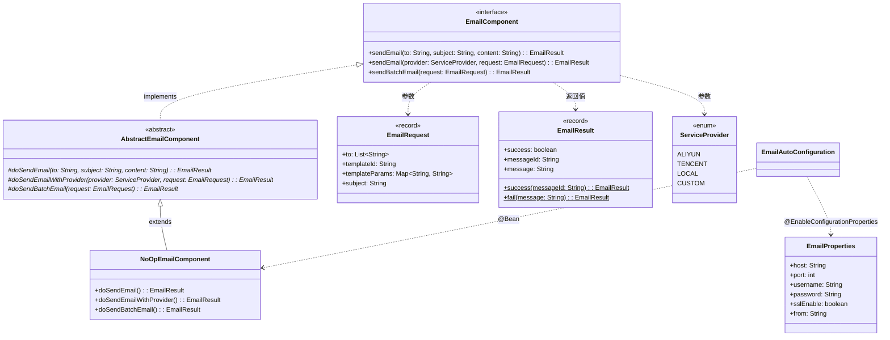

# 邮件组件（component-email） — Contract 轨

> 代码变更时必须同步更新本文档

## 📋 目录

- [概述](#概述)
- [业务场景](#业务场景)
- [技术设计](#技术设计)
- [API 参考](#api-参考)
- [配置参考](#配置参考)
- [使用指南](#使用指南)
- [相关文档](#相关文档)
- [变更历史](#变更历史)

## 概述

邮件组件（`component-email`）提供统一的邮件发送抽象接口，内置 `NoOpEmailComponent` 无操作实现。采用 Template Method 模式，支持简单邮件、指定服务商邮件和批量邮件三种发送方式。

**核心特性：**

- 统一的 `EmailComponent` 接口，支持 3 种发送模式
- **Template Method 模式**：抽象基类统一处理参数校验、异常转换与日志记录
- **NoOp 默认实现**：不调用真实邮件 SDK，仅记录日志并返回成功结果，适用于开发和测试环境
- 支持 `ServiceProvider` 枚举指定服务商（ALIYUN / TENCENT / LOCAL / CUSTOM）
- **条件装配**：默认不启用（`enabled=false`），需显式配置开启

**模块坐标：** `org.smm.archetype:component-email`

## 业务场景

| 场景 | 说明 |
|------|------|
| 注册验证码 | 发送用户注册邮箱验证码 |
| 密码重置 | 发送密码重置链接到用户邮箱 |
| 系统通知 | 发送系统告警、任务完成等通知邮件 |
| 报表推送 | 定时将业务报表以邮件附件形式发送 |
| 批量营销 | 向多个收件人批量发送营销邮件 |

## 技术设计

### 类继承关系



### 关键类说明

| 类名 | 职责 | 关键方法 |
|------|------|----------|
| `EmailComponent` | 邮件发送接口，定义 3 个方法 | `sendEmail`, `sendEmail(provider)`, `sendBatchEmail` |
| `AbstractEmailComponent` | 抽象基类，Template Method 模式骨架 | `final` 公开方法 + `do*` 扩展点 |
| `NoOpEmailComponent` | 无操作实现，仅记录日志 | 适用于开发和测试环境 |
| `EmailRequest` | 邮件请求 record | `to`, `templateId`, `templateParams`, `subject` |
| `EmailResult` | 邮件发送结果 record | 静态工厂 `success()` / `fail()` |
| `ServiceProvider` | 服务商枚举 | `ALIYUN`, `TENCENT`, `LOCAL`, `CUSTOM` |
| `EmailProperties` | SMTP 配置属性类 | `host`, `port`, `username`, `password`, `sslEnable`, `from` |

### Template Method 模式

本组件采用 Template Method 模式实现统一的校验/日志骨架。公开方法为 `final`（参数校验+日志），子类实现 `do*` 扩展点。详见 [设计模式](../architecture/design-patterns.md)。

### 条件装配

```yaml
# 自动装配条件
@ConditionalOnProperty(                                 # 配置开关
  prefix = "component.email",
  name = "enabled",
  havingValue = "true"                                  # 默认 false，不自动注册
)
```

> **重要**：邮件组件默认 **不启用**，需在配置文件中显式设置 `component.email.enabled=true`。

## API 参考

### EmailComponent 接口方法（3 个）

| 方法 | 参数 | 返回值 | 说明 |
|------|------|--------|------|
| `sendEmail(String to, String subject, String content)` | `to` - 收件人, `subject` - 主题, `content` - 内容 | `EmailResult` | 发送简单邮件 |
| `sendEmail(ServiceProvider provider, EmailRequest request)` | `provider` - 服务商, `request` - 邮件请求 | `EmailResult` | 使用指定服务商发送邮件 |
| `sendBatchEmail(EmailRequest request)` | `request` - 邮件请求（含收件人列表） | `EmailResult` | 发送批量邮件 |

### DTO 说明

#### EmailRequest

| 字段 | 类型 | 说明 |
|------|------|------|
| `to` | `List<String>` | 收件人列表 |
| `templateId` | `String` | 邮件模板 ID |
| `templateParams` | `Map<String, String>` | 模板参数 |
| `subject` | `String` | 邮件主题 |

#### EmailResult

| 字段 | 类型 | 说明 |
|------|------|------|
| `success` | `boolean` | 是否发送成功 |
| `messageId` | `String` | 消息 ID（NoOp 模式为随机 UUID） |
| `message` | `String` | 结果消息 |

#### ServiceProvider

| 枚举值 | 说明 |
|--------|------|
| `ALIYUN` | 阿里云邮件服务 |
| `TENCENT` | 腾讯云邮件服务 |
| `LOCAL` | 本地（无操作） |
| `CUSTOM` | 自定义服务商 |

## 配置参考

| 配置项 | 类型 | 默认值 | 说明 |
|--------|------|--------|------|
| `component.email.enabled` | `boolean` | `false` | 是否启用邮件组件（需显式开启） |
| `component.email.host` | `String` | `null` | SMTP 主机地址 |
| `component.email.port` | `int` | `587` | SMTP 端口 |
| `component.email.username` | `String` | `null` | SMTP 用户名 |
| `component.email.password` | `String` | `null` | SMTP 密码 |
| `component.email.ssl-enable` | `boolean` | `true` | 是否启用 SSL |
| `component.email.from` | `String` | `null` | 发件人地址 |

## 使用指南

### 发送简单邮件

```java
@RequiredArgsConstructor
@Service
public class NotificationService {

    private final EmailComponent emailClient;

    public void sendVerifyCode(String email, String code) {
        EmailResult result = emailClient.sendEmail(
            email,
            "注册验证码",
            "您的验证码为：" + code + "，5 分钟内有效。"
        );
        if (!result.success()) {
            throw new BizException("验证码发送失败: " + result.message());
        }
    }
}
```

### 使用指定服务商发送

```java
EmailRequest request = new EmailRequest(
    List.of("user@example.com"),
    "WELCOME_TEMPLATE",
    Map.of("username", "张三", "activationUrl", "https://example.com/activate"),
    "欢迎注册"
);

EmailResult result = emailClient.sendEmail(ServiceProvider.ALIYUN, request);
```

### 发送批量邮件

```java
EmailRequest batchRequest = new EmailRequest(
    List.of("user1@example.com", "user2@example.com", "user3@example.com"),
    "MONTHLY_REPORT",
    Map.of("month", "2026-04"),
    "4 月月报"
);

EmailResult result = emailClient.sendBatchEmail(batchRequest);
```

### 配置示例

```yaml
# application.yaml
middleware:
  email:
    enabled: true
    host: smtp.example.com
    port: 465
    username: noreply@example.com
    password: ${EMAIL_PASSWORD}
    ssl-enable: true
    from: noreply@example.com
```

## 相关文档

### 上游依赖

| 文档 | 说明 |
|------|------|
| [Template Method 模式](../architecture/design-patterns.md) | `AbstractEmailComponent` 基类的设计模式说明 |
| [配置前缀规范](../conventions/configuration.md) | `component.email.*` 配置前缀约定 |

### 下游消费者

| 文档 | 说明 |
|------|------|
| [认证模块](auth.md) | 注册验证码、密码重置邮件的发送场景 |
| [操作日志模块](operation-log.md) | 系统告警通知邮件的发送场景 |

### 设计依据

| 文档 | 说明 |
|------|------|
| [系统全景](../architecture/system-overview.md) | C4 架构中 component-email 的定位 |
| [模块结构](../architecture/module-structure.md) | Maven 多模块结构中 component-email 的依赖关系 |

## 变更历史
| 日期 | 变更内容 |
|------|---------|
| 2025-04-14 | 初始创建 |
