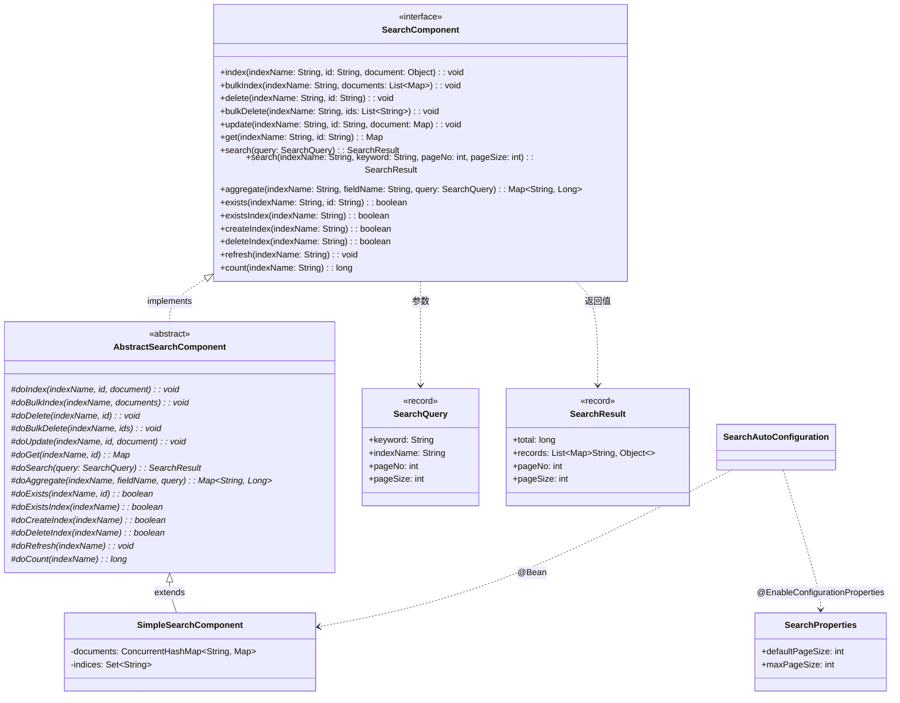

# 搜索组件（component-search） — Contract 轨

> 代码变更时必须同步更新本文档

## 📋 目录

- [概述](#概述)
- [业务场景](#业务场景)
- [技术设计](#技术设计)
- [API 参考](#api-参考)
- [配置参考](#配置参考)
- [使用指南](#使用指南)
- [相关文档](#相关文档)
- [变更历史](#变更历史)

## 概述

搜索组件（`component-search`）提供完整的全文搜索抽象接口，内置基于 `ConcurrentHashMap` 的 `SimpleSearchComponent` 内存实现。支持索引管理、文档 CRUD、全文关键字匹配、分页查询和聚合统计等功能。

**核心特性：**

- 统一的 `SearchComponent` 接口，提供 **15 个方法**，覆盖索引操作、文档操作和查询操作
- **Template Method 模式**：抽象基类统一处理参数校验、异常转换与日志记录
- **SimpleSearchComponent 内存实现**：基于 `ConcurrentHashMap`，零外部依赖，适用于开发和测试环境
- 支持全文关键字匹配：所有字段值的 `String.contains(keyword)` 匹配
- 支持分页查询和聚合统计
- 自动装配：默认启用，`component.search.enabled` 控制

**模块坐标：** `org.smm.archetype:component-search`

## 业务场景

| 场景 | 说明 |
|------|------|
| 全文搜索 | 对业务数据进行全文关键字搜索（如文章、商品、日志） |
| 数据聚合 | 按字段值聚合统计（如按分类统计文章数量） |
| 文档管理 | 文档的索引、更新、删除等 CRUD 操作 |
| 开发测试 | 在开发/测试环境中替代 Elasticsearch，快速验证搜索逻辑 |

## 技术设计

### 类继承关系



### 关键类说明

| 类名 | 职责 | 关键方法 |
|------|------|----------|
| `SearchComponent` | 搜索操作接口，定义 15 个方法 | 索引操作、文档操作、查询操作 |
| `AbstractSearchComponent` | 抽象基类，Template Method 模式骨架 | `final` 公开方法 + `do*` 扩展点 |
| `SimpleSearchComponent` | 内存实现，ConcurrentHashMap 存储 | 全文匹配、分页、聚合 |
| `SearchQuery` | 搜索查询 record | `keyword`, `indexName`, `pageNo`, `pageSize` |
| `SearchResult` | 搜索结果 record | `total`, `records`, `pageNo`, `pageSize` |
| `SearchProperties` | 配置属性类 | `defaultPageSize`, `maxPageSize` |

### Template Method 模式

本组件采用 Template Method 模式实现统一的校验/日志骨架。公开方法为 `final`（参数校验+日志），子类实现 `do*` 扩展点。详见 [设计模式](../architecture/design-patterns.md)。

### SimpleSearchComponent 存储结构

```
documents (ConcurrentHashMap)
├── "articles:001" → {"_id": "001", "title": "Java 入门", "content": "...", "author": "张三"}
├── "articles:002" → {"_id": "002", "title": "Spring Boot 实战", "content": "...", "author": "李四"}
└── "products:001" → {"_id": "001", "name": "手机", "price": "2999"}

indices (ConcurrentHashMap.newKeySet)
├── "articles"
└── "products"
```

- 文档键格式：`indexName:docId`
- 内部字段 `_id` 在返回时自动移除
- 对象文档通过 FastJSON2 序列化为 `Map`

### 条件装配

```yaml
# 自动装配条件
@ConditionalOnProperty(                                 # 配置开关
  prefix = "component.search",
  name = "enabled",
  havingValue = "true",
  matchIfMissing = true                                 # 默认启用
)
```

## API 参考

### SearchComponent 接口方法（15 个）

#### 索引操作（3 个）

| 方法 | 参数 | 返回值 | 说明 |
|------|------|--------|------|
| `createIndex(String indexName)` | `indexName` - 索引名称 | `boolean` | 创建索引 |
| `deleteIndex(String indexName)` | `indexName` - 索引名称 | `boolean` | 删除索引及其所有文档 |
| `existsIndex(String indexName)` | `indexName` - 索引名称 | `boolean` | 判断索引是否存在 |

#### 文档操作（5 个）

| 方法 | 参数 | 返回值 | 说明 |
|------|------|--------|------|
| `index(String indexName, String id, Object document)` | `indexName` - 索引名, `id` - 文档 ID, `document` - 文档内容 | `void` | 索引单条文档 |
| `bulkIndex(String indexName, List<Map<String, Object>> documents)` | `indexName` - 索引名, `documents` - 文档列表（含 `"id"` 或 `"_id"` 键） | `void` | 批量索引文档 |
| `update(String indexName, String id, Map<String, Object> document)` | `indexName` - 索引名, `id` - 文档 ID, `document` - 更新内容 | `void` | 更新文档（合并） |
| `delete(String indexName, String id)` | `indexName` - 索引名, `id` - 文档 ID | `void` | 删除单条文档 |
| `bulkDelete(String indexName, List<String> ids)` | `indexName` - 索引名, `ids` - 文档 ID 列表 | `void` | 批量删除文档 |

#### 查询操作（4 个）

| 方法 | 参数 | 返回值 | 说明 |
|------|------|--------|------|
| `get(String indexName, String id)` | `indexName` - 索引名, `id` - 文档 ID | `Map<String, Object>` | 获取单条文档 |
| `exists(String indexName, String id)` | `indexName` - 索引名, `id` - 文档 ID | `boolean` | 判断文档是否存在 |
| `count(String indexName)` | `indexName` - 索引名 | `long` | 获取索引文档数量 |
| `refresh(String indexName)` | `indexName` - 索引名 | `void` | 刷新索引（内存实现无操作） |

#### 搜索操作（3 个）

| 方法 | 参数 | 返回值 | 说明 |
|------|------|--------|------|
| `search(SearchQuery query)` | `query` - 搜索查询 | `SearchResult` | 搜索文档（全文匹配 + 分页） |
| `search(String indexName, String keyword, int pageNo, int pageSize)` | `indexName` - 索引名, `keyword` - 关键字, `pageNo` - 页码, `pageSize` - 每页大小 | `SearchResult` | 搜索文档（便捷方法，内部构造 `SearchQuery`） |
| `aggregate(String indexName, String fieldName, SearchQuery query)` | `indexName` - 索引名, `fieldName` - 聚合字段, `query` - 搜索查询（可为 null） | `Map<String, Long>` | 聚合查询（field → count） |

### DTO 说明

#### SearchQuery

| 字段 | 类型 | 说明 |
|------|------|------|
| `keyword` | `String` | 搜索关键字（全文匹配） |
| `indexName` | `String` | 索引名称 |
| `pageNo` | `int` | 页码（从 1 开始） |
| `pageSize` | `int` | 每页大小 |

#### SearchResult

| 字段 | 类型 | 说明 |
|------|------|------|
| `total` | `long` | 匹配总记录数 |
| `records` | `List<Map<String, Object>>` | 当前页记录列表 |
| `pageNo` | `int` | 当前页码 |
| `pageSize` | `int` | 每页大小 |

## 配置参考

| 配置项 | 类型 | 默认值 | 说明 |
|--------|------|--------|------|
| `component.search.enabled` | `boolean` | `true` | 是否启用搜索组件 |
| `component.search.default-page-size` | `int` | `10` | 默认每页大小 |
| `component.search.max-page-size` | `int` | `100` | 最大每页大小 |

## 使用指南

### 索引文档

```java
@RequiredArgsConstructor
@Service
public class ArticleService {

    private final SearchComponent searchClient;

    // 索引单条文档
    public void indexArticle(Article article) {
        Map<String, Object> doc = new HashMap<>();
        doc.put("title", article.getTitle());
        doc.put("content", article.getContent());
        doc.put("author", article.getAuthor());
        doc.put("category", article.getCategory());
        searchClient.index("articles", article.getId(), doc);
    }

    // 批量索引
    public void bulkIndexArticles(List<Article> articles) {
        List<Map<String, Object>> docs = articles.stream()
            .map(a -> {
                Map<String, Object> doc = new HashMap<>();
                doc.put("id", a.getId());
                doc.put("title", a.getTitle());
                doc.put("content", a.getContent());
                return doc;
            })
            .collect(Collectors.toList());
        searchClient.bulkIndex("articles", docs);
    }
}
```

### 搜索文档

```java
// 使用 SearchQuery 对象
SearchQuery query = new SearchQuery("Java", "articles", 1, 10);
SearchResult result = searchClient.search(query);
result.records().forEach(record -> log.info("标题: {}", record.get("title")));

// 使用便捷方法
SearchResult result2 = searchClient.search("articles", "Spring Boot", 1, 20);
log.info("共 {} 条结果", result2.total());
```

### 聚合查询

```java
// 按分类统计文章数量
Map<String, Long> categoryStats = searchClient.aggregate(
    "articles", "category", new SearchQuery(null, "articles", 1, 1000)
);
categoryStats.forEach((category, count) ->
    log.info("分类 {} 的文章数: {}", category, count)
);
```

### 文档管理

```java
// 获取单条文档
Map<String, Object> doc = searchClient.get("articles", "001");

// 更新文档
Map<String, Object> updates = Map.of("title", "新标题", "content", "新内容");
searchClient.update("articles", "001", updates);

// 检查文档是否存在
boolean exists = searchClient.exists("articles", "001");

// 删除单条文档
searchClient.delete("articles", "001");

// 批量删除
searchClient.bulkDelete("articles", List.of("001", "002", "003"));

// 统计文档数量
long total = searchClient.count("articles");
```

### 索引管理

```java
// 创建索引
searchClient.createIndex("products");

// 检查索引是否存在
boolean exists = searchClient.existsIndex("products");

// 删除索引（同时删除所有文档）
searchClient.deleteIndex("products");

// 刷新索引（内存实现无操作）
searchClient.refresh("articles");
```

### 配置示例

```yaml
# application.yaml
middleware:
  search:
    enabled: true
    default-page-size: 20
    max-page-size: 200
```

## 相关文档

### 上游依赖

| 文档 | 说明 |
|------|------|
| [Template Method 模式](../architecture/design-patterns.md) | `AbstractSearchComponent` 基类的设计模式说明 |
| [配置前缀规范](../conventions/configuration.md) | `component.search.*` 配置前缀约定 |

### 下游消费者

| 文档 | 说明 |
|------|------|
| [系统配置模块](system-config.md) | 系统配置的搜索与聚合查询场景 |
| [操作日志模块](operation-log.md) | 操作日志的全文搜索场景 |

### 设计依据

| 文档 | 说明 |
|------|------|
| [系统全景](../architecture/system-overview.md) | C4 架构中 component-search 的定位 |
| [模块结构](../architecture/module-structure.md) | Maven 多模块结构中 component-search 的依赖关系 |

## 变更历史
| 日期 | 变更内容 |
|------|---------|
| 2025-04-14 | 初始创建 |
