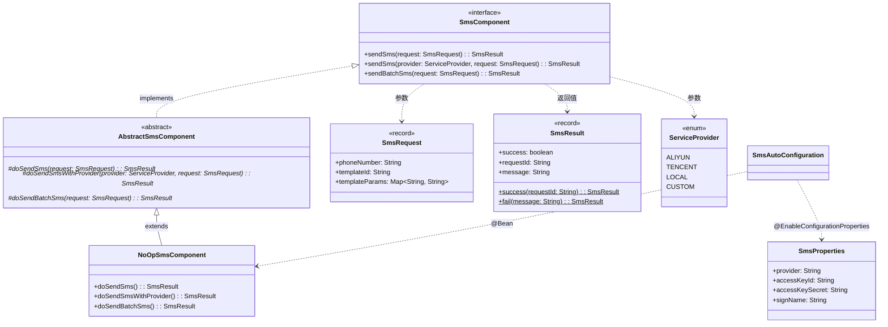

# 短信组件（component-sms） — Contract 轨

> 代码变更时必须同步更新本文档

## 📋 目录

- [概述](#概述)
- [业务场景](#业务场景)
- [技术设计](#技术设计)
- [API 参考](#api-参考)
- [配置参考](#配置参考)
- [使用指南](#使用指南)
- [相关文档](#相关文档)
- [变更历史](#变更历史)

## 概述

短信组件（`component-sms`）提供统一的短信发送抽象接口，内置 `NoOpSmsComponent` 无操作实现。采用 Template Method 模式，支持模板短信、指定服务商短信和批量短信三种发送方式。

**核心特性：**

- 统一的 `SmsComponent` 接口，支持 3 种发送模式
- **Template Method 模式**：抽象基类统一处理参数校验、异常转换与日志记录
- **NoOp 默认实现**：不调用真实短信 SDK，仅记录日志并返回成功结果，适用于开发和测试环境
- 支持 `ServiceProvider` 枚举指定服务商（ALIYUN / TENCENT / LOCAL / CUSTOM）
- **条件装配**：默认不启用（`enabled=false`），需显式配置开启

**模块坐标：** `org.smm.archetype:component-sms`

## 业务场景

| 场景 | 说明 |
|------|------|
| 注册验证码 | 发送用户注册手机验证码 |
| 登录验证 | 发送短信登录/二次验证码 |
| 安全通知 | 敏感操作（修改密码、异地登录）的短信通知 |
| 运维告警 | 系统异常时发送短信告警给运维人员 |
| 批量通知 | 向多个手机号批量发送通知短信 |

## 技术设计

### 类继承关系



### 关键类说明

| 类名 | 职责 | 关键方法 |
|------|------|----------|
| `SmsComponent` | 短信发送接口，定义 3 个方法 | `sendSms`, `sendSms(provider)`, `sendBatchSms` |
| `AbstractSmsComponent` | 抽象基类，Template Method 模式骨架 | `final` 公开方法 + `do*` 扩展点 |
| `NoOpSmsComponent` | 无操作实现，仅记录日志 | 适用于开发和测试环境 |
| `SmsRequest` | 短信请求 record | `phoneNumber`, `templateId`, `templateParams` |
| `SmsResult` | 短信发送结果 record | 静态工厂 `success()` / `fail()` |
| `ServiceProvider` | 服务商枚举 | `ALIYUN`, `TENCENT`, `LOCAL`, `CUSTOM` |
| `SmsProperties` | 短信配置属性类 | `provider`, `accessKeyId`, `accessKeySecret`, `signName` |

### Template Method 模式

本组件采用 Template Method 模式实现统一的校验/日志骨架。公开方法为 `final`（参数校验+日志），子类实现 `do*` 扩展点。详见 [设计模式](../architecture/design-patterns.md)。

### 条件装配

```yaml
# 自动装配条件
@ConditionalOnProperty(                                 # 配置开关
  prefix = "component.sms",
  name = "enabled",
  havingValue = "true"                                  # 默认 false，不自动注册
)
```

> **重要**：短信组件默认 **不启用**，需在配置文件中显式设置 `component.sms.enabled=true`。

## API 参考

### SmsComponent 接口方法（3 个）

| 方法 | 参数 | 返回值 | 说明 |
|------|------|--------|------|
| `sendSms(SmsRequest request)` | `request` - 短信请求 | `SmsResult` | 发送模板短信 |
| `sendSms(ServiceProvider provider, SmsRequest request)` | `provider` - 服务商, `request` - 短信请求 | `SmsResult` | 使用指定服务商发送短信 |
| `sendBatchSms(SmsRequest request)` | `request` - 短信请求（`phoneNumber` 支持多个手机号） | `SmsResult` | 发送批量短信 |

### DTO 说明

#### SmsRequest

| 字段 | 类型 | 说明 |
|------|------|------|
| `phoneNumber` | `String` | 手机号码（单个或逗号分隔的多个） |
| `templateId` | `String` | 短信模板 ID |
| `templateParams` | `Map<String, String>` | 模板参数 |

#### SmsResult

| 字段 | 类型 | 说明 |
|------|------|------|
| `success` | `boolean` | 是否发送成功 |
| `requestId` | `String` | 请求 ID（NoOp 模式为随机 UUID） |
| `message` | `String` | 结果消息 |

#### ServiceProvider

| 枚举值 | 说明 |
|--------|------|
| `ALIYUN` | 阿里云短信服务 |
| `TENCENT` | 腾讯云短信服务 |
| `LOCAL` | 本地（无操作） |
| `CUSTOM` | 自定义服务商 |

## 配置参考

| 配置项 | 类型 | 默认值 | 说明 |
|--------|------|--------|------|
| `component.sms.enabled` | `boolean` | `false` | 是否启用短信组件（需显式开启） |
| `component.sms.provider` | `String` | `null` | 短信服务商标识 |
| `component.sms.access-key-id` | `String` | `null` | AccessKey ID |
| `component.sms.access-key-secret` | `String` | `null` | AccessKey Secret |
| `component.sms.sign-name` | `String` | `null` | 短信签名 |

## 使用指南

### 发送验证码

```java
@RequiredArgsConstructor
@Service
public class AuthService {

    private final SmsComponent smsClient;

    public void sendLoginCode(String phone, String code) {
        SmsRequest request = new SmsRequest(
            phone,
            "SMS_LOGIN_CODE",
            Map.of("code", code)
        );
        SmsResult result = smsClient.sendSms(request);
        if (!result.success()) {
            throw new BizException("验证码发送失败: " + result.message());
        }
    }
}
```

### 使用指定服务商发送

```java
SmsRequest request = new SmsRequest(
    "13800138000",
    "SMS_ORDER_NOTIFY",
    Map.of("orderId", "ORD20260414001", "amount", "99.00")
);

SmsResult result = smsClient.sendSms(ServiceProvider.ALIYUN, request);
```

### 发送批量短信

```java
SmsRequest batchRequest = new SmsRequest(
    "13800138000,13900139000",
    "SMS_SYSTEM_NOTICE",
    Map.of("content", "系统将于今晚 22:00 进行维护")
);

SmsResult result = smsClient.sendBatchSms(batchRequest);
```

### 配置示例

```yaml
# application.yaml
middleware:
  sms:
    enabled: true
    provider: aliyun
    access-key-id: ${SMS_ACCESS_KEY_ID}
    access-key-secret: ${SMS_ACCESS_KEY_SECRET}
    sign-name: 我的应用
```

## 相关文档

### 上游依赖

| 文档 | 说明 |
|------|------|
| [Template Method 模式](../architecture/design-patterns.md) | `AbstractSmsComponent` 基类的设计模式说明 |
| [配置前缀规范](../conventions/configuration.md) | `component.sms.*` 配置前缀约定 |

### 下游消费者

| 文档 | 说明 |
|------|------|
| [认证模块](auth.md) | 登录验证码、注册验证码短信的发送场景 |
| [操作日志模块](operation-log.md) | 安全通知、运维告警短信的发送场景 |

### 设计依据

| 文档 | 说明 |
|------|------|
| [系统全景](../architecture/system-overview.md) | C4 架构中 component-sms 的定位 |
| [模块结构](../architecture/module-structure.md) | Maven 多模块结构中 component-sms 的依赖关系 |

## 变更历史
| 日期 | 变更内容 |
|------|---------|
| 2025-04-14 | 初始创建 |
