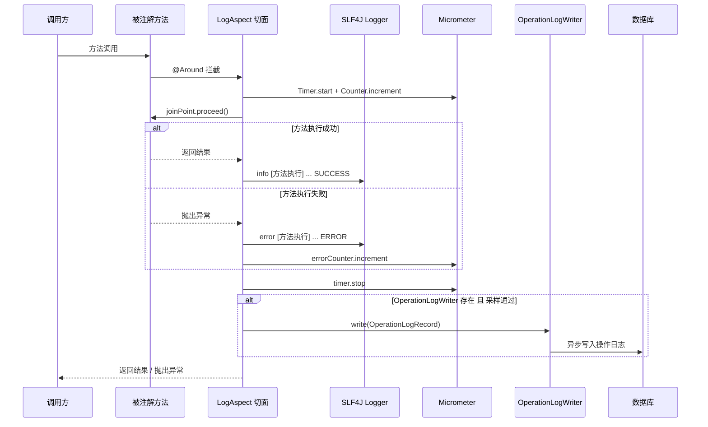
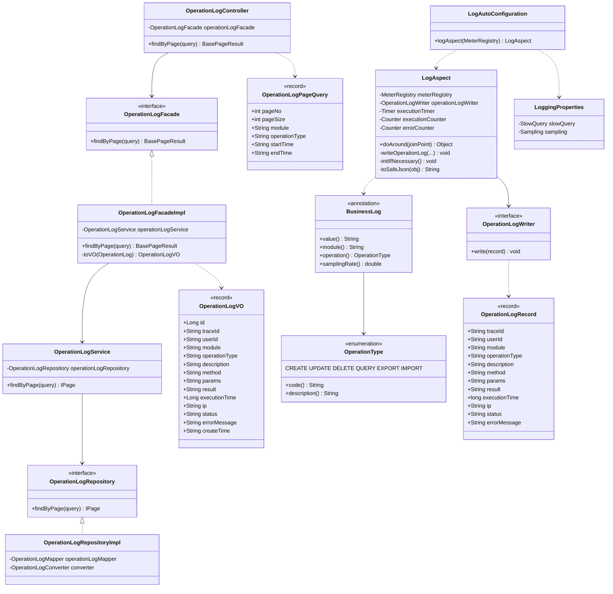

# 操作日志模块 — Contract 轨

> 代码变更时必须同步更新本文档

## 📋 目录

- [概述](#概述)
- [业务场景](#业务场景)
- [技术设计](#技术设计)
- [API 参考](#api-参考)
- [配置参考](#配置参考)
- [使用指南](#使用指南)
- [相关文档](#相关文档)
- [变更历史](#变更历史)

## 概述

通过 `@BusinessLog` 注解自动记录业务操作日志，支持 Micrometer 指标采集、采样率控制和分页查询，日志可通过 `OperationLogWriter` 接口持久化到数据库。

## 业务场景

1. **业务方法日志记录**：在任意 Service/Facade 方法上添加 `@BusinessLog` 注解，自动记录方法名、参数、返回值、执行时间、状态
2. **操作日志持久化**：通过 `OperationLogWriter` 接口将日志异步写入数据库，由 app 模块实现具体的持久化逻辑
3. **分页查询日志**：通过 REST API 分页查询操作日志，支持按模块、操作类型、时间范围过滤
4. **Micrometer 指标采集**：自动注册执行耗时 Timer、执行计数 Counter、错误计数 Counter
5. **采样控制**：高并发场景通过 `samplingRate` 属性控制日志记录比例

## 技术设计

### 日志记录时序图



### 类图



### 关键类说明

| 类 | 位置 | 职责 |
|---|---|---|
| `@BusinessLog` | `clients/client-log/` | 方法级注解，标注需要记录日志的业务方法 |
| `LogAspect` | `clients/client-log/` | AOP 切面，`@Around` 环绕通知，记录执行日志 + Micrometer 指标 + 持久化 |
| `OperationType` | `clients/client-log/` | 操作类型枚举：CREATE / UPDATE / DELETE / QUERY / EXPORT / IMPORT |
| `OperationLogWriter` | `clients/client-log/` | 操作日志写入器接口，由 app 模块实现具体持久化逻辑 |
| `OperationLogRecord` | `clients/client-log/` | 操作日志数据载体 record，在 LogAspect 与 Writer 之间传递 |
| `LogAutoConfiguration` | `clients/client-log/` | 自动配置类，注册 LogAspect Bean，条件：classpath 中存在 Micrometer + AspectJ |
| `LoggingProperties` | `clients/client-log/` | 日志配置属性（`logging.*`），含 slow-query 和 sampling 子配置 |
| `OperationLogController` | `app/.../controller/operationlog/` | REST 入口，提供分页查询端点 |
| `OperationLogFacade` / `OperationLogFacadeImpl` | `app/.../facade/operationlog/` | 门面层，Entity→VO 转换 |
| `OperationLogService` | `app/.../service/operationlog/` | 服务层，只读事务查询 |
| `OperationLogRepository` / `OperationLogRepositoryImpl` | `app/.../repository/operationlog/` | 数据访问层，MyBatis-Plus 查询，支持多条件过滤 |

### @BusinessLog 注解属性

| 属性 | 类型 | 默认值 | 说明 |
|---|---|---|---|
| `value` | String | `""` | 操作描述文本 |
| `module` | String | `""` | 业务模块名称 |
| `operation` | OperationType | `QUERY` | 操作类型（CREATE/UPDATE/DELETE/QUERY/EXPORT/IMPORT） |
| `samplingRate` | double | `1.0` | 采样率（0.0~1.0），1.0 表示全部记录 |

### Micrometer 指标

| 指标名 | 类型 | 说明 |
|---|---|---|
| `log_aspect_timer_seconds` | Timer | 方法执行耗时分布 |
| `log_aspect_counter_total` | Counter | 方法执行总次数 |
| `log_aspect_errors_total` | Counter | 方法执行错误次数 |

## API 参考

### GET /api/system/operation-logs

分页查询操作日志。

**查询参数**（`OperationLogPageQuery`）：

| 字段 | 类型 | 必填 | 校验规则 | 说明 |
|---|---|---|---|---|
| `pageNo` | int | 是 | `@Min(1)` | 当前页码 |
| `pageSize` | int | 是 | `@Min(1) @Max(100)` | 每页大小（最大 100） |
| `module` | String | 否 | — | 按模块名称过滤 |
| `operationType` | String | 否 | — | 按操作类型过滤（CREATE/UPDATE/DELETE/QUERY/EXPORT/IMPORT） |
| `startTime` | String | 否 | — | 开始时间（ISO 8601 格式，如 `2026-04-14T00:00:00Z`） |
| `endTime` | String | 否 | — | 结束时间（ISO 8601 格式） |

**响应**（`BasePageResult<OperationLogVO>`）：

```json
{
  "code": 0,
  "success": true,
  "message": "操作成功",
  "total": 100,
  "pageNo": 1,
  "pageSize": 20,
  "data": [
    {
      "id": 1,
      "traceId": "abc123",
      "userId": "1001",
      "module": "系统配置",
      "operationType": "UPDATE",
      "description": "更新配置",
      "method": "SystemConfigServiceImpl#updateConfig",
      "params": "[{\"configKey\":\"site.name\",\"configValue\":\"MyApp\"}]",
      "result": "null",
      "executionTime": 15,
      "ip": "192.168.1.100",
      "status": "SUCCESS",
      "errorMessage": "",
      "createTime": "2026-04-14T10:00:00Z"
    }
  ],
  "traceId": "abc123",
  "time": "2026-04-14T10:00:00Z"
}
```

**OperationLogVO 字段说明**：

| 字段 | 类型 | 说明 |
|---|---|---|
| `id` | Long | 日志 ID |
| `traceId` | String | 请求追踪 ID |
| `userId` | String | 操作用户 ID |
| `module` | String | 业务模块 |
| `operationType` | String | 操作类型（CREATE/UPDATE/DELETE/QUERY/EXPORT/IMPORT） |
| `description` | String | 操作描述 |
| `method` | String | 方法名（类名#方法名） |
| `params` | String | 请求参数（JSON，最大 2048 字符，超出截断） |
| `result` | String | 返回结果（JSON） |
| `executionTime` | Long | 执行时间（毫秒） |
| `ip` | String | 客户端 IP 地址 |
| `status` | String | 执行状态（SUCCESS / ERROR） |
| `errorMessage` | String | 错误信息（仅 ERROR 时有值） |
| `createTime` | String | 创建时间 |

## 配置参考

### 日志客户端配置（`logging.*`）

| 配置项 | 类型 | 默认值 | 说明 |
|---|---|---|---|
| `logging.slow-query.enabled` | boolean | `false` | 是否启用慢 SQL 监控 |
| `logging.slow-query.threshold-ms` | long | `1000` | 慢 SQL 阈值（毫秒），超过此阈值记录到 SLOW_QUERY logger |
| `logging.sampling.enabled` | boolean | `false` | 是否启用日志采样（SamplingTurboFilter） |
| `logging.sampling.rate` | double | `0.1` | 采样率（0.0~1.0），ERROR 级别始终记录不受采样影响 |

> **注意**：日志配置前缀为 `logging`（对接 Spring Boot 日志配置惯例），而非 `middleware.logging`。

### 条件装配

- `LogAutoConfiguration` 条件：classpath 中同时存在 `MeterRegistry` 和 `Aspect` 类
- `SlowQueryInterceptor` 条件：classpath 中存在 MyBatis 且 `logging.slow-query.enabled=true`
- `SamplingTurboFilter` 条件：`logging.sampling.enabled=true`

## 使用指南

### 在业务方法上使用 @BusinessLog

在需要记录日志的 Service 或 Facade 方法上添加 `@BusinessLog` 注解：

```java
import org.smm.archetype.client.log.BusinessLog;
import org.smm.archetype.client.log.OperationType;

@Service
public class SystemConfigService {

    @BusinessLog(value = "更新系统配置", module = "系统配置", operation = OperationType.UPDATE)
    @Transactional
    public void updateConfig(UpdateConfigCommand command) {
        // 业务逻辑...
    }

    @BusinessLog(value = "导出配置", module = "系统配置", operation = OperationType.EXPORT)
    public byte[] exportConfigs() {
        // 导出逻辑...
    }

    // 高频查询方法，设置采样率降低日志量
    @BusinessLog(value = "查询配置", module = "系统配置", operation = OperationType.QUERY, samplingRate = 0.1)
    public List<SystemConfig> getAllConfigs() {
        // 查询逻辑...
    }
}
```

### 实现 OperationLogWriter 持久化

在 app 模块中实现 `OperationLogWriter` 接口，将操作日志写入数据库：

```java
@Component
@RequiredArgsConstructor
public class MyBatisOperationLogWriter implements OperationLogWriter {

    private final OperationLogMapper operationLogMapper;

    @Override
    public void write(OperationLogRecord record) {
        OperationLogDO logDO = new OperationLogDO();
        logDO.setTraceId(record.traceId());
        logDO.setUserId(record.userId());
        logDO.setModule(record.module());
        logDO.setOperationType(record.operationType());
        logDO.setDescription(record.description());
        logDO.setMethod(record.method());
        logDO.setParams(record.params());
        logDO.setResult(record.result());
        logDO.setExecutionTime(record.executionTime());
        logDO.setIp(record.ip());
        logDO.setStatus(record.status());
        logDO.setErrorMessage(record.errorMessage());
        operationLogMapper.insert(logDO);
    }
}
```

### 查询操作日志

```bash
# 分页查询所有操作日志
curl "http://localhost:8080/api/system/operation-logs?pageNo=1&pageSize=20"

# 按模块过滤
curl "http://localhost:8080/api/system/operation-logs?pageNo=1&pageSize=20&module=系统配置"

# 按操作类型 + 时间范围过滤
curl "http://localhost:8080/api/system/operation-logs?pageNo=1&pageSize=20&operationType=UPDATE&startTime=2026-04-14T00:00:00Z&endTime=2026-04-14T23:59:59Z"
```

### 在 Facade 层使用 @BusinessLog

在 Facade 层方法上添加 `@BusinessLog` 注解，记录业务操作日志并自动采集 Micrometer 指标：

```java
@Facade
@RequiredArgsConstructor
public class UserFacadeImpl implements UserFacade {

    private final UserService userService;

    @BusinessLog(value = "创建用户", module = "用户管理", operation = OperationType.CREATE)
    @Override
    public UserVO createUser(CreateUserCommand command) {
        User user = userService.create(command);
        return toVO(user);
    }

    @BusinessLog(value = "删除用户", module = "用户管理", operation = OperationType.DELETE, samplingRate = 0.5)
    @Override
    public void deleteUser(Long userId) {
        userService.delete(userId);
    }
}
```

> **注意**：`@BusinessLog` 可用于 Service 或 Facade 层，建议放在 Facade 层以统一记录业务操作入口。`samplingRate = 0.5` 表示仅记录 50% 的操作日志，适用于高频低价值操作。

## 相关文档

### 上游依赖
- [docs/modules/client-log.md](client-log.md) — @BusinessLog 注解定义、LogAspect 切面、LoggingProperties 配置
- [docs/architecture/request-lifecycle.md](../architecture/request-lifecycle.md) — HTTP 请求完整处理链路

### 下游消费者
- **运维监控面板**：通过分页查询 API 展示操作日志，支持按模块/类型/时间范围过滤
- **Prometheus + Grafana**：通过 Micrometer 指标（Timer/Counter）监控方法执行耗时和错误率

### 设计依据
- [openspec/specs/operation-log/spec.md](../../openspec/specs/operation-log/spec.md) — 操作日志功能设计意图（🔴 Intent 轨）

## 变更历史
| 日期 | 变更内容 |
|------|---------|
| 2025-04-14 | 初始创建 |
