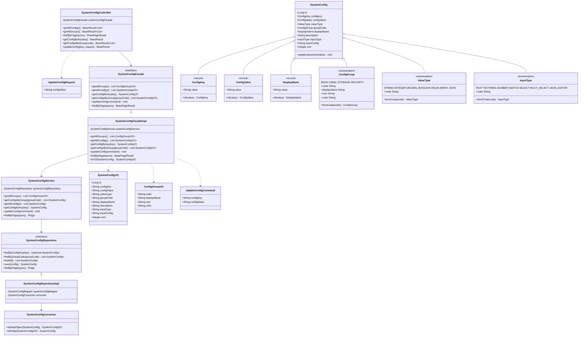

# 系统配置模块 — Contract 轨

> 代码变更时必须同步更新本文档

## 📋 目录

- [概述](#概述)
- [业务场景](#业务场景)
- [技术设计](#技术设计)
- [API 参考](#api-参考)
- [配置参考](#配置参考)
- [使用指南](#使用指南)
- [相关文档](#相关文档)
- [变更历史](#变更历史)

## 概述

系统配置的 CRUD 管理，支持按 Key 查询、按分组查询、分页查询和配置值更新，遵循 Controller → Facade → Service → Repository 四层架构。

## 业务场景

1. **获取所有配置**：查询系统中全部配置项列表，按分组和排序返回
2. **获取配置分组**：返回所有可用配置分组信息（BASIC、EMAIL、STORAGE、SECURITY）
3. **按 Key 获取配置**：根据配置键精确查找单个配置项
4. **按分组获取配置**：根据分组编码查询该分组下的所有配置项
5. **分页查询配置**：支持按分组过滤的分页查询，结果按 groupCode + sort 排序
6. **更新配置值**：通过 Key 定位配置项并更新其值

## 技术设计

### 类图



### 关键类说明

| 类 | 位置 | 职责 |
|---|---|---|
| `SystemConfigController` | `app/.../controller/system/` | REST 入口，6 个端点 |
| `SystemConfigFacade` / `SystemConfigFacadeImpl` | `app/.../facade/system/` | 门面层，Entity→VO 转换，统一 Controller 调用入口 |
| `SystemConfigService` | `app/.../service/system/` | 服务层，业务逻辑（含 `@Transactional`） |
| `SystemConfigRepository` / `SystemConfigRepositoryImpl` | `app/.../repository/system/` | 数据访问层，MyBatis-Plus 查询 |
| `SystemConfigConverter` | `app/.../repository/system/` | DO ↔ Entity 转换器 |
| `SystemConfig` | `app/.../entity/system/` | 领域实体，包含 `updateValue()` 业务方法 |
| `ConfigKey` / `ConfigValue` / `DisplayName` | `app/.../entity/system/` | 值对象 record，含校验和静态工厂 |
| `ConfigGroup` | `app/.../entity/system/` | 配置分组枚举（BASIC/EMAIL/STORAGE/SECURITY），含 icon 和 color |
| `ValueType` | `app/.../entity/system/` | 值类型枚举（STRING/INTEGER/DECIMAL/BOOLEAN/ENUM/ARRAY/JSON） |
| `InputType` | `app/.../entity/system/` | 输入类型枚举（TEXT/TEXTAREA/NUMBER/SWITCH/SELECT/MULTI_SELECT/JSON_EDITOR） |

## API 参考

### GET /api/system/configs

获取所有配置。

**响应**（`BaseResult<List<SystemConfigVO>>`）：

```json
{
  "code": 0,
  "success": true,
  "message": "操作成功",
  "data": [
    {
      "id": 1,
      "configKey": "site.name",
      "configValue": "MyApp",
      "valueType": "STRING",
      "groupCode": "BASIC",
      "displayName": "站点名称",
      "description": "站点显示名称",
      "inputType": "TEXT",
      "inputConfig": null,
      "sort": 1
    }
  ],
  "traceId": "abc123",
  "time": "2026-04-14T10:00:00Z"
}
```

---

### GET /api/system/configs/groups

获取所有配置分组。

**响应**（`BaseResult<List<ConfigGroupVO>>`）：

```json
{
  "code": 0,
  "success": true,
  "message": "操作成功",
  "data": [
    { "code": "BASIC", "displayName": "基础配置", "icon": "SettingOutlined", "color": "#1890ff" },
    { "code": "EMAIL", "displayName": "邮件配置", "icon": "MailOutlined", "color": "#52c41a" },
    { "code": "STORAGE", "displayName": "存储配置", "icon": "CloudOutlined", "color": "#faad14" },
    { "code": "SECURITY", "displayName": "安全配置", "icon": "LockOutlined", "color": "#722ed1" }
  ],
  "traceId": "abc123",
  "time": "2026-04-14T10:00:00Z"
}
```

---

### GET /api/system/configs/page

分页查询系统配置。

**查询参数**（`SystemConfigPageQuery`）：

| 字段 | 类型 | 必填 | 默认值 | 校验规则 | 说明 |
|---|---|---|---|---|---|
| `pageNo` | Integer | 否 | `1` | `@Min(1)` | 当前页码 |
| `pageSize` | Integer | 否 | `20` | `@Min(1) @Max(100)` | 每页大小（最大 100） |
| `groupCode` | String | 否 | — | — | 按分组编码过滤 |

**响应**（`BasePageResult<SystemConfigVO>`）：

```json
{
  "code": 0,
  "success": true,
  "message": "操作成功",
  "total": 50,
  "pageNo": 1,
  "pageSize": 20,
  "data": [...],
  "traceId": "abc123",
  "time": "2026-04-14T10:00:00Z"
}
```

---

### GET /api/system/configs/{key}

按 Key 获取单个配置。

**路径参数**：

| 字段 | 类型 | 说明 |
|---|---|---|
| `key` | String | 配置键（如 `site.name`） |

**响应**（`BaseResult<SystemConfigVO>`）：

```json
{
  "code": 0,
  "success": true,
  "message": "操作成功",
  "data": {
    "id": 1,
    "configKey": "site.name",
    "configValue": "MyApp",
    "valueType": "STRING",
    "groupCode": "BASIC",
    "displayName": "站点名称",
    "description": "站点显示名称",
    "inputType": "TEXT",
    "inputConfig": null,
    "sort": 1
  },
  "traceId": "abc123",
  "time": "2026-04-14T10:00:00Z"
}
```

---

### GET /api/system/configs/group/{code}

按分组获取配置列表。

**路径参数**：

| 字段 | 类型 | 说明 |
|---|---|---|
| `code` | String | 分组编码（BASIC/EMAIL/STORAGE/SECURITY） |

**响应**（`BaseResult<List<SystemConfigVO>>`）：同 GET /api/system/configs 格式。

---

### PUT /api/system/configs/{key}

更新配置值。

**路径参数**：

| 字段 | 类型 | 说明 |
|---|---|---|
| `key` | String | 配置键 |

**请求体**（`UpdateConfigRequest`）：

| 字段 | 类型 | 必填 | 校验规则 | 说明 |
|---|---|---|---|---|
| `configValue` | String | 是 | `@NotBlank` | 新的配置值 |

**响应**（`BaseResult<SystemConfigVO>`）：返回更新后的配置项。

## 配置参考

本模块无独立配置项，使用系统默认数据源（SQLite）。

## 使用指南

### 集成步骤

1. **新增配置分组**：在 `ConfigGroup` 枚举中添加新值

```java
// app/.../entity/system/ConfigGroup.java
public enum ConfigGroup {
    BASIC("BASIC", "基础配置", "SettingOutlined", "#1890ff"),
    EMAIL("EMAIL", "邮件配置", "MailOutlined", "#52c41a"),
    STORAGE("STORAGE", "存储配置", "CloudOutlined", "#faad14"),
    SECURITY("SECURITY", "安全配置", "LockOutlined", "#722ed1"),
    // 新增分组
    NOTIFY("NOTIFY", "通知配置", "BellOutlined", "#eb2f96");
    // ...
}
```

2. **新增配置项**：在数据库 `system_config` 表中插入记录

```sql
INSERT INTO system_config (config_key, config_value, value_type, group_code, display_name, description, input_type, sort)
VALUES ('notify.webhook.url', '', 'STRING', 'NOTIFY', 'Webhook 地址', '通知回调地址', 'TEXT', 1);
```

3. **在 Service 层使用配置**：注入 `SystemConfigService` 查询配置

```java
@Service
@RequiredArgsConstructor
public class NotifyService {

    private final SystemConfigService systemConfigService;

    public String getWebhookUrl() {
        SystemConfig config = systemConfigService.getConfigByKey("notify.webhook.url");
        return config != null ? config.getConfigValue().value() : "";
    }
}
```

4. **前端调用示例**：

```bash
# 获取所有配置
curl http://localhost:8080/api/system/configs

# 分页查询 BASIC 分组
curl "http://localhost:8080/api/system/configs/page?pageNo=1&pageSize=10&groupCode=BASIC"

# 按 Key 查询
curl http://localhost:8080/api/system/configs/site.name

# 更新配置
curl -X PUT http://localhost:8080/api/system/configs/site.name \
  -H "Content-Type: application/json" \
  -d '{"configValue": "MyNewApp"}'
```

### 在 Facade 层进行 Entity→VO 转换

`SystemConfigFacadeImpl` 负责将 Service 层返回的 Entity 转换为 Controller 层使用的 VO，确保 Entity 不泄露到 API 层：

```java
@Service
@RequiredArgsConstructor
public class SystemConfigFacadeImpl implements SystemConfigFacade {

    private final SystemConfigService systemConfigService;

    @Override
    public SystemConfigVO getConfigByKey(ConfigKey key) {
        SystemConfig config = systemConfigService.getConfigByKey(key);
        return toVO(config);
    }

    private SystemConfigVO toVO(SystemConfig entity) {
        if (entity == null) {
            return null;
        }
        return new SystemConfigVO(
            entity.getId(),
            entity.getConfigKey().value(),
            entity.getConfigValue().value(),
            entity.getValueType().code(),
            entity.getGroupCode().code(),
            entity.getDisplayName().value(),
            entity.getDescription(),
            entity.getInputType().code(),
            entity.getInputConfig(),
            entity.getSort()
        );
    }
}
```

## 相关文档

### 上游依赖
- [docs/conventions/configuration.md](../conventions/configuration.md) — 配置规范（@ConfigurationProperties、Properties 前缀）
- [docs/architecture/module-structure.md](../architecture/module-structure.md) — 四层架构与模块结构说明

### 下游消费者
- **client-email**：邮件发送时读取 EMAIL 分组下的 SMTP 配置
- **client-oss**：对象存储时读取 STORAGE 分组下的存储路径配置
- **前端管理界面**：通过 REST API 展示和编辑系统配置

### 设计依据
- [openspec/specs/system-config/spec.md](../../openspec/specs/system-config/spec.md) — 系统配置功能设计意图（🔴 Intent 轨）

## 变更历史
| 日期 | 变更内容 |
|------|---------|
| 2025-04-14 | 初始创建 |
